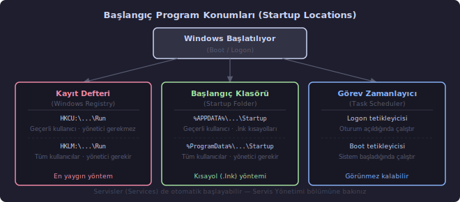
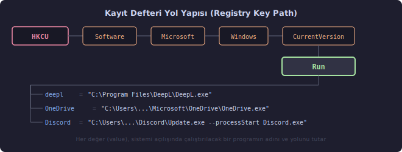

# Windows Başlangıç Programları Yönetimi (Startup Program Management)

Windows her açıldığında, masaüstü tam oluşmadan bazı uygulamalar arka planda devreye girer. Bulut depolama istemcisi, antivirüs, mesajlaşma uygulaması, çeviri aracı... Bunlar sisteme "her açılışta beni çalıştır" diye kayıt yaptırmış programlardır.

Çoğu kullanıcı bu programları bir kez kurar, sonra unutur. Zamanla birikir: RAM erken dolar, açılış süresi uzar, sistem tepsisi küçük simgelerle dolup taşar. IT yöneticisi açısından ise soru daha keskindir — hangi program neden başlıyor, bunu kim koydu ve nasıl kaldırılır?

Windows'ta başlangıç programları birden fazla konumdan devreye girebilir:

- **Kayıt Defteri** (Windows Registry) — en yaygın yöntem
- **Başlangıç Klasörü** (Startup Folder) — kısayol dosyası yöntemi
- **Görev Zamanlayıcı** (Task Scheduler) — görünmez kalabilen yöntem
- **Sistem Servisleri** (Services) — yönetim bölümünde ele alındı



---

## Windows Kayıt Defteri (Windows Registry)

**Kayıt defteri**, Windows'un ve üzerindeki uygulamaların yapılandırma bilgilerini sakladığı hiyerarşik bir veritabanıdır. Kullanıcı tercihleri, donanım yapılandırması, kurulu yazılım bilgileri, sistem politikaları — bunların büyük bölümü burada tutulur.

Büyük bir şirketin arşiv odasını düşünün: bölümler (hive) vardır, her bölümde klasörler (key), her klasörün içinde kartlar (value). Her kartın üzerinde adı ve değeri yazılıdır. Windows başlarken ilgili kartları okuyarak neyi, nerede, nasıl başlatacağını öğrenir.

### Kayıt Defteri Hive'ları (Registry Hives)

`HKEY` kısaltması, "Handle to a KEY" — bir anahtara açılan tutamacı ifade eder. Her hive, altında binlerce alt anahtar barındıran bir ağaç yapısıdır:

| Kısaltma | Tam Adı | Kapsam |
| --- | --- | --- |
| `HKCU` | HKEY_CURRENT_USER | Yalnızca oturum açmış kullanıcı |
| `HKLM` | HKEY_LOCAL_MACHINE | Tüm kullanıcılar / sistem geneli |
| `HKCR` | HKEY_CLASSES_ROOT | Dosya türü ilişkilendirmeleri |
| `HKU` | HKEY_USERS | Tüm kullanıcıların profilleri |
| `HKCC` | HKEY_CURRENT_CONFIG | Geçerli donanım profili |

### Başlangıç Programlarının Yeri

Otomatik başlayan programlar çoğunlukla şu iki anahtarda kayıtlıdır:

| Konum | Kapsam | Yönetici Gerekli? |
| --- | --- | --- |
| `HKCU:\Software\Microsoft\Windows\CurrentVersion\Run` | Yalnızca bu kullanıcı | Hayır |
| `HKLM:\Software\Microsoft\Windows\CurrentVersion\Run` | Tüm kullanıcılar | **Evet** |

Her değer (value), bir programın adını ve çalıştırılacak dosya yolunu tutar.



---

## Tüm Başlangıç Programlarını Listeleme

Müdahale etmeden önce mevcut durumu görmek her zaman önce gelir. İyi bir IT alışkanlığıdır: önce bak, sonra değiştir.

### Kayıt Defteri — Geçerli Kullanıcı

```powershell
Get-ItemProperty "HKCU:\Software\Microsoft\Windows\CurrentVersion\Run"
```

### Kayıt Defteri — Tüm Kullanıcılar

```powershell
Get-ItemProperty "HKLM:\Software\Microsoft\Windows\CurrentVersion\Run"
```

### Başlangıç Klasörü — Geçerli Kullanıcı

```powershell
Get-ChildItem "$env:APPDATA\Microsoft\Windows\Start Menu\Programs\Startup"
```

`$env:APPDATA`, PowerShell'in ortam değişkenlerine erişim biçimidir — Windows'taki `%APPDATA%` ifadesinin karşılığıdır. Gerçek yolu görmek için:

```powershell
$env:APPDATA    # C:\Users\KullaniciAdi\AppData\Roaming
```

### Başlangıç Klasörü — Tüm Kullanıcılar

```powershell
Get-ChildItem "$env:ProgramData\Microsoft\Windows\Start Menu\Programs\Startup"
```

### Tüm Konumları Birlikte Taramak

```powershell
$konumlar = @(
    "HKCU:\Software\Microsoft\Windows\CurrentVersion\Run",
    "HKLM:\Software\Microsoft\Windows\CurrentVersion\Run"
)

foreach ($konum in $konumlar) {
    Write-Output "`n=== $konum ==="
    Get-ItemProperty $konum |
        Select-Object * -ExcludeProperty PSPath, PSParentPath, PSChildName, PSDrive, PSProvider
}
```

`-ExcludeProperty` ile PowerShell'in kendi eklediği meta veriler (`PSPath`, `PSDrive` vb.) çıktıdan temizlenir; yalnızca gerçek başlangıç girdileri kalır.

---

## Kayıt Defteri Üzerinden Yönetim

### Girdi Sorgulamak — `Get-ItemProperty`

```powershell
# Tüm değerleri getir
Get-ItemProperty -Path "HKCU:\Software\Microsoft\Windows\CurrentVersion\Run"

# Belirli bir girdiyi ara
Get-ItemProperty -Path "HKCU:\Software\Microsoft\Windows\CurrentVersion\Run" -Name "deepl"

# Joker karakterle ara
Get-ItemProperty -Path "HKCU:\Software\Microsoft\Windows\CurrentVersion\Run" |
    Select-Object deepl*
```

**`Get-ItemProperty` — Parametreler:**

| Parametre | Değer | Açıklama |
| --- | --- | --- |
| `-Path` *(konumsal, 1. sıra)* | Registry yolu | Okunacak kayıt defteri anahtarının tam yolu. PowerShell'de `HKCU:` ve `HKLM:` sürücü adı olarak kullanılır. |
| `-Name` | Değer adı | Belirli bir değeri getir. Belirtilmezse anahtardaki tüm değerler döner. |

### Girdi Silmek — `Remove-ItemProperty`

Kayıt defterinden bir başlangıç girdisini silmek uygulamayı silmez; yalnızca "her açılışta beni çalıştır" notunu kaldırır. Uygulama elle açılmaya devam eder.

```powershell
Remove-ItemProperty -Path "HKCU:\Software\Microsoft\Windows\CurrentVersion\Run" `
                    -Name "deepl" `
                    -ErrorAction SilentlyContinue
```

**`Remove-ItemProperty` — Parametreler:**

| Parametre | Değer | Açıklama |
| --- | --- | --- |
| `-Path` *(konumsal, 1. sıra)* | Registry yolu | Girdiyi içeren anahtarın tam yolu |
| `-Name` | Değer adı | Silinecek değerin adı. Büyük/küçük harf duyarsızdır. |
| `-ErrorAction SilentlyContinue` | — | Girdi zaten yoksa hata vermez, sessizce devam eder |

### Silmeden Önce Yedeklemek

Kayıt defteri değişiklikleri kalıcıdır; geri almak için yedek gerekir. Silmeden önce mevcut değeri kaydetmek güvenli bir alışkanlıktır:

```powershell
$run = "HKCU:\Software\Microsoft\Windows\CurrentVersion\Run"
$ad  = "deepl"

$girdi = Get-ItemProperty -Path $run -Name $ad -ErrorAction SilentlyContinue

if ($null -ne $girdi) {
    $yedekYolu = "$env:USERPROFILE\Desktop\$ad-baslangic-yedek.txt"
    $girdi.$ad | Out-File -FilePath $yedekYolu -Encoding UTF8
    Write-Output "Yedeklendi: $yedekYolu"

    Remove-ItemProperty -Path $run -Name $ad
    Write-Output "'$ad' başlangıç girdisi kaldırıldı."
} else {
    Write-Output "'$ad' başlangıç girdisi bulunamadı."
}
```

---

## Başlangıç Klasörü Üzerinden Yönetim

Bazı uygulamalar kayıt defteri yerine başlangıç klasörüne **kısayol** (shortcut, `.lnk`) dosyası ekler. Windows bu klasördeki her `.lnk` dosyasını oturum açılırken çalıştırır.

### Listelemek

```powershell
$baslangicKlasoru = "$env:APPDATA\Microsoft\Windows\Start Menu\Programs\Startup"

Get-ChildItem -Path $baslangicKlasoru
Get-ChildItem -Path $baslangicKlasoru | Where-Object Name -like "*OneNote*"
```

### Silmeden Önce Test Etmek: `-WhatIf`

`-WhatIf` parametresi, komutu gerçekten çalıştırmadan ne yapacağını gösterir. Silme işlemlerinden önce kullanmak iyi bir uygulamadır:

```powershell
Get-ChildItem -Path $baslangicKlasoru |
    Where-Object Name -like "*OneNote*" |
    Remove-Item -WhatIf
```

`-WhatIf` çıktısı şu biçimdedir:

```text
What if: Performing the operation "Remove File" on target "C:\Users\...\OneNote'a Gönder.lnk".
```

Çıktı beklenenle uyuşuyorsa `-WhatIf` kaldırılarak komut gerçekleştirilir:

```powershell
Get-ChildItem -Path $baslangicKlasoru |
    Where-Object Name -like "*OneNote*" |
    Remove-Item
```

**`Remove-Item` — Parametreler:**

| Parametre | Tür | Açıklama |
| --- | --- | --- |
| `-Path` *(konumsal, 1. sıra)* | Metin | Silinecek dosya veya klasörün yolu |
| `-WhatIf` | Anahtar | Komutu çalıştırmadan simüle eder; ne yapılacağını gösterir |
| `-Confirm` | Anahtar | Her öğe için onay ister |
| `-Recurse` | Anahtar | Klasör siliniyorsa içeriğiyle birlikte siler |

---

## Görev Zamanlayıcı Üzerinden Başlangıç Görevleri

Bazı uygulamalar ne kayıt defterine ne de başlangıç klasörüne dokunur. Kendini görev zamanlayıcı üzerinden "kullanıcı oturum açarken" veya "sistem başlarken" tetiklenen bir görev olarak tanımlar. Bu, Görev Yöneticisi'nin Başlangıç sekmesinde görünmeyen başlangıç programlarının gizlendiği yerdir.

### Başlangıç Tetikleyicili Görevleri Bulmak

```powershell
# Logon (oturum açma) tetikleyicisi olan görevler
Get-ScheduledTask | Where-Object {
    $_.Triggers | Where-Object { $_.CimClass.CimClassName -like "*Logon*" }
} | Select-Object TaskName, TaskPath, State

# Boot (sistem başlangıcı) tetikleyicisi olan görevler
Get-ScheduledTask | Where-Object {
    $_.Triggers | Where-Object { $_.CimClass.CimClassName -like "*Boot*" }
} | Select-Object TaskName, TaskPath, State
```

### Görevi Devre Dışı Bırakmak

```powershell
Disable-ScheduledTask -TaskName "GorevAdi" -TaskPath "\GorevKlasoru\"
```

**`Disable-ScheduledTask` — Parametreler:**

| Parametre | Değer | Açıklama |
| --- | --- | --- |
| `-TaskName` | Metin | Görevin adı |
| `-TaskPath` | Metin | Görevin klasör yolu. Kök dizindeyse `"\"` yazılır. |

---

## Uygulama Örnekleri

### DeepL

DeepL, başlangıç kaydını `HKCU:\...\Run` altında tutar. Yönetici yetkisi gerekmez; yalnızca geçerli kullanıcıyı etkiler.

```powershell
# 1. Girdinin varlığını kontrol et
Get-ItemProperty "HKCU:\Software\Microsoft\Windows\CurrentVersion\Run" |
    Select-Object deepl*

# 2. Varsa kaldır
Remove-ItemProperty -Path "HKCU:\Software\Microsoft\Windows\CurrentVersion\Run" `
                    -Name "deepl" `
                    -ErrorAction SilentlyContinue

# 3. Sonucu doğrula
Get-ItemProperty "HKCU:\Software\Microsoft\Windows\CurrentVersion\Run" |
    Select-Object deepl*
```

### OneNote

OneNote, başlangıç klasörüne `OneNote'a Gönder.lnk` adıyla (sistemin diline göre değişebilir) bir kısayol ekler.

```powershell
$baslangicKlasoru = "$env:APPDATA\Microsoft\Windows\Start Menu\Programs\Startup"

# 1. Kısayolu bul
$onenote = Get-ChildItem -Path $baslangicKlasoru | Where-Object Name -like "*OneNote*"

# 2. Bulduysa sil
if ($null -ne $onenote) {
    Write-Output "Bulunan kısayol: $($onenote.Name)"
    $onenote | Remove-Item
    Write-Output "Kısayol silindi."
} else {
    Write-Output "Başlangıç klasöründe OneNote kısayolu bulunamadı."
}
```

---

## Grafiksel Araçlar

Aynı işlemler grafik arayüzle de yapılabilir. Ancak grafiksel araçlar yalnızca bir bölümünü gösterir; PowerShell veya Autoruns daha kapsamlıdır.

| Araç | Erişim | Kapsam |
| --- | --- | --- |
| Görev Yöneticisi (Task Manager) | `Ctrl+Shift+Esc` → Başlangıç Uygulamaları | Yalnızca kayıt defteri ve başlangıç klasörü; görev zamanlayıcı gözükmez |
| Windows Ayarlar | Ayarlar → Uygulamalar → Başlangıç | Modern arayüz; kapsamı sınırlı |
| Autoruns (Sysinternals) | Microsoft üzerinden indirilir | En kapsamlı; kayıt defteri, klasör, görev, sürücü, hizmet dahil tüm konumları gösterir |

**Autoruns**, Microsoft'un Sysinternals paketinde ücretsiz sunulan bir araçtır. Bir sistemdeki tüm otomatik başlangıç mekanizmalarını tek ekranda gösterir; üstelik imzalanmamış veya şüpheli girdileri renkle işaretler. Sistematik bir başlangıç denetimi yapılacaksa başvurulacak ilk araçtır.

---

## Dikkat Edilmesi Gerekenler

- Kayıt defteri değişiklikleri kalıcıdır; silmeden önce değeri bir dosyaya yedeklemek iyi bir alışkanlıktır.
- `HKLM` altındaki değişiklikler tüm kullanıcıları etkiler; yönetici yetkisi zorunludur.
- Bazı güvenlik yazılımları kendi başlangıç girdilerini korur; kaldırılırsa kendini yeniden ekler.
- Başlangıç girdisini kaldırmak uygulamayı kaldırmaz; yalnızca otomatik çalışmasını durdurur.
- Silme işlemlerinde `-WhatIf` ile önce test etmek, geri dönülemez hataları önler.
- Bir program hâlâ otomatik başlıyorsa yalnızca kayıt defteri değil, başlangıç klasörü ve görev zamanlayıcı da kontrol edilmelidir.
