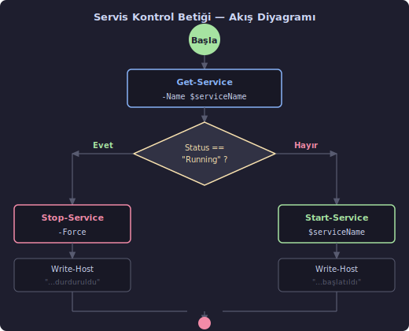
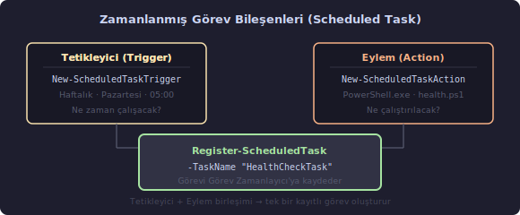

# PowerShell Betik Uygulamaları (PowerShell Script Examples)

Aşağıdaki örnekler, PowerShell'in gerçek IT senaryolarında nasıl kullanıldığını göstermektedir. Her örnek önce ne yaptığını ve neden yararlı olduğunu açıklar, ardından kodu sunar. Kodu okumadan önce açıklamayı okumak, satırların amacını daha hızlı kavramayı sağlar.

---

## Örnek 1: Servis Durum Kontrolü ve Geçiş

Windows'ta bir servisi elle başlatıp durdurmak kolaydır. Asıl güç, bu işlemi koşula bağlamaktan gelir: "servis çalışıyorsa durdur, çalışmıyorsa başlat." Bu tür açma-kapama mantığına **toggle** (geçiş) denir.

`wuauserv`, Windows Update'in servis adıdır. Servis adlarında büyük/küçük harf önemli değildir.

```powershell
$serviceName = "wuauserv"
$service     = Get-Service -Name $serviceName

if ($service.Status -eq "Running") {
    Stop-Service -Name $serviceName -Force
    Write-Host "$serviceName servisi durduruldu."
} else {
    Start-Service -Name $serviceName
    Write-Host "$serviceName servisi başlatıldı."
}
```



`Get-Service` bir **ServiceController** nesnesi döndürür. Bu nesnenin `Status` özelliği `Running`, `Stopped` veya `Paused` değerlerinden birini taşır.

`Stop-Service` içindeki `-Force` parametresi, başka servislerin bu servise bağımlı olması durumunda bile durdurma işlemini zorla uygular. Bağımlı servisler de durdurulur. `-Force` olmadan PowerShell bağımlı servis varsa hata üretebilir.

`Write-Host` çıktıyı doğrudan konsol ekranına yazar; pipeline'a nesne göndermez. Betiğin çıktısını başka bir komuta aktarmayı düşünmüyorsanız bilgilendirme amacıyla kullanışlıdır. Pipeline'da ilerleyecek çıktılar için `Write-Output` tercih edilir.

---

## Örnek 2: Olay Günlüğünden Son Kayıtları Almak

> **Dikkat:** `Get-EventLog` yalnızca Windows PowerShell 5.1'de çalışır; PowerShell 7 ve sonrasında bu cmdlet kaldırılmıştır. Yerine `Get-WinEvent` kullanılmalıdır.

```powershell
# Windows PowerShell 5.1 (eski — yalnızca referans amaçlı)
Get-EventLog -LogName Application -Newest 10

# PowerShell 7+ ve Windows PowerShell 5.1 (önerilen)
Get-WinEvent -LogName Application -MaxEvents 10
```

`-LogName` ile belirtilen değer, sorgulanacak günlük adını tanımlar. Yaygın kullanılan günlük adları: `Application`, `System`, `Security`.

`-Newest` (Get-EventLog) ve `-MaxEvents` (Get-WinEvent) aynı işlevi görür: döndürülecek maksimum kayıt sayısını belirler. Belirtilmezse tüm günlük okunur — büyük günlüklerde bu işlem yavaş ve bellek yoğun olabilir.

Yalnızca hataları görmek için:

```powershell
Get-WinEvent -LogName Application -MaxEvents 50 |
    Where-Object { $_.LevelDisplayName -eq "Error" }
```

---

## Örnek 3: Parolayı Güvenli Biçimde Şifreleyip Dosyaya Kaydetme

Bir betiğin parola gerektirdiği durumlarda parolayı düz metin olarak `.ps1` veya `.txt` dosyasına yazmak güvenlik açığıdır. PowerShell'in **SecureString** türü ve **DPAPI** (Data Protection API — Veri Koruma API'si), parolayı şifrelenmiş biçimde diske yazmayı mümkün kılar.

```powershell
$securePassword = Read-Host -AsSecureString "Parolayı girin"
$encrypted      = ConvertFrom-SecureString $securePassword
Set-Content -Path "sifre.txt" -Value $encrypted
```

`Read-Host -AsSecureString` klavyeden okunan karakterleri ekranda `*` olarak gösterir ve bunları `SecureString` nesnesinde saklar. `SecureString`, bellekte şifrelenmiş biçimde tutulan bir metin türüdür.

`ConvertFrom-SecureString`, `SecureString` nesnesini diske yazılabilir şifreli metne dönüştürür. Burada bir şifreleme anahtarı belirtilmediğinde **DPAPI** devreye girer: şifreleme, Windows'un mevcut kullanıcı hesabına ve makineye bağlı bir anahtarla yapılır.

> **Önemli Kısıtlama:** DPAPI ile şifrelenen veri yalnızca **aynı kullanıcı** tarafından **aynı makinede** çözülebilir. Dosyayı başka bir kullanıcıya veya makineye taşırsanız çözümlenemez. Birden fazla makinede çalışacak betikler için `-Key` parametresiyle açık bir şifreleme anahtarı belirlenmelidir.

`Set-Content` ile ilgili parametreler:

| Parametre | Değer | Açıklama |
| --- | --- | --- |
| `-Path` *(konumsal, 1. sıra)* | Dosya yolu | Yazılacak dosyanın yolu |
| `-Value` | Metin | Dosyaya yazılacak içerik |
| `-Encoding` | `UTF8`, `ASCII`... | Belirtilmezse sistem varsayılanı kullanılır |

---

## Örnek 4: Şifreli Parolayı Dosyadan Okuma ve Çözme

Örnek 3'te kaydedilen şifreli parola bu betikle geri okunur. Doğrudan düz metin okunmaz; önce `SecureString`'e, ardından `.NET` bellek işlemleriyle düz metne dönüştürülür.

```powershell
$encrypted     = Get-Content -Path "sifre.txt"
$securePassword = ConvertTo-SecureString -String $encrypted

$marshal        = [System.Runtime.InteropServices.Marshal]
$bstr           = $marshal::SecureStringToBSTR($securePassword)
$plainPassword  = $marshal::PtrToStringAuto($bstr)
$marshal::ZeroFreeBSTR($bstr)

Write-Host "Çözülmüş parola: $plainPassword"
```

`ConvertTo-SecureString`, Örnek 3'ün tersini yapar: DPAPI ile şifrelenmiş metni `SecureString` nesnesine çevirir.

**Marshal sınıfı ve BSTR:**

`[System.Runtime.InteropServices.Marshal]`, .NET'in yönetilen (managed) bellek ile yönetilmeyen (unmanaged) yerel bellek arasında köprü kuran sınıftır. PowerShell bunu `[Tip::MetotAdı]` sözdizimi ile çağırır.

`BSTR` (Binary STRing), COM (Component Object Model) ve Windows API'lerinde kullanılan bir metin türüdür — başında uzunluk bilgisi taşıyan, sıfır ile biten geniş karakter dizisidir.

1. `SecureStringToBSTR` → `SecureString` içeriğini yönetilmeyen belleğe kopyalar.
2. `PtrToStringAuto` → yönetilmeyen belleği düz `String`'e çevirir.
3. `ZeroFreeBSTR` → BSTR belleğini sıfırlar ve serbest bırakır.

Üçüncü adım (`ZeroFreeBSTR`) orijinal kodda eksik. Bu ihmal, parolanın düz metin olarak bellekte asılı kalmasına yol açar. Bellek temizliği güvenli kod yazımının bir parçasıdır.

> **Güvenlik Notu:** `Write-Host "Çözülmüş parola: $plainPassword"` satırı parolayı konsola yazar. Gerçek bir betik senaryosunda bu satır üretim kodunda bulunmamalıdır; yalnızca kavramı doğrulamak için yazılmıştır. Parola düz metin olarak herhangi bir günlüğe, ekrana veya dosyaya yazılmamalıdır.

---

## Örnek 5: Zamanlanmış Görev Oluşturma

Görev zamanlayıcı (Windows Task Scheduler), belirli bir koşul gerçekleştiğinde otomatik çalışacak görevleri sisteme kaydeder. Sabah 05:00'te haftalık sağlık kontrolü çalıştırmak bunun tipik bir örneğidir.

Bir alarm saati düşünün: "her Pazartesi 05:00'te çal" tetikleyicidir; "health.ps1 betiğini çalıştır" eylemdir. İkisi birleşince görev oluşur.

```powershell
$trigger = New-ScheduledTaskTrigger -Weekly -DaysOfWeek Monday -At 5am

$action = New-ScheduledTaskAction -Execute "PowerShell.exe" `
              -Argument "-NonInteractive -File C:\scripts\health.ps1"

Register-ScheduledTask -Action $action `
                       -Trigger $trigger `
                       -TaskName "HealthCheckTask" `
                       -Description "Haftalık sistem sağlık kontrolü" `
                       -RunLevel Highest
```



**`New-ScheduledTaskTrigger` — Seçili Parametreler:**

| Parametre | Değer | Açıklama |
| --- | --- | --- |
| `-Weekly` | Anahtar | Haftalık tetikleyici türü |
| `-DaysOfWeek` | `Monday` | Hangi günlerde çalışacağı. Birden fazla gün: `Monday,Wednesday` |
| `-At` | `5am` | Saat. `"05:30"` biçimi de kabul edilir. |
| `-Once` | Anahtar | Tek seferlik tetikleyici. `-At` ile birlikte kullanılır. |
| `-AtLogon` | Anahtar | Kullanıcı oturum açtığında tetikler |
| `-AtStartup` | Anahtar | Sistem başladığında tetikler |

**`New-ScheduledTaskAction` — Parametreler:**

| Parametre | Değer | Açıklama |
| --- | --- | --- |
| `-Execute` | `"PowerShell.exe"` | Çalıştırılacak program |
| `-Argument` | `"-File C:\..."` | Programa geçilecek argümanlar |
| `-WorkingDirectory` | Yol | Betiğin çalışacağı dizin |

**`Register-ScheduledTask` — Seçili Parametreler:**

| Parametre | Değer | Açıklama |
| --- | --- | --- |
| `-TaskName` | Metin | Görev adı; Görev Zamanlayıcı'da görünür |
| `-Description` | Metin | Görevin açıklaması |
| `-RunLevel` | `Highest` / `Limited` | `Highest`: yönetici (administrator) yetkileriyle çalışır |
| `-User` | Kullanıcı adı | Görevi çalıştıracak hesap. Belirtilmezse geçerli kullanıcı. |

Orijinal kodda `-Argument "-File C:\scripts\health.ps1"` yazıyor. Buna `-NonInteractive` eklemek iyi bir alışkanlıktır: arka planda çalışan betiklerde kullanıcı etkileşimi beklenmesi betiği askıya alır.

---

## Örnek 6: Uzak Bilgisayarda Komut Çalıştırma

Uzak bir bilgisayardaki süreçleri listelemek, yerel makinede aynı komutu çalıştırmaktan farklı değildir — yalnızca komut uzak makinede yürütülür.

```powershell
$remotePC = "10.1.1.12"
$cred     = Get-Credential

Invoke-Command -ComputerName $remotePC -ScriptBlock {
    Get-Process
} -Credential $cred
```

`Get-Credential` bir kimlik bilgisi iletişim kutusu açar: kullanıcı adı ve parola girilebilir. Döndürülen `PSCredential` nesnesi, `-Credential` parametresine geçilir.

Hedef makinede WinRM'nin etkin olması gerekir. Etkinleştirmek için hedef makinede yönetici olarak:

```powershell
Enable-PSRemoting -Force
```

Birden fazla makineye aynı anda komut göndermek için ComputerName dizisi kullanılır:

```powershell
Invoke-Command -ComputerName "10.1.1.12","10.1.1.13" -ScriptBlock {
    Get-Process
} -Credential $cred
```

Uzak makine güvenilir hostlar listesinde değilse bağlantı reddedilebilir. Etki alanı (domain) dışındaki makineler için WinRM TrustedHosts ayarı gerekebilir.

---

## Örnek 7: Active Directory Kullanıcılarını Listeleme

**Active Directory** (AD — Etkin Dizin), kullanıcı hesapları, bilgisayarlar, gruplar ve politikaları merkezi olarak yöneten bir dizin hizmetidir. Kurumsal Windows ortamlarında kimlik yönetiminin omurgasıdır.

```powershell
Import-Module ActiveDirectory

Get-ADUser -Filter * -Properties Name, Department |
    Select-Object Name, Department
```

`Import-Module ActiveDirectory`, AD cmdlet'lerini içeren modülü oturuma yükler. Bu modül domain controller'da varsayılan olarak bulunur; istemci bilgisayarlarda RSAT (Remote Server Administration Tools — Uzak Sunucu Yönetim Araçları) kurulu olmalıdır.

**`Get-ADUser` — Parametreler:**

| Parametre | Değer | Açıklama |
| --- | --- | --- |
| `-Filter` *(zorunlu)* | `*` veya filtre ifadesi | `*` tüm kullanıcıları getirir. Daha seçici: `-Filter "Department -eq 'IT'"` |
| `-Properties` | Özellik listesi | Varsayılan dışında ek özellikler. `Department`, `Title`, `Manager` gibi alanlar varsayılan değildir; açıkça belirtilmesi gerekir. |
| `-SearchBase` | Distinguished Name | Aramanın yapılacağı OU (Organizational Unit — Organizasyon Birimi): `"OU=IT,DC=firma,DC=local"` |

`Select-Object Name, Department` yalnızca bu iki sütunu gösterir. `-Properties Name, Department` yazılmazsa `Department` alanı boş gelir — özelliği hem `-Properties`'te hem `Select-Object`'te belirtmek gerekir.

---

## Örnek 8: CSV Dosyasını İçe Aktarma ve Filtreleme

**CSV** (Comma-Separated Values — Virgülle Ayrılmış Değerler) dosyaları, tablo verilerini düz metin olarak saklamanın en yaygın yoludur. `Import-Csv` her satırı bir `PSCustomObject`'e dönüştürür; sütun adları doğrudan nesne özelliği olur.

```powershell
$students = Import-Csv "ogrenciler.csv"

$passed = $students | Where-Object { $_.Not -ge 50 }

$passed | Export-Csv -Path "gecenler.csv" -NoTypeInformation
```

`$_.Not` ifadesindeki `Not`, `ogrenciler.csv` dosyasının başlık satırındaki sütun adıdır — Türkçede "not" sözcüğü sınav puanını ifade eder. `Import-Csv` CSV başlığını okur ve her başlığı nesne özelliğine dönüştürür. Sütun adı farklıysa (örneğin "Puan"), `$_.Puan` yazılır.

Örnek bir `ogrenciler.csv` içeriği:

```text
Ad,Soyad,Not
Ali,Kaya,75
Ayşe,Demir,45
Mehmet,Yıldız,90
```

`Export-Csv` parametreleri:

| Parametre | Değer | Açıklama |
| --- | --- | --- |
| `-Path` | Dosya yolu | Çıktı dosyası |
| `-NoTypeInformation` | Anahtar | Dosya başına `#TYPE ...` satırının eklenmesini engeller |
| `-Append` | Anahtar | Mevcut dosyaya ekler, üzerine yazmaz |
| `-Encoding` | `UTF8` | Türkçe karakter içeriyorsa zorunludur |

---

## Örnek 9: Belirli Olay Kimliğiyle Filtreleme

Her Windows olayının bir **Event ID** (Olay Kimliği) vardır. Bu numaralar Microsoft tarafından standartlaştırılmıştır: 10010, DCOM sunucusunun zamanında başlatılamaması anlamına gelir. IT yöneticisi bu numaraları arama motorunda arayarak olayın anlamını hızla öğrenebilir.

> **Dikkat:** `Get-EventLog` yalnızca Windows PowerShell 5.1'de çalışır. Modern ve önerilen komut `Get-WinEvent`'tir.

```powershell
# Windows PowerShell 5.1 (eski)
Get-EventLog -LogName System | Where-Object { $_.InstanceID -eq 10010 }

# PowerShell 7+ (önerilen — Get-WinEvent + FilterHashtable daha hızlıdır)
Get-WinEvent -FilterHashtable @{ LogName = "System"; Id = 10010 }
```

`-FilterHashtable` yaklaşımı `Where-Object` kullanımına göre önemli ölçüde daha hızlıdır: filtre doğrudan Windows olay günlüğü motoruna devredilir; tüm kayıtlar önce belleğe alınıp sonra süzülmez.

Belirli bir zaman aralığıyla birleştirmek:

```powershell
Get-WinEvent -FilterHashtable @{
    LogName   = "System"
    Id        = 10010
    StartTime = (Get-Date).AddDays(-7)
}
```

---

## Örnek 10: .NET Sınıflarını PowerShell'den Kullanmak

PowerShell, .NET platformunun üzerine inşa edilmiştir ve tüm .NET sınıf kitaplığına (class library) doğrudan erişebilir. Bu, PowerShell'in cmdlet'lerle çözülemeyen durumlar için .NET'in geniş ekosisteminden yararlanmasını sağlar.

```powershell
$pi   = [System.Math]::PI
$sqrt = [System.Math]::Sqrt(64)

Write-Host "Pi: $pi  |  √64: $sqrt"
```

`[System.Math]` sözdizimi, .NET'in `System` isim alanındaki (namespace) `Math` sınıfına erişir. `::` operatörü **statik** (static) üyelere erişmek için kullanılır — yani nesne oluşturmadan doğrudan sınıf üzerinden çağrılabilen yöntemler ve sabitler.

| Sözdizimi | Anlamı |
| --- | --- |
| `[System.Math]::PI` | `Math` sınıfının `PI` sabit özelliği |
| `[System.Math]::Sqrt(64)` | `Math.Sqrt()` statik yöntemi |
| `[System.Math]::Round(3.14159, 2)` | 2 ondalık basamağa yuvarlama |
| `[System.Math]::Abs(-15)` | Mutlak değer |
| `[System.Math]::Max(10, 20)` | İki değerin büyüğü |

Statik üyelere `::` ile erişilirken, nesne örneklerine (instance) `.` ile erişilir. Bu ayrım, C# ve Java gibi dillerde de geçerlidir:

```powershell
# Statik çağrı (nesne oluşturmadan)
[System.Math]::Sqrt(16)

# Nesne örneği üzerinden (. operatörü)
$metin = "PowerShell"
$metin.ToUpper()          # "POWERSHELL"
$metin.Length             # 10
```

Kullanılabilir .NET sınıflarını bulmak için:

```powershell
# System.IO isim alanındaki tüm türleri listele
[System.AppDomain]::CurrentDomain.GetAssemblies() |
    ForEach-Object { $_.GetTypes() } |
    Where-Object { $_.FullName -like "System.IO.*" } |
    Select-Object -First 20 -ExpandProperty FullName
```

---

## Kaynaklar

- Prashanth Jayaram, Rajendra Gupta — *Ultimate PowerShell Automation for System Administration* (2024), Orange Education Pvt. Ltd.
- GitHub: [github.com/ava-orange-education](https://github.com/ava-orange-education)
- Microsoft Docs: [learn.microsoft.com/powershell](https://learn.microsoft.com/powershell)
