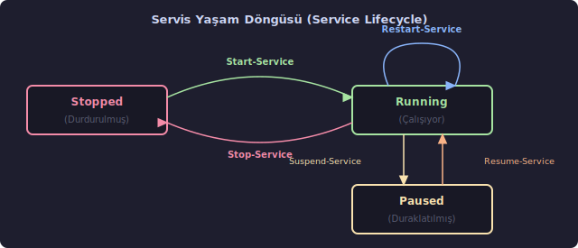
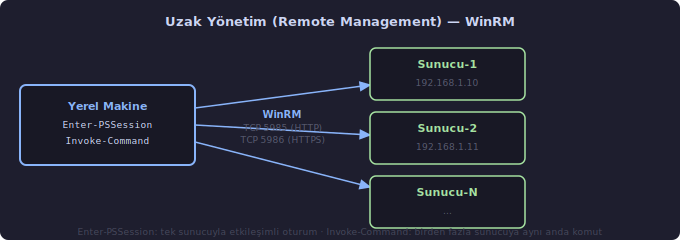

# PowerShell

PowerShell, Microsoft tarafından geliştirilen, .NET platformu üzerine inşa edilmiş bir **komut satırı kabuğu** (command-line shell) ve **betik dili**dir (scripting language). Windows, macOS ve Linux üzerinde çalışır.

## Kabuk (Shell) Kavramı

"Kabuk" terimi kasıtlı seçilmiş bir isimdir: işletim sisteminin çekirdeğini (kernel) dışarıdan saran, kullanıcıyla çekirdek arasında aracılık eden katmana verilen addır. Terminal penceresine yazdığınız komut doğrudan donanıma ulaşmaz; önce kabuğun içinden geçer.

Bir restoranı düşünün: siparişi siz verirsiniz, garson mutfakla konuşur, sonucu size getirir. Siz mutfakla doğrudan muhatap olmazsınız. Kabuk da tam bu rolü üstlenir — sizin yazdıklarınızı işletim sisteminin anlayacağı biçime çevirir ve yanıtı size geri sunar.

PowerShell, klasik Unix/Linux kabuklarından (Bash, sh, zsh) köklü biçimde ayrılır: komut çıktıları **düz metin değil, .NET nesneleridir**. Bu ayrım ilk bakışta küçük görünse de pratikte her şeyi değiştirir; bunu pipeline konusunda somut olarak göreceğiz.

---

## Cmdlet Yapısı (Verb-Noun Pattern)

PowerShell komutlarına **cmdlet** (*command-let*, "küçük komut" anlamında) denir. Her cmdlet `Fiil-İsim` (Verb-Noun) biçiminde adlandırılır:

| Cmdlet | Anlamı |
| --- | --- |
| `Get-Process` | Çalışan süreçleri listele |
| `Set-Location` | Çalışma dizinini değiştir |
| `New-Item` | Yeni dosya veya klasör oluştur |
| `Remove-Item` | Dosya veya klasör sil |
| `Stop-Process` | Süreci durdur |
| `Start-Service` | Sistem hizmetini başlat |

Bu adlandırma standardı öğrenildiğinde, daha önce hiç karşılaşılmamış bir cmdlet adı tahmin edilebilir hale gelir. "Hizmetleri nasıl listelerim?" sorusunun yanıtı `Get-Service`'tir; denemeden önce bile bilinebilir. Desen bir kez oturdu mu, binlerce cmdlet kendiliğinden anlamlıdır.


---

## Parametre Sözdizimi (Parameter Syntax)

Cmdlet'ler tek başlarına çalışabilse de asıl gücünü **parametre**lerle (parameter) ortaya koyar. Parametre, bir işlemin *nasıl* yapılacağını belirtir. Bir tarif düşünün: tarif "kek pişir" iken parametre "fırın sıcaklığı 180°C, süre 40 dakika" anlamına gelir. Aynı tarif, farklı parametrelerle farklı sonuçlar üretir.

PowerShell'de üç tür parametre vardır:

**1. Adlandırılmış Parametre (Named Parameter)** — `-ParamAdı Değer` biçiminde yazılır; ad ve değer açıkça belirtilir:

```powershell
Set-ExecutionPolicy -ExecutionPolicy RemoteSigned -Scope CurrentUser
```

**2. Konumsal Parametre (Positional Parameter)** — Parametre adı yazılmadan yalnızca değer verilir; cmdlet, değerin sırasına bakarak hangi parametreye ait olduğunu anlar:

```powershell
Get-ChildItem C:\Users   # C:\Users, -Path parametresinin konumsal değeridir
```

**3. Anahtarlı Parametre (Switch Parameter)** — Değer almaz; yalnızca varlığıyla etkisini gösterir. Elektrik düğmesi gibidir — yazılmışsa açık, yazılmamışsa kapalı:

```powershell
Sort-Object CPU -Descending   # -Descending bir anahtardır; ters sıralamayı etkinleştirir
```


---

## Temel Komutlar

### Değişken Tanımlama (Variable)

PowerShell'de değişkenler `$` işaretiyle başlar:

```powershell
$isim = "Ali"
Write-Output "Merhaba $isim"
```

**`Write-Output "Merhaba $isim"` — Parametreler:**

| Parametre | Değer | Açıklama |
| --- | --- | --- |
| `-InputObject` *(konumsal, 1. sıra)* | `"Merhaba $isim"` | Ekrana gönderilecek nesne veya metin. Parametre adı yazılmadan doğrudan değer verilir. |

Çift tırnak içindeki `$isim` **değişken iç içe geçirme** (string interpolation) ile çalışır: PowerShell, `$isim`'i çalışma anında değişkenin gerçek değeriyle değiştirir. Tek tırnak kullanıldığında bu yorumlama yapılmaz:

```powershell
Write-Output 'Merhaba $isim'   # Çıktı: Merhaba $isim  (değişken yorumlanmaz)
Write-Output "Merhaba $isim"   # Çıktı: Merhaba Ali     (değişken yerleştirilir)
```

---

### Süreçleri Listeleme (Get-Process)

```powershell
Get-Process
```

Parametresiz çalıştırıldığında sistemdeki tüm çalışan süreçleri listeler. Aynı cmdlet, parametrelerle çok daha odaklı sorgulamalar yapabilir:

```powershell
Get-Process -Name "chrome"
Get-Process -Id 1234
Get-Process -Name "chrome","code"
```

**Parametreler:**

| Parametre | Tür | Açıklama |
| --- | --- | --- |
| `-Name` *(konumsal, 1. sıra)* | Metin dizisi | Süreç adı. Joker karakter kabul eder: `"ch*"` ifadesi "chrome", "chkdsk" gibi `ch` ile başlayan tüm süreçleri getirir. |
| `-Id` | Tam sayı | PID (Process ID — Süreç Kimlik Numarası). İşletim sisteminin her çalışan sürece atadığı benzersiz numaradır. |
| `-ComputerName` | Metin dizisi | Uzak bir bilgisayardaki süreçleri sorgular. |

---

### Filtreleme (Where-Object)

```powershell
Get-Process | Where-Object { $_.CPU -gt 50 }
```

**`Where-Object { $_.CPU -gt 50 }` — Parametreler:**

| Parametre | Değer | Açıklama |
| --- | --- | --- |
| `-FilterScript` *(konumsal, 1. sıra)* | `{ $_.CPU -gt 50 }` | Süzgeç koşulunu tanımlayan **script bloğu** (ScriptBlock). Süslü parantezler `{ }` bir kod parçasını "şimdi çalıştırma, hazır tut" diye paketler. Pipeline'dan gelen her nesne bu bloktan geçirilir; blok `$true` üretirse nesne ileri iletilir, `$false` üretirse elenir. |

**`$_` nedir?**

`$_`, PowerShell'in **otomatik değişkeni**dir (automatic variable); pipeline üzerinden gelen geçerli nesneyi temsil eder. Bir eleme bandını düşünün: bant üzerindeki her ürün sırayla tek tek gelir, o an elde tutulana `$_` deniyor. Her nesne geldiğinde "bu nesnenin CPU özelliği 50'den büyük mü?" sorusu yeniden sorulur.

**Karşılaştırma Operatörleri (Comparison Operators):**

| Operatör | Anlamı | Kısaltmanın Açılımı |
| --- | --- | --- |
| `-gt` | büyüktür | **g**reater **t**han |
| `-lt` | küçüktür | **l**ess **t**han |
| `-ge` | büyük eşit | **g**reater than or **e**qual |
| `-le` | küçük eşit | **l**ess than or **e**qual |
| `-eq` | eşittir | **eq**ual |
| `-ne` | eşit değildir | **n**ot **e**qual |
| `-like` | joker karakter eşleşmesi | `*` ve `?` ile çalışır |
| `-match` | düzenli ifade eşleşmesi (regex) | |

PowerShell neden `>`, `<` yerine `-gt`, `-lt` kullanır? Çünkü `>` ve `<` kabuklarda çıktı yönlendirme için ayrılmıştır — `>` çıktıyı dosyaya yazar. Bu çakışmayı önlemek için metin tabanlı operatörler seçilmiştir.

---

### Sıralama (Sort-Object)

```powershell
Get-Process | Sort-Object CPU -Descending
```

**`Sort-Object CPU -Descending` — Parametreler:**

| Parametre | Değer | Açıklama |
| --- | --- | --- |
| `-Property` *(konumsal, 1. sıra)* | `CPU` | Sıralama kriteri olarak kullanılacak nesne özelliğinin (property) adı. Birden fazla kriter virgülle belirtilir: `Sort-Object LastName, FirstName` |
| `-Descending` | *(anahtarlı)* | Büyükten küçüğe sırala. Yazılmazsa varsayılan sıralama küçükten büyüğedir. |

---

### Seçim (Select-Object)

```powershell
Get-Process | Select-Object Name, CPU
```

**`Select-Object Name, CPU` — Parametreler:**

| Parametre | Değer | Açıklama |
| --- | --- | --- |
| `-Property` *(konumsal, 1. sıra)* | `Name, CPU` | Gösterilecek nesne özelliklerinin listesi. Nesnenin tüm alanları yerine yalnızca ilgili olanlar seçilir — veri kümesini daraltır ve okunabilirliği artırır. |

Ek kullanışlı parametreler:

| Parametre | Açıklama |
| --- | --- |
| `-First 5` | İlk 5 nesneyi al |
| `-Last 5` | Son 5 nesneyi al |
| `-Unique` | Yalnızca benzersiz değerleri döndür |
| `-ExpandProperty` | Bir özelliğin değerini nesne değil düz değer olarak çıkart |

---

### Klasör İçeriğini Listeleme (Get-ChildItem)

```powershell
Get-ChildItem C:\Users
```

**`Get-ChildItem C:\Users` — Parametreler:**

| Parametre | Değer | Açıklama |
| --- | --- | --- |
| `-Path` *(konumsal, 1. sıra)* | `C:\Users` | Listelemenin yapılacağı dizin yolu. Joker karakter kabul eder: `C:\Users\*\Desktop` tüm kullanıcıların masaüstünü getirir. |

`gci` kısaltmasıyla da yazılabilir. Linux'taki `ls` komutunun işlevsel karşılığıdır.

Sık kullanılan ek parametreler:

```powershell
Get-ChildItem C:\Proje -Recurse
Get-ChildItem C:\Proje -Filter "*.txt"
Get-ChildItem C:\Proje -File
Get-ChildItem C:\Proje -Directory
Get-ChildItem C:\Proje -Recurse -Filter "*.log" -Depth 3
```

| Parametre | Tür | Açıklama |
| --- | --- | --- |
| `-Recurse` | Anahtar | Alt dizinlere de iner; dizin ağacının tamamını tarar |
| `-Filter` | Metin | Dosya adı filtresi. `*` sıfır veya daha fazla karakter, `?` tek karakter yerine geçer |
| `-File` | Anahtar | Yalnızca dosyaları listeler; klasörleri atlar |
| `-Directory` | Anahtar | Yalnızca klasörleri listeler; dosyaları atlar |
| `-Hidden` | Anahtar | Gizli öğeleri de dahil eder |
| `-Depth` | Tam sayı | `-Recurse` ile birlikte kaç seviye derine inileceğini sınırlar |

---

### Fonksiyon Tanımı (Function)

```powershell
function Selamla($isim) {
    "Merhaba, $isim."
}

Selamla "Ali"
```

Fonksiyon parametreleri iki biçimde tanımlanabilir. Yukarıdaki kısa biçim çalışır, ancak üretim kodunda tercih edilen biçim `param` bloğuyla yapılandır:

```powershell
function Selamla {
    param(
        [string]$isim
    )
    "Merhaba, $isim."
}
```

`[string]` burada **tür kısıtlaması** (type constraint) görevi görür: parametre yalnızca metin kabul eder. Bu biçim, ileride zorunlu parametre işaretleme (`[Parameter(Mandatory)]`) ve yardım metni ekleme gibi özelliklere de kapı açar.

---

## Pipeline (Boru Hattı)

`|` (pipe, boru hattı) operatörü, PowerShell'in en belirleyici özelliğidir. Bir fabrika üretim bandını düşünün: birinci istasyon hammaddeyi işleyip ikinciye verir, ikinci kendi işini yapıp üçüncüye aktarır. Her istasyon yalnızca kendine düşen işi yapar, ama sonuçta ortaya çıkan ürün tüm istasyonların katkısıdır. PowerShell pipeline'ı da böyle çalışır — her komut, bir sonrakine **işlenmiş nesne** iletir:

```powershell
Get-Process | Where-Object { $_.CPU -gt 50 } | Sort-Object CPU -Descending
```

Bu tek satır şunu yapar:

1. Tüm süreçleri alır,
2. CPU > 50 olanları filtreler,
3. CPU değerine göre büyükten küçüğe sıralar.


**PowerShell ile Bash Karşılaştırması:**

```bash
# Bash: metin tabanlı — sütun sırası değişirse veya boşluk sayısı artarsa kod kırılabilir
ps aux | awk '{print $11, $3}' | sort -k2 -rn
```

```powershell
# PowerShell: nesne tabanlı — alan adıyla erişilir, biçim sorunları yoktur
Get-Process | Select-Object Name, CPU | Sort-Object CPU -Descending
```

Bash'te veriyi kullanabilmek için `awk`, `grep`, `cut` gibi araçlarla metni elle ayrıştırmak gerekir; çıktı biçimi değiştiğinde kod kırılabilir. PowerShell'de nesne üzerinde çalışıldığından bu kırılganlık yoktur.

---

## Execution Policy (Yürütme İlkesi)

PowerShell, betiklerin çalıştırılmasını güvenlik amacıyla kısıtlar. Windows'ta varsayılan politika `Restricted`'dir: hiçbir `.ps1` dosyası çalışmaz.

"Execute" kelimesi Latince *exsequi*'den gelir: "sonuna kadar götürmek, gerçekleştirmek." Policy ise Yunanca *politeia*'dan: "yönetim düzeni." Yani Execution Policy, "hangi betiklerin çalıştırılmasına izin verildiğini düzenleyen kural" demektir. Bu kural sisteme dışarıdan gelen zararlı betiklere karşı bir güvenlik katmanıdır.


| Politika | Davranış |
| --- | --- |
| `Restricted` | Hiçbir betik çalışmaz (Windows varsayılanı) |
| `AllSigned` | Yalnızca dijital imzalı betikler çalışır |
| `RemoteSigned` | Yerel betikler serbest; uzaktan indirilenler imza ister |
| `Unrestricted` | Her şey çalışır; üretim ortamı için önerilmez |

Mevcut politika düzeyini görmek için:

```powershell
Get-ExecutionPolicy -List
```

**`Get-ExecutionPolicy -List` — Parametreler:**

| Parametre | Tür | Açıklama |
| --- | --- | --- |
| `-List` | Anahtar | Tüm kapsam (scope) katmanları için politikaları ayrı ayrı listeler. Yazılmazsa yalnızca o an geçerli olan politika gösterilir. |

Geliştirme ortamı için önerilen ayar:

```powershell
Set-ExecutionPolicy RemoteSigned -Scope CurrentUser
```

**`Set-ExecutionPolicy RemoteSigned -Scope CurrentUser` — Parametreler:**

| Parametre | Değer | Açıklama |
| --- | --- | --- |
| `-ExecutionPolicy` *(konumsal, 1. sıra)* | `RemoteSigned` | Uygulanacak politika düzeyi. Yukarıdaki tablodaki dört değerden biri yazılır. |
| `-Scope` | `CurrentUser` | Değişikliğin hangi kapsamda geçerli olacağı. Aşağıdaki tabloya bakınız. |

**`-Scope` değerleri:**

| Değer | Kapsam | Yönetici Gerekli? |
| --- | --- | --- |
| `Process` | Yalnızca bu terminal oturumu; kapanınca sıfırlanır | Hayır |
| `CurrentUser` | Bu kullanıcı hesabı; kalıcıdır | Hayır |
| `LocalMachine` | Tüm sistem, tüm kullanıcılar; kalıcıdır | **Evet** |
| `UserPolicy` | Grup politikası (GPO) ile kullanıcıya uygulanan | GPO ile yönetilir |
| `MachinePolicy` | Grup politikası (GPO) ile makineye uygulanan | GPO ile yönetilir |

Bu komut yönetici yetkisi **gerektirmez**; yalnızca kendi kullanıcı hesabınıza uygulanır. Tüm sistemi kapsayan bir değişiklik için `-Scope LocalMachine` kullanılır ve bu durumda PowerShell'i **Yönetici (Administrator) olarak** açmak gerekir.

---

## PowerShell Betiği (.ps1) Oluşturma ve Çalıştırma

### Betik Dosyası Oluşturma

Uzantısı `.ps1` olan bir dosya oluşturun (örnek: `1-Giris.ps1`). `.ps1` uzantısı, PowerShell 1.0'dan gelen tarihsel bir isimlendirmedir.

```powershell
Write-Output "PowerShell betiği çalıştı."
```

### Betiği Çalıştırma

```powershell
./1-Giris.ps1
```

> **Not:** PowerShell hem `.\` (backslash, Windows) hem de `./` (forward slash, Unix) yol ayracını kabul eder. Her ikisi de çalışır; Linux alışkanlığıyla `./` yazmak doğrudur.

---

## Yardım Alma (Get-Help)

Herhangi bir cmdlet hakkında ayrıntılı bilgi için:

```powershell
Get-Help Get-Process
Get-Help Get-Process -Examples
Get-Help Get-Process -Full
```

**`Get-Help Get-Process -Examples` — Parametreler:**

| Parametre | Değer | Açıklama |
| --- | --- | --- |
| `-Name` *(konumsal, 1. sıra)* | `Get-Process` | Yardım istenecek cmdlet ya da kavramın adı. Joker karakter kabul eder: `Get-Help *Process*` adında "Process" geçen tüm yardım konularını listeler. |
| `-Examples` | *(anahtarlı)* | Yalnızca kullanım örneklerini gösterir. Teorik açıklamayı atlayıp doğrudan örnek görmek isteyenler için en kısa yoldur. |
| `-Full` | *(anahtarlı)* | Parametrelerin ayrıntılı açıklamaları, girdi/çıktı türleri ve notlar dahil tüm yardım içeriğini gösterir. |
| `-Online` | *(anahtarlı)* | Varsayılan tarayıcıda Microsoft'un güncel çevrimiçi belgelerini açar. Yerel yardım dosyaları eski kalmışsa bu parametre güncel içeriğe ulaştırır. |

---

## Dosya Boyutu Sorgulama

```powershell
(Get-Item "C:\dosya\yolu\ornek.txt").Length
```

**`Get-Item "C:\dosya\yolu\ornek.txt"` — Parametreler:**

| Parametre | Değer | Açıklama |
| --- | --- | --- |
| `-Path` *(konumsal, 1. sıra)* | `"C:\dosya\yolu\ornek.txt"` | Bilgi alınacak öğenin tam yolu. Dosya, klasör veya sürücü olabilir. |

`Get-Item` bir `FileInfo` nesnesi döndürür. Noktadan sonra gelen `Length`, bu nesnenin bayt cinsinden boyutunu tutan özelliğidir (property). Dıştaki parantez, önce cmdlet'in çalıştırılmasını, ardından dönen nesne üzerindeki özelliğe erişilmesini sağlar.

Dönen `FileInfo` nesnesi üzerinde erişilebilecek diğer özellikler:

```powershell
$dosya = Get-Item "C:\dosya\yolu\ornek.txt"
$dosya.Length           # Bayt cinsinden boyut
$dosya.Name             # Yalnızca dosya adı
$dosya.FullName         # Tam yol
$dosya.LastWriteTime    # Son değiştirilme tarihi
$dosya.Extension        # Uzantı (.txt)
```

---

## Servis Yönetimi (Service Management)

Windows'ta arka planda sessizce çalışan yüzlerce **servis** vardır. Antivirüs taraması, yazıcı kuyruğu, ağ yönetimi, Windows Update — bunların hepsi birer servistir. Servisler, kullanıcı oturumu açmadan da çalışabilir; sistem başladığında otomatik devreye girebilirler.

Bir binanın altyapısını düşünün: ısıtma sistemi, asansörler, güvenlik kameraları. Binada kim olduğuna bakmaksızın bu sistemler kendi döngülerinde çalışır. IT'deki servisler de işletim sisteminin görünmez altyapı bileşenleridir.



### Servisleri Listeleme — `Get-Service`

```powershell
Get-Service
Get-Service -Name "Spooler"
Get-Service -Name "w*"
Get-Service | Where-Object { $_.Status -eq "Stopped" }
```

**`Get-Service` — Parametreler:**

| Parametre | Değer | Açıklama |
| --- | --- | --- |
| `-Name` *(konumsal, 1. sıra)* | `"Spooler"` | Servis adı. Joker karakter kabul eder: `"SQL*"` SQL Server ile ilgili tüm servisleri getirir. |
| `-DisplayName` | Metin | Görünen ad üzerinden sorgular. Örn: `"Windows Update"` |
| `-DependentServices` | Anahtar | Bu servise bağımlı servisleri de getirir |
| `-RequiredServices` | Anahtar | Bu servisin çalışması için gereken servisleri getirir |

`$_.Status` değerleri: `Running`, `Stopped`, `Paused`.

### Servisleri Başlatma, Durdurma, Yeniden Başlatma

```powershell
Start-Service -Name "Spooler"
Stop-Service -Name "Spooler"
Restart-Service -Name "Spooler"
```

**`Start-Service / Stop-Service / Restart-Service` — Parametreler:**

| Parametre | Tür | Açıklama |
| --- | --- | --- |
| `-Name` *(konumsal, 1. sıra)* | Metin | Servis adı |
| `-Force` | Anahtar | `Stop-Service` için: bağımlı servisler de varsa zorla durdurur |
| `-PassThru` | Anahtar | İşlem sonrası servis nesnesini pipeline'a gönderir; zincirleme kullanıma olanak tanır |

### Servis Başlangıç Türünü Değiştirme

```powershell
Set-Service -Name "Spooler" -StartupType Automatic
Set-Service -Name "XboxGipSvc" -StartupType Disabled
```

**`Set-Service` — `-StartupType` değerleri:**

| Değer | Anlamı |
| --- | --- |
| `Automatic` | Sistem açılışında otomatik başlar |
| `AutomaticDelayedStart` | Otomatik, ama sistem tam yüklendikten biraz sonra |
| `Manual` | Yalnızca istendiğinde başlar |
| `Disabled` | Başlatılamaz |

---

## Sistem ve Donanım Bilgisi

**CIM** (Common Information Model — Ortak Bilgi Modeli), IT altyapısını sorgulamak için DMTF tarafından tanımlanmış bir standarttır. **WMI** (Windows Management Instrumentation — Windows Yönetim Araçları), Microsoft'un bu standardı Windows üzerindeki uygulamasıdır.

PowerShell 3.0'dan itibaren `Get-WmiObject` cmdlet'i yerine `Get-CimInstance` önerilir: daha hızlı, DCOM yerine WS-Man (WS-Management) protokolünü kullandığından güvenlik duvarı dostu ve uzak sorgularda daha güvenilirdir.

### Genel Sistem Bilgisi

```powershell
Get-ComputerInfo

# Yalnızca belirli alanlar:
Get-ComputerInfo -Property CsName, WindowsVersion, OsTotalVisibleMemorySize
```

### İşletim Sistemi Bilgisi

```powershell
Get-CimInstance -ClassName Win32_OperatingSystem |
    Select-Object Caption, Version, OSArchitecture, LastBootUpTime
```

**`Get-CimInstance` — Parametreler:**

| Parametre | Değer | Açıklama |
| --- | --- | --- |
| `-ClassName` *(konumsal, 1. sıra)* | `Win32_OperatingSystem` | Sorgulanacak CIM sınıfı. `Win32_*` önekiyle başlayan sınıflar Windows'a özgüdür. |
| `-ComputerName` | Metin dizisi | Uzak bilgisayarda sorgu yapar. WinRM gerektirmez; eski DCOM üzerinden çalışır. |
| `-Filter` | Metin | WQL (WMI Query Language — WMI Sorgu Dili) filtresi. SQL WHERE cümlesine benzer: `"DriveType = 3"` |

### Disk Alanı İzleme

IT'de en sık sorular "disk doldu mu?" diye başlar. Aşağıdaki komut disk kullanımını okunabilir biçimde sunar:

```powershell
Get-CimInstance -ClassName Win32_LogicalDisk -Filter "DriveType = 3" |
    Select-Object DeviceID,
        @{Name="Toplam_GB";  Expression={[math]::Round($_.Size      / 1GB, 1)}},
        @{Name="Bos_GB";     Expression={[math]::Round($_.FreeSpace / 1GB, 1)}},
        @{Name="Dolu_Yuzde"; Expression={[math]::Round((1 - $_.FreeSpace/$_.Size) * 100, 1)}}
```

`@{Name="..."; Expression={...}}` sözdizimi **hesaplanmış özellik** (calculated property) tanımlar: var olan bir özelliğin adını ve/veya değerini dönüştürür. `1GB` PowerShell'in yerleşik sabiti — 1073741824 bayta karşılık gelir; `1MB`, `1KB` de aynı şekilde kullanılabilir.

`DriveType = 3` sabit diskleri seçer (1 = bilinmiyor, 2 = çıkarılabilir, 3 = yerel, 4 = ağ, 5 = CD-ROM).

### İşlemci ve Bellek Bilgisi

```powershell
# CPU
Get-CimInstance -ClassName Win32_Processor |
    Select-Object Name, NumberOfCores, NumberOfLogicalProcessors, MaxClockSpeed

# RAM modülleri
Get-CimInstance -ClassName Win32_PhysicalMemory |
    Select-Object BankLabel,
        @{Name="Kapasite_GB"; Expression={[math]::Round($_.Capacity / 1GB, 0)}},
        Speed
```

---

## Ağ Tanılama (Network Diagnostics)

### Bağlantı Testi

```powershell
Test-Connection -TargetName "google.com" -Count 4
Test-Connection -TargetName "192.168.1.1" -Count 1 -Quiet
```

**`Test-Connection` — Parametreler:**

| Parametre | Değer | Açıklama |
| --- | --- | --- |
| `-TargetName` *(konumsal, 1. sıra)* | `"google.com"` | Hedef sunucu adı veya IP adresi |
| `-Count` | Tam sayı | Gönderilecek ICMP (ping) paketi sayısı. Varsayılan: 4 |
| `-Quiet` | Anahtar | Ayrıntı yerine yalnızca `True` veya `False` döndürür; `if` koşullarında kullanışlıdır |
| `-TimeoutSeconds` | Tam sayı | Her deneme için zaman aşımı süresi |

**Port erişilebilirliği testi** — ping'den daha anlamlıdır çünkü ICMP engellenmiş olsa bile TCP bağlantısını dener:

```powershell
Test-NetConnection -ComputerName "192.168.1.10" -Port 3389   # RDP portu
Test-NetConnection -ComputerName "webserver"     -Port 443   # HTTPS
```

### Ağ Bağdaştırıcıları ve IP Adresleri

```powershell
Get-NetAdapter
Get-NetAdapter | Where-Object { $_.Status -eq "Up" }

Get-NetIPAddress -AddressFamily IPv4
Get-NetIPAddress | Where-Object { $_.PrefixOrigin -eq "Manual" }  # Elle atanmış IP'ler
```

**`Get-NetIPAddress` — Seçili Parametreler:**

| Parametre | Açıklama |
| --- | --- |
| `-AddressFamily` | `IPv4` veya `IPv6` |
| `-InterfaceAlias` | Belirli bir ağ bağdaştırıcısının adı: `"Ethernet"`, `"Wi-Fi"` |
| `-PrefixOrigin` | `Manual` (elle), `Dhcp` (otomatik), `WellKnown` (loopback) |

### DNS Sorgusu

**DNS** (Domain Name System — Alan Adı Sistemi), alan adlarını IP adreslerine çeviren dağıtık bir telefon rehberidir.

```powershell
Resolve-DnsName "google.com"
Resolve-DnsName "google.com" -Type MX     # Mail sunucu kayıtları
Resolve-DnsName "google.com" -Type NS     # İsim sunucuları
Resolve-DnsName "192.168.1.1"             # Ters DNS sorgusu
```

**`Resolve-DnsName` — Parametreler:**

| Parametre | Değer | Açıklama |
| --- | --- | --- |
| `-Name` *(konumsal, 1. sıra)* | `"google.com"` | Sorgulanacak alan adı veya IP |
| `-Type` | `A`, `MX`, `NS`, `PTR`... | DNS kayıt türü. Varsayılan `A` (IPv4 adresi) |
| `-Server` | Metin | Sorgunun yapılacağı DNS sunucusu. Varsayılan sistem DNS'i |

### Açık Bağlantılar ve Dinlenen Portlar

```powershell
Get-NetTCPConnection -State Listen                  # Dinlenen tüm portlar
Get-NetTCPConnection -State Listen | Sort-Object LocalPort
Get-NetTCPConnection -LocalPort 443                 # 443 portundaki bağlantılar
Get-NetTCPConnection -State Established             # Kurulu bağlantılar
```

Hangi işlemin hangi portu dinlediğini bulmak için:

```powershell
Get-NetTCPConnection -State Listen |
    Select-Object LocalPort, OwningProcess,
        @{Name="Surec"; Expression={(Get-Process -Id $_.OwningProcess).Name}} |
    Sort-Object LocalPort
```

---

## Olay Günlükleri (Event Log)

Windows, sistemde olan her şeyi **olay günlüğü** (event log) adı verilen yapılandırılmış kayıtlara yazar: başarılı oturum açmalar, uygulama çökmeleri, disk hataları, politika değişiklikleri... Bir güvenlik kamerası sistemini düşünün: her hareket kayıt altına alınır; sorun çıktığında geriye dönüp bakılır.

**`Get-WinEvent`**, `Get-EventLog`'un modern ve çok daha hızlı halefidir.

### Temel Kullanım

```powershell
Get-WinEvent -LogName "System"   -MaxEvents 50
Get-WinEvent -LogName "Security" -MaxEvents 20
Get-WinEvent -LogName "Application" -MaxEvents 30 |
    Where-Object { $_.LevelDisplayName -eq "Error" }
```

**`Get-WinEvent` — Parametreler:**

| Parametre | Değer | Açıklama |
| --- | --- | --- |
| `-LogName` | `"System"` | Günlük adı. Yaygın adlar: `System`, `Application`, `Security` |
| `-MaxEvents` | Tam sayı | Döndürülecek maksimum olay sayısı. Belirtilmezse tüm günlük okunur — büyük günlüklerde yavaş olur. |
| `-ComputerName` | Metin | Uzak bilgisayarın günlüklerini okur |

**Olay düzeyleri (Level):**

| Sayı | Ad | Anlamı |
| --- | --- | --- |
| 1 | Critical | Geri dönülemeyen ciddi hata |
| 2 | Error | Ciddi hata |
| 3 | Warning | Dikkat gerektiren durum |
| 4 | Information | Bilgi niteliğinde kayıt |
| 5 | Verbose | Ayrıntılı tanılama kaydı |

### Verimli Filtreleme — `-FilterHashtable`

`Where-Object` günlüğü önce tümüyle okuyup sonra filtreler. `-FilterHashtable` ise filtreyi doğrudan günlük motoruna devreder — büyük günlüklerde belirgin biçimde daha hızlıdır:

```powershell
Get-WinEvent -FilterHashtable @{
    LogName   = "System"
    Level     = 2                          # Yalnızca Error
    StartTime = (Get-Date).AddHours(-24)   # Son 24 saat
}

# Son 1 saatteki tüm kritik ve hata olayları
Get-WinEvent -FilterHashtable @{
    LogName   = "System","Application"
    Level     = 1,2
    StartTime = (Get-Date).AddHours(-1)
} | Select-Object TimeCreated, LevelDisplayName, ProviderName, Message
```

`@{ }` sözdizimi PowerShell'de **hashtable** (karma tablo) oluşturur: anahtar-değer çiftlerinden oluşan bir sözlük yapısıdır. `@{Anahtar = Değer}` biçiminde yazılır.

---

## Çıktı Yönetimi ve Raporlama

Komut çıktısını ekrana yazdırmak yeterli olmadığında — düzenli raporlar oluşturmak, başka araçlara veri aktarmak veya kayıt tutmak için — PowerShell'in çıktı yönlendirme araçları devreye girer.

### CSV Dosyasına Aktarma

**CSV** (Comma-Separated Values — Virgülle Ayrılmış Değerler), Excel ve tablo araçlarının doğrudan açabildiği metin tabanlı bir biçimdir:

```powershell
Get-Process | Export-Csv -Path "C:\rapor\surecler.csv" -NoTypeInformation
Get-Service | Export-Csv -Path "C:\rapor\servisler.csv" -NoTypeInformation -Encoding UTF8
```

**`Export-Csv` — Parametreler:**

| Parametre | Değer | Açıklama |
| --- | --- | --- |
| `-Path` *(konumsal, 2. sıra)* | `"C:\rapor.csv"` | Hedef dosya yolu |
| `-NoTypeInformation` | Anahtar | Dosyanın başına `#TYPE ...` satırının yazılmasını engeller; Excel'de açılırken bu satır karışıklık yaratır |
| `-Encoding` | `UTF8`, `Unicode`... | Dosya kodlaması. Türkçe karakter içeriyorsa `UTF8` kullanın |
| `-Append` | Anahtar | Mevcut dosyaya üstüne yazmak yerine ekler |
| `-Delimiter` | Karakter | Varsayılan `,`. Noktalı virgül isteyenler için: `-Delimiter ";"` |

### Metin Dosyasına Yazma

```powershell
Get-Service | Out-File -FilePath "C:\servisler.txt" -Encoding UTF8
"$(Get-Date) — Yedek tamamlandı" | Out-File -FilePath "C:\log.txt" -Append
```

**`Out-File` — Parametreler:**

| Parametre | Değer | Açıklama |
| --- | --- | --- |
| `-FilePath` *(konumsal, 1. sıra)* | Metin | Hedef dosya yolu |
| `-Encoding` | `UTF8`, `ASCII`... | Dosya kodlaması |
| `-Append` | Anahtar | Mevcut içeriği silmeden sonuna ekler |
| `-Width` | Tam sayı | Satır genişliği (karakter). Kırpılmamış çıktı için büyük değer verin: `-Width 200` |

### JSON'a Dönüştürme

**JSON** (JavaScript Object Notation — JavaScript Nesne Gösterimi), API'larla ve modern araçlarla veri alışverişinde en yaygın kullanılan biçimdir:

```powershell
Get-Process | Select-Object Name, Id, CPU |
    ConvertTo-Json | Out-File "C:\surecler.json" -Encoding UTF8

# JSON dosyasını okuyup nesneye çevirmek:
$veri = Get-Content "C:\surecler.json" | ConvertFrom-Json
$veri | Where-Object { $_.CPU -gt 10 }
```

### Ekran Biçimlendirme

`Format-*` cmdlet'leri çıktıyı ekranda düzenli göstermek için kullanılır. Ancak dikkat: `Format-*` sonrası pipeline'a nesne değil, biçimlendirilmiş metin gider — bu yüzden `Export-Csv` veya `Where-Object` gibi cmdlet'lerden **önce değil**, genellikle sonunda kullanılır.

```powershell
Get-Service | Format-Table Name, Status, StartType -AutoSize
Get-Process | Format-Table Name, CPU, WorkingSet -AutoSize | Out-File "C:\rapor.txt"

Get-Service -Name "Spooler" | Format-List *    # Nesnenin tüm özelliklerini listeler
```

| Cmdlet | Kullanım amacı |
| --- | --- |
| `Format-Table` | Sütunlu tablo görünümü |
| `Format-List` | Her özelliği ayrı satırda listeler; tek bir nesneyi incelemek için idealdir |
| `Format-Wide` | Yalnızca tek sütun; dizin listeleme gibi geniş görünümler için |

---

## Uzak Yönetim (Remote Management)

Onlarca sunucuyu teker teker ziyaret etmek yerine, aynı komutu merkezi bir noktadan hepsine aynı anda göndermek — bu PowerShell'in ağ yöneticisine sunduğu en değerli yeteneklerden biridir.

PowerShell uzak yönetimi **WinRM** (Windows Remote Management — Windows Uzaktan Yönetim) altyapısına dayanır. WinRM, Microsoft'un WS-Management standardını uygulamasıdır; HTTP için TCP 5985, HTTPS için TCP 5986 portlarını kullanır.



### WinRM'yi Etkinleştirme

Hedef makinede, yönetici olarak çalıştırılan PowerShell'de:

```powershell
Enable-PSRemoting -Force
```

Bu komut WinRM hizmetini başlatır, gerekli güvenlik duvarı kurallarını oluşturur ve yapılandırmayı tamamlar.

### Etkileşimli Uzak Oturum — `Enter-PSSession`

Tek bir sunucuya uzak bağlanmak ve komutları o sunucuda çalıştırmak için kullanılır. Kavramsal olarak SSH oturumuna benzer:

```powershell
Enter-PSSession -ComputerName "Sunucu1"
Enter-PSSession -ComputerName "192.168.1.10" -Credential (Get-Credential)
```

Oturum içindeyken komut istemcisi `[Sunucu1]: PS C:\>` biçiminde değişir. Oturumu kapatmak için:

```powershell
Exit-PSSession
```

**`Enter-PSSession` — Parametreler:**

| Parametre | Değer | Açıklama |
| --- | --- | --- |
| `-ComputerName` *(konumsal, 1. sıra)* | Metin | Hedef bilgisayar adı veya IP adresi |
| `-Credential` | PSCredential | Farklı kullanıcı adıyla bağlanmak için. `Get-Credential` bir kimlik bilgisi iletişim kutusu açar. |
| `-UseSSL` | Anahtar | HTTP yerine HTTPS (port 5986) üzerinden bağlanır |
| `-Port` | Tam sayı | Varsayılan dışında bir port kullanılıyorsa |

### Toplu Uzak Komut — `Invoke-Command`

Birden fazla sunucuya aynı anda komut göndermek için tasarlanmıştır. `Enter-PSSession`'ın aksine etkileşimli değildir; bir betik bloğu alır ve çalıştırır:

```powershell
# Tek sunucu
Invoke-Command -ComputerName "Sunucu1" -ScriptBlock {
    Get-Service -Name "Spooler"
}

# Birden fazla sunucu — paralel çalışır
Invoke-Command -ComputerName "Sunucu1","Sunucu2","Sunucu3" -ScriptBlock {
    Get-CimInstance -ClassName Win32_LogicalDisk -Filter "DriveType = 3" |
        Select-Object DeviceID,
            @{Name="Bos_GB"; Expression={[math]::Round($_.FreeSpace/1GB, 1)}}
}
```

**`Invoke-Command` — Parametreler:**

| Parametre | Değer | Açıklama |
| --- | --- | --- |
| `-ComputerName` | Metin dizisi | Hedef sunucu(lar). Birden fazla ad virgülle verilir. |
| `-ScriptBlock` | `{ ... }` | Uzakta çalıştırılacak kod bloğu |
| `-Credential` | PSCredential | Farklı kullanıcı kimliği |
| `-ThrottleLimit` | Tam sayı | Aynı anda bağlanılacak maksimum sunucu sayısı. Varsayılan: 32 |
| `-AsJob` | Anahtar | Komutu arka planda çalıştırır; sonucu beklemeden devam edilir |

### `$using:` — Yerel Değişkeni Uzakta Kullanmak

Script bloğu uzak makinede çalışır; yerel makinedeki değişkenlere erişimi yoktur. `$using:` öneki bu köprüyü kurar:

```powershell
$servisAdi = "Spooler"
$sunucular  = "Sunucu1","Sunucu2"

Invoke-Command -ComputerName $sunucular -ScriptBlock {
    Restart-Service -Name $using:servisAdi -Force
}
```

---

## Hata Yönetimi (Error Handling)

Betik yazarken her şeyin yolunda gideceğini varsaymak tehlikelidir: ağ kesilebilir, dosya bulunamayabilir, yetki yetersiz olabilir. İyi yazılmış bir betik, bu durumları öngörür ve uygun biçimde yönetir.

### Sonlandırıcı ve Sonlandırıcı Olmayan Hatalar

PowerShell'de iki tür hata vardır:

- **Sonlandırıcı olmayan hata** (non-terminating error): Hata mesajı ekrana yazılır ama betik çalışmaya devam eder. Çoğu cmdlet varsayılan olarak bu türde hata üretir.
- **Sonlandırıcı hata** (terminating error): Betiği durdurur. `Try/Catch` ile yakalanabilir.

`-ErrorAction Stop` parametresi, sonlandırıcı olmayan bir hatayı sonlandırıcıya dönüştürür — `catch` bloğuna düşmesini sağlar.

### `Try / Catch / Finally`

```powershell
try {
    $dosya = Get-Item "C:\olmayan\dosya.txt" -ErrorAction Stop
    Write-Output "Boyut: $($dosya.Length) bayt"
}
catch {
    Write-Output "Hata oluştu: $($_.Exception.Message)"
}
finally {
    Write-Output "Bu blok hata olsa da olmasa da çalışır."
}
```

"Try" kelimesi Latince *temptare*'den gelir: "denemek, sınamak." Kod dener (`try`); başarısız olursa yakalar (`catch`); her koşulda temizlik yapar (`finally`). Bir mutfak düşünün: yemek pişirmeyi dene, yanmışsa müdahale et, her durumda ocağı kapat.

**`catch` bloğunda `$_` nesnesinin özellikleri:**

```powershell
catch {
    Write-Output "Mesaj  : $($_.Exception.Message)"
    Write-Output "Tür    : $($_.Exception.GetType().Name)"
    Write-Output "Satır  : $($_.InvocationInfo.ScriptLineNumber)"
}
```

### `-ErrorAction` Parametresi

Her cmdlet'te kullanılabilir; o komutun hata davranışını değiştirir:

| Değer | Davranış |
| --- | --- |
| `Continue` | Hata mesajını göster, devam et (varsayılan) |
| `Stop` | Hatayı sonlandırıcıya çevir; `catch` bloğuna düşer |
| `SilentlyContinue` | Hatayı sessizce geç; mesaj gösterme |
| `Inquire` | Her hata için kullanıcıya ne yapılacağını sor |
| `Ignore` | Hatayı tamamen yoksay; `$Error`'a bile yazma |

```powershell
Get-Item "C:\olmayan.txt" -ErrorAction SilentlyContinue   # Hata mesajı çıkmaz
Get-Item "C:\olmayan.txt" -ErrorAction Stop                # catch'e düşer
```

### `$Error` Otomatik Değişkeni

PowerShell, session boyunca oluşan tüm hataları `$Error` listesinde tutar:

```powershell
$Error[0]                          # En son hata
$Error[0].Exception.Message        # Hata mesajı
$Error[0].InvocationInfo.Line      # Hatanın oluştuğu satır
$Error.Count                       # Toplam hata sayısı
$Error.Clear()                     # Listeyi temizle
```

### Pratik Örnek: Çoklu Sunucu Disk Raporu

Tüm öğrenilenleri bir araya getiren, hata yönetimiyle desteklenmiş, CSV'ye yazan bir örnek:

```powershell
$sunucular = "Sunucu1","Sunucu2","Sunucu3"

$rapor = Invoke-Command -ComputerName $sunucular -ScriptBlock {
    try {
        Get-CimInstance -ClassName Win32_LogicalDisk -Filter "DriveType = 3" -ErrorAction Stop |
            Select-Object PSComputerName, DeviceID,
                @{Name="Toplam_GB"; Expression={[math]::Round($_.Size/1GB, 1)}},
                @{Name="Bos_GB";    Expression={[math]::Round($_.FreeSpace/1GB, 1)}},
                @{Name="Dolu_Pct";  Expression={[math]::Round((1 - $_.FreeSpace/$_.Size)*100, 1)}}
    }
    catch {
        [PSCustomObject]@{
            PSComputerName = $env:COMPUTERNAME
            DeviceID       = "HATA"
            Toplam_GB      = 0
            Bos_GB         = 0
            Dolu_Pct       = 0
        }
    }
}

$rapor | Export-Csv -Path "C:\rapor\disk_durumu.csv" -NoTypeInformation -Encoding UTF8
$rapor | Format-Table -AutoSize
```

Bu betik: uzaktaki üç sunucuya paralel bağlanır, disk bilgilerini çeker, hata durumunda boş kayıt yazar, sonucu hem ekrana hem CSV'ye gönderir.
