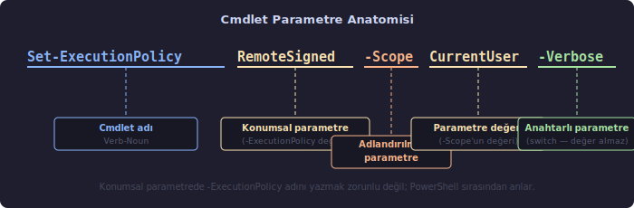
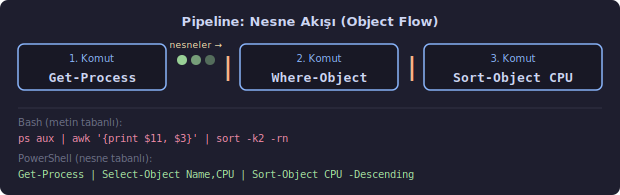
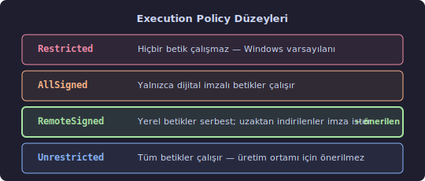

# PowerShell

PowerShell, Microsoft tarafından geliştirilen, .NET platformu üzerine inşa edilmiş bir **komut satırı kabuğu** (command-line shell) ve **betik dili**dir (scripting language). Windows, macOS ve Linux üzerinde çalışır.

## Kabuk (Shell) Kavramı

"Kabuk" terimi kasıtlı seçilmiş bir isimdir: işletim sisteminin çekirdeğini (kernel) dışarıdan saran, kullanıcıyla çekirdek arasında aracılık eden katmana verilen addır. Terminal penceresine yazdığınız komut doğrudan donanıma ulaşmaz; önce kabuğun içinden geçer.

Bir restoranı düşünün: siparişi siz verirsiniz, garson mutfakla konuşur, sonucu size getirir. Siz mutfakla doğrudan muhatap olmazsınız. Kabuk da tam bu rolü üstlenir — sizin yazdıklarınızı işletim sisteminin anlayacağı biçime çevirir ve yanıtı size geri sunar.

PowerShell, klasik Unix/Linux kabuklarından (Bash, sh, zsh) köklü biçimde ayrılır: komut çıktıları **düz metin değil, .NET nesneleridir**. Bu ayrım ilk bakışta küçük görünse de pratikte her şeyi değiştirir; bunu pipeline konusunda somut olarak göreceğiz.

---

## Cmdlet Yapısı (Verb-Noun Pattern)

PowerShell komutlarına **cmdlet** (*command-let*, "küçük komut" anlamında) denir. Her cmdlet `Fiil-İsim` (Verb-Noun) biçiminde adlandırılır:

| Cmdlet | Anlamı |
| --- | --- |
| `Get-Process` | Çalışan süreçleri listele |
| `Set-Location` | Çalışma dizinini değiştir |
| `New-Item` | Yeni dosya veya klasör oluştur |
| `Remove-Item` | Dosya veya klasör sil |
| `Stop-Process` | Süreci durdur |
| `Start-Service` | Sistem hizmetini başlat |

Bu adlandırma standardı öğrenildiğinde, daha önce hiç karşılaşılmamış bir cmdlet adı tahmin edilebilir hale gelir. "Hizmetleri nasıl listelerim?" sorusunun yanıtı `Get-Service`'tir; denemeden önce bile bilinebilir. Desen bir kez oturdu mu, binlerce cmdlet kendiliğinden anlamlıdır.


---

## Parametre Sözdizimi (Parameter Syntax)

Cmdlet'ler tek başlarına çalışabilse de asıl gücünü **parametre**lerle (parameter) ortaya koyar. Parametre, bir işlemin *nasıl* yapılacağını belirtir. Bir tarif düşünün: tarif "kek pişir" iken parametre "fırın sıcaklığı 180°C, süre 40 dakika" anlamına gelir. Aynı tarif, farklı parametrelerle farklı sonuçlar üretir.

PowerShell'de üç tür parametre vardır:

**1. Adlandırılmış Parametre (Named Parameter)** — `-ParamAdı Değer` biçiminde yazılır; ad ve değer açıkça belirtilir:

```powershell
Set-ExecutionPolicy -ExecutionPolicy RemoteSigned -Scope CurrentUser
```

**2. Konumsal Parametre (Positional Parameter)** — Parametre adı yazılmadan yalnızca değer verilir; cmdlet, değerin sırasına bakarak hangi parametreye ait olduğunu anlar:

```powershell
Get-ChildItem C:\Users   # C:\Users, -Path parametresinin konumsal değeridir
```

**3. Anahtarlı Parametre (Switch Parameter)** — Değer almaz; yalnızca varlığıyla etkisini gösterir. Elektrik düğmesi gibidir — yazılmışsa açık, yazılmamışsa kapalı:

```powershell
Sort-Object CPU -Descending   # -Descending bir anahtardır; ters sıralamayı etkinleştirir
```



---

## Temel Komutlar

### Değişken Tanımlama (Variable)

PowerShell'de değişkenler `$` işaretiyle başlar:

```powershell
$isim = "Ali"
Write-Output "Merhaba $isim"
```

**`Write-Output "Merhaba $isim"` — Parametreler:**

| Parametre | Değer | Açıklama |
| --- | --- | --- |
| `-InputObject` *(konumsal, 1. sıra)* | `"Merhaba $isim"` | Ekrana gönderilecek nesne veya metin. Parametre adı yazılmadan doğrudan değer verilir. |

Çift tırnak içindeki `$isim` **değişken iç içe geçirme** (string interpolation) ile çalışır: PowerShell, `$isim`'i çalışma anında değişkenin gerçek değeriyle değiştirir. Tek tırnak kullanıldığında bu yorumlama yapılmaz:

```powershell
Write-Output 'Merhaba $isim'   # Çıktı: Merhaba $isim  (değişken yorumlanmaz)
Write-Output "Merhaba $isim"   # Çıktı: Merhaba Ali     (değişken yerleştirilir)
```

---

### Süreçleri Listeleme (Get-Process)

```powershell
Get-Process
```

Parametresiz çalıştırıldığında sistemdeki tüm çalışan süreçleri listeler. Aynı cmdlet, parametrelerle çok daha odaklı sorgulamalar yapabilir:

```powershell
Get-Process -Name "chrome"
Get-Process -Id 1234
Get-Process -Name "chrome","code"
```

**Parametreler:**

| Parametre | Tür | Açıklama |
| --- | --- | --- |
| `-Name` *(konumsal, 1. sıra)* | Metin dizisi | Süreç adı. Joker karakter kabul eder: `"ch*"` ifadesi "chrome", "chkdsk" gibi `ch` ile başlayan tüm süreçleri getirir. |
| `-Id` | Tam sayı | PID (Process ID — Süreç Kimlik Numarası). İşletim sisteminin her çalışan sürece atadığı benzersiz numaradır. |
| `-ComputerName` | Metin dizisi | Uzak bir bilgisayardaki süreçleri sorgular. |

---

### Filtreleme (Where-Object)

```powershell
Get-Process | Where-Object { $_.CPU -gt 50 }
```

**`Where-Object { $_.CPU -gt 50 }` — Parametreler:**

| Parametre | Değer | Açıklama |
| --- | --- | --- |
| `-FilterScript` *(konumsal, 1. sıra)* | `{ $_.CPU -gt 50 }` | Süzgeç koşulunu tanımlayan **script bloğu** (ScriptBlock). Süslü parantezler `{ }` bir kod parçasını "şimdi çalıştırma, hazır tut" diye paketler. Pipeline'dan gelen her nesne bu bloktan geçirilir; blok `$true` üretirse nesne ileri iletilir, `$false` üretirse elenir. |

**`$_` nedir?**

`$_`, PowerShell'in **otomatik değişkeni**dir (automatic variable); pipeline üzerinden gelen geçerli nesneyi temsil eder. Bir eleme bandını düşünün: bant üzerindeki her ürün sırayla tek tek gelir, o an elde tutulana `$_` deniyor. Her nesne geldiğinde "bu nesnenin CPU özelliği 50'den büyük mü?" sorusu yeniden sorulur.

**Karşılaştırma Operatörleri (Comparison Operators):**

| Operatör | Anlamı | Kısaltmanın Açılımı |
| --- | --- | --- |
| `-gt` | büyüktür | **g**reater **t**han |
| `-lt` | küçüktür | **l**ess **t**han |
| `-ge` | büyük eşit | **g**reater than or **e**qual |
| `-le` | küçük eşit | **l**ess than or **e**qual |
| `-eq` | eşittir | **eq**ual |
| `-ne` | eşit değildir | **n**ot **e**qual |
| `-like` | joker karakter eşleşmesi | `*` ve `?` ile çalışır |
| `-match` | düzenli ifade eşleşmesi (regex) | |

PowerShell neden `>`, `<` yerine `-gt`, `-lt` kullanır? Çünkü `>` ve `<` kabuklarda çıktı yönlendirme için ayrılmıştır — `>` çıktıyı dosyaya yazar. Bu çakışmayı önlemek için metin tabanlı operatörler seçilmiştir.

---

### Sıralama (Sort-Object)

```powershell
Get-Process | Sort-Object CPU -Descending
```

**`Sort-Object CPU -Descending` — Parametreler:**

| Parametre | Değer | Açıklama |
| --- | --- | --- |
| `-Property` *(konumsal, 1. sıra)* | `CPU` | Sıralama kriteri olarak kullanılacak nesne özelliğinin (property) adı. Birden fazla kriter virgülle belirtilir: `Sort-Object LastName, FirstName` |
| `-Descending` | *(anahtarlı)* | Büyükten küçüğe sırala. Yazılmazsa varsayılan sıralama küçükten büyüğedir. |

---

### Seçim (Select-Object)

```powershell
Get-Process | Select-Object Name, CPU
```

**`Select-Object Name, CPU` — Parametreler:**

| Parametre | Değer | Açıklama |
| --- | --- | --- |
| `-Property` *(konumsal, 1. sıra)* | `Name, CPU` | Gösterilecek nesne özelliklerinin listesi. Nesnenin tüm alanları yerine yalnızca ilgili olanlar seçilir — veri kümesini daraltır ve okunabilirliği artırır. |

Ek kullanışlı parametreler:

| Parametre | Açıklama |
| --- | --- |
| `-First 5` | İlk 5 nesneyi al |
| `-Last 5` | Son 5 nesneyi al |
| `-Unique` | Yalnızca benzersiz değerleri döndür |
| `-ExpandProperty` | Bir özelliğin değerini nesne değil düz değer olarak çıkart |

---

### Klasör İçeriğini Listeleme (Get-ChildItem)

```powershell
Get-ChildItem C:\Users
```

**`Get-ChildItem C:\Users` — Parametreler:**

| Parametre | Değer | Açıklama |
| --- | --- | --- |
| `-Path` *(konumsal, 1. sıra)* | `C:\Users` | Listelemenin yapılacağı dizin yolu. Joker karakter kabul eder: `C:\Users\*\Desktop` tüm kullanıcıların masaüstünü getirir. |

`gci` kısaltmasıyla da yazılabilir. Linux'taki `ls` komutunun işlevsel karşılığıdır.

Sık kullanılan ek parametreler:

```powershell
Get-ChildItem C:\Proje -Recurse
Get-ChildItem C:\Proje -Filter "*.txt"
Get-ChildItem C:\Proje -File
Get-ChildItem C:\Proje -Directory
Get-ChildItem C:\Proje -Recurse -Filter "*.log" -Depth 3
```

| Parametre | Tür | Açıklama |
| --- | --- | --- |
| `-Recurse` | Anahtar | Alt dizinlere de iner; dizin ağacının tamamını tarar |
| `-Filter` | Metin | Dosya adı filtresi. `*` sıfır veya daha fazla karakter, `?` tek karakter yerine geçer |
| `-File` | Anahtar | Yalnızca dosyaları listeler; klasörleri atlar |
| `-Directory` | Anahtar | Yalnızca klasörleri listeler; dosyaları atlar |
| `-Hidden` | Anahtar | Gizli öğeleri de dahil eder |
| `-Depth` | Tam sayı | `-Recurse` ile birlikte kaç seviye derine inileceğini sınırlar |

---

### Fonksiyon Tanımı (Function)

```powershell
function Selamla($isim) {
    "Merhaba, $isim."
}

Selamla "Ali"
```

Fonksiyon parametreleri iki biçimde tanımlanabilir. Yukarıdaki kısa biçim çalışır, ancak üretim kodunda tercih edilen biçim `param` bloğuyla yapılandır:

```powershell
function Selamla {
    param(
        [string]$isim
    )
    "Merhaba, $isim."
}
```

`[string]` burada **tür kısıtlaması** (type constraint) görevi görür: parametre yalnızca metin kabul eder. Bu biçim, ileride zorunlu parametre işaretleme (`[Parameter(Mandatory)]`) ve yardım metni ekleme gibi özelliklere de kapı açar.

---

## Pipeline (Boru Hattı)

`|` (pipe, boru hattı) operatörü, PowerShell'in en belirleyici özelliğidir. Bir fabrika üretim bandını düşünün: birinci istasyon hammaddeyi işleyip ikinciye verir, ikinci kendi işini yapıp üçüncüye aktarır. Her istasyon yalnızca kendine düşen işi yapar, ama sonuçta ortaya çıkan ürün tüm istasyonların katkısıdır. PowerShell pipeline'ı da böyle çalışır — her komut, bir sonrakine **işlenmiş nesne** iletir:

```powershell
Get-Process | Where-Object { $_.CPU -gt 50 } | Sort-Object CPU -Descending
```

Bu tek satır şunu yapar:

1. Tüm süreçleri alır,
2. CPU > 50 olanları filtreler,
3. CPU değerine göre büyükten küçüğe sıralar.



**PowerShell ile Bash Karşılaştırması:**

```bash
# Bash: metin tabanlı — sütun sırası değişirse veya boşluk sayısı artarsa kod kırılabilir
ps aux | awk '{print $11, $3}' | sort -k2 -rn
```

```powershell
# PowerShell: nesne tabanlı — alan adıyla erişilir, biçim sorunları yoktur
Get-Process | Select-Object Name, CPU | Sort-Object CPU -Descending
```

Bash'te veriyi kullanabilmek için `awk`, `grep`, `cut` gibi araçlarla metni elle ayrıştırmak gerekir; çıktı biçimi değiştiğinde kod kırılabilir. PowerShell'de nesne üzerinde çalışıldığından bu kırılganlık yoktur.

---

## Execution Policy (Yürütme İlkesi)

PowerShell, betiklerin çalıştırılmasını güvenlik amacıyla kısıtlar. Windows'ta varsayılan politika `Restricted`'dir: hiçbir `.ps1` dosyası çalışmaz.

"Execute" kelimesi Latince *exsequi*'den gelir: "sonuna kadar götürmek, gerçekleştirmek." Policy ise Yunanca *politeia*'dan: "yönetim düzeni." Yani Execution Policy, "hangi betiklerin çalıştırılmasına izin verildiğini düzenleyen kural" demektir. Bu kural sisteme dışarıdan gelen zararlı betiklere karşı bir güvenlik katmanıdır.



| Politika | Davranış |
| --- | --- |
| `Restricted` | Hiçbir betik çalışmaz (Windows varsayılanı) |
| `AllSigned` | Yalnızca dijital imzalı betikler çalışır |
| `RemoteSigned` | Yerel betikler serbest; uzaktan indirilenler imza ister |
| `Unrestricted` | Her şey çalışır; üretim ortamı için önerilmez |

Mevcut politika düzeyini görmek için:

```powershell
Get-ExecutionPolicy -List
```

**`Get-ExecutionPolicy -List` — Parametreler:**

| Parametre | Tür | Açıklama |
| --- | --- | --- |
| `-List` | Anahtar | Tüm kapsam (scope) katmanları için politikaları ayrı ayrı listeler. Yazılmazsa yalnızca o an geçerli olan politika gösterilir. |

Geliştirme ortamı için önerilen ayar:

```powershell
Set-ExecutionPolicy RemoteSigned -Scope CurrentUser
```

**`Set-ExecutionPolicy RemoteSigned -Scope CurrentUser` — Parametreler:**

| Parametre | Değer | Açıklama |
| --- | --- | --- |
| `-ExecutionPolicy` *(konumsal, 1. sıra)* | `RemoteSigned` | Uygulanacak politika düzeyi. Yukarıdaki tablodaki dört değerden biri yazılır. |
| `-Scope` | `CurrentUser` | Değişikliğin hangi kapsamda geçerli olacağı. Aşağıdaki tabloya bakınız. |

**`-Scope` değerleri:**

| Değer | Kapsam | Yönetici Gerekli? |
| --- | --- | --- |
| `Process` | Yalnızca bu terminal oturumu; kapanınca sıfırlanır | Hayır |
| `CurrentUser` | Bu kullanıcı hesabı; kalıcıdır | Hayır |
| `LocalMachine` | Tüm sistem, tüm kullanıcılar; kalıcıdır | **Evet** |
| `UserPolicy` | Grup politikası (GPO) ile kullanıcıya uygulanan | GPO ile yönetilir |
| `MachinePolicy` | Grup politikası (GPO) ile makineye uygulanan | GPO ile yönetilir |

Bu komut yönetici yetkisi **gerektirmez**; yalnızca kendi kullanıcı hesabınıza uygulanır. Tüm sistemi kapsayan bir değişiklik için `-Scope LocalMachine` kullanılır ve bu durumda PowerShell'i **Yönetici (Administrator) olarak** açmak gerekir.

---

## PowerShell Betiği (.ps1) Oluşturma ve Çalıştırma

### Betik Dosyası Oluşturma

Uzantısı `.ps1` olan bir dosya oluşturun (örnek: `1-Giris.ps1`). `.ps1` uzantısı, PowerShell 1.0'dan gelen tarihsel bir isimlendirmedir.

```powershell
Write-Output "PowerShell betiği çalıştı."
```

### Betiği Çalıştırma

```powershell
./1-Giris.ps1
```

> **Not:** PowerShell hem `.\` (backslash, Windows) hem de `./` (forward slash, Unix) yol ayracını kabul eder. Her ikisi de çalışır; Linux alışkanlığıyla `./` yazmak doğrudur.

---

## Yardım Alma (Get-Help)

Herhangi bir cmdlet hakkında ayrıntılı bilgi için:

```powershell
Get-Help Get-Process
Get-Help Get-Process -Examples
Get-Help Get-Process -Full
```

**`Get-Help Get-Process -Examples` — Parametreler:**

| Parametre | Değer | Açıklama |
| --- | --- | --- |
| `-Name` *(konumsal, 1. sıra)* | `Get-Process` | Yardım istenecek cmdlet ya da kavramın adı. Joker karakter kabul eder: `Get-Help *Process*` adında "Process" geçen tüm yardım konularını listeler. |
| `-Examples` | *(anahtarlı)* | Yalnızca kullanım örneklerini gösterir. Teorik açıklamayı atlayıp doğrudan örnek görmek isteyenler için en kısa yoldur. |
| `-Full` | *(anahtarlı)* | Parametrelerin ayrıntılı açıklamaları, girdi/çıktı türleri ve notlar dahil tüm yardım içeriğini gösterir. |
| `-Online` | *(anahtarlı)* | Varsayılan tarayıcıda Microsoft'un güncel çevrimiçi belgelerini açar. Yerel yardım dosyaları eski kalmışsa bu parametre güncel içeriğe ulaştırır. |

---

## Dosya Boyutu Sorgulama

```powershell
(Get-Item "C:\dosya\yolu\ornek.txt").Length
```

**`Get-Item "C:\dosya\yolu\ornek.txt"` — Parametreler:**

| Parametre | Değer | Açıklama |
| --- | --- | --- |
| `-Path` *(konumsal, 1. sıra)* | `"C:\dosya\yolu\ornek.txt"` | Bilgi alınacak öğenin tam yolu. Dosya, klasör veya sürücü olabilir. |

`Get-Item` bir `FileInfo` nesnesi döndürür. Noktadan sonra gelen `Length`, bu nesnenin bayt cinsinden boyutunu tutan özelliğidir (property). Dıştaki parantez, önce cmdlet'in çalıştırılmasını, ardından dönen nesne üzerindeki özelliğe erişilmesini sağlar.

Dönen `FileInfo` nesnesi üzerinde erişilebilecek diğer özellikler:

```powershell
$dosya = Get-Item "C:\dosya\yolu\ornek.txt"
$dosya.Length           # Bayt cinsinden boyut
$dosya.Name             # Yalnızca dosya adı
$dosya.FullName         # Tam yol
$dosya.LastWriteTime    # Son değiştirilme tarihi
$dosya.Extension        # Uzantı (.txt)
```
