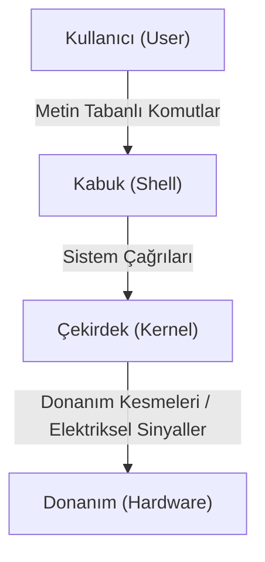

# Kabuk Programlama (Shell Programming)

Gençler, bir işletim sistemini (Operating System - OS) incelerken mimarinin katmanlı bir yapıdan oluştuğunu görürüz. En alt katmanda elektronik devrelerden, işlemciden ve bellek modüllerinden oluşan donanım (Hardware) bulunur. Donanımın hemen üzerinde, fiziksel kaynakları yöneten ve sisteme hayat veren çekirdek (Kernel) yer alır. Ancak sistemin kullanıcıları olarak bizler, çekirdekle doğrudan iletişim kurmayız; bu son derece karmaşık, donanıma bağımlı ve hata yapmaya açık bir süreç olurdu. İşte bu noktada kullanıcı ile çekirdek arasında bir ara yüzey olan kabuk (Shell) devreye girer.

Kabuk terimi, yapısı gereği bir çekirdeği saran ve onu dış dünyaya bağlayan koruyucu katman benzetmesinden gelir. Tıpkı bir cevizin özünü dış etkenlerden ayıran sert yüzeyi gibi, işletim sisteminin çekirdeği de kabuk aracılığıyla sarmalanır. Biz komutlarımızı kabuğa iletiriz, kabuk bunları yorumlar (Interpreter) ve çekirdeğin anlayabileceği sistem çağrılarına (System Calls) dönüştürür.



Kabuk üzerinde tek tek komut çalıştırmak günlük işler için yeterli olsa da, birbirini izleyen karmaşık işlemleri otomatize etmek istediğimizde betik (Script - Latince *scriptum*, yazılmış metin) yazmamız gerekir. Bu işletim sistemi iş akışlarını otomatikleştirme eylemine kabuk programlama adı verilir.

## Değişkenler ve Bellek Yönetimi

Bilgisayar belleği (RAM - Random Access Memory, Rastgele Erişimli Bellek), milyarlarca hücreden oluşan devasa bir depodur. Programlama dillerinde değişkenler (Variables), bu hücrelerdeki verilere belleğin fiziksel onaltılık (hexadecimal) adresleri yerine bizim belirlediğimiz etiketlerle ulaşmamızı sağlayan referanslardır.

Kabuk ortamında değişken tanımlamak ve atama yapmak oldukça sadedir:

```bash
sayac=10
sistem_adi="Linux"
```

Atama operatörü olan eşittir (`=`) işaretinin sağında veya solunda boşluk bırakmamak, kabuk programlamanın katı sözdizimi (Syntax - Eski Yunanca *syntaxis*, düzen/sıralama) kurallarından biridir. Boşluk bırakıldığında kabuk, ilk kelimeyi bir komut, eşittir işaretini ise o komutun bir parametresi sanarak hata üretecektir.

## Kontrol Yapıları

Algoritmalar, karar verme yetenekleriyle anlam kazanır. Bir koşulun doğru (True) veya yanlış (False) olmasına göre programın akış yönünü değiştirmek için koşullu ifadeler (Conditional Statements) kullanılır. 

```bash
if [ $sayac -gt 5 ]; then
    echo "Sayac 5'ten büyüktür."
else
    echo "Sayac 5'ten küçük veya eşittir."
fi
```

Buradaki `if` yapısı içerisinde kullanılan `-gt` ifadesi, İngilizce "Greater Than" (Daha Büyük) kelimelerinin kısaltmasıdır. Kabuk programlamada sayısal karşılaştırmalar yapılırken diğer programlama dillerinde sıkça karşılaştığınız `>` veya `<` operatörleri yerine bu tip kısaltmalar kullanılır. 

## Döngü Mekanizmaları

Bilgisayarların insanlara karşı en büyük üstünlüğü, tekrarlayan işleri yorulmadan ve hata yapmadan icra edebilmeleridir. Döngüler (Loops), belirli bir kod bloğunu bir koşul sağlandığı sürece veya veri yapılarındaki bir liste tamamlanana kadar tekrar tekrar çalıştırır.

```bash
for dosya in *.txt; do
    echo "İşlenen dosya: $dosya"
done
```

Bu yapı, bulunduğumuz dizindeki `.txt` uzantılı tüm dosyaları bulur ve her bir iterasyonda (Iteration - Latince *iterare*, tekrarlamak) ilgili dosya ismini değişkenin içine atarak bloğun içindeki işlemleri yürütür.

## Süreçler ve Çıkış Durumu

Her çalıştırılan komut veya betik sistem belleğinde yalıtılmış bir süreç (Process - Latince *processus*, ilerleme/gelişme) başlatır. Çekirdek, işi biten her sürecin ardından kabuğa sayısal bir çıkış durumu (Exit Status) kodu döndürür. Bu, POSIX tabanlı işletim sistemlerinin temel tasarım felsefesidir: Sistemde sessizlik esastır. Bir komut başarıyla tamamlanırsa ekrana gereksiz bilgiler yazdırmaz, ancak arka planda işletim sistemine `0` kodunu döndürür. Başarısızlık durumunda ise hatanın tipine göre `1` ile `255` arasında bir değer üretilir.

Bir önceki komutun nasıl sonuçlandığını `$?` özel değişkeni ile öğrenebiliriz:

```bash
mkdir yeni_dizin_yapisi

if [ $? -eq 0 ]; then
    echo "Dizin başarıyla oluşturuldu."
else
    echo "Dizin oluşturulurken bir hata meydana geldi."
fi
```

Buradaki `-eq` operatörü, İngilizce "Equal" (Eşit) anlamına gelir ve dönen kodun sıfır olup olmadığını denetler.

## Dosya Tanımlayıcıları ve Veri Akış Yönlendirmesi

Bir sürecin çevresiyle veri alışverişi yapabilmesi için işletim sistemi ona varsayılan girdi ve çıktı kanalları tahsis eder. Çekirdek seviyesindeki bu kanallara Dosya Tanımlayıcı (File Descriptor - FD) denir. Standart olarak her sürecin üç temel iletişim kanalı bulunur:

* `0`: Standart Girdi (Standard Input - stdin)
* `1`: Standart Çıktı (Standard Output - stdout)
* `2`: Standart Hata (Standard Error - stderr)

Sistem programlamada bir betik yazarken hata mesajlarını normal bilgi çıktılarından ayırmak, sistemin günlük (Log) kayıtlarının doğruluğu açısından kritiktir. İleri seviye betiklerde çıktıları şu şekilde yönlendiririz:

```bash
ls var_olmayan_bir_dizin > normal_sonuclar.txt 2> hata_kayitlari.log
```

Yukarıdaki işlemde, listeleme komutunun üreteceği geçerli sonuçlar `>` (veya gizli haliyle `1>`) operatörü üzerinden `normal_sonuclar.txt` dosyasına aktarılırken, dizin bulunamadığında işletim sisteminin üreteceği hata metni `2>` operatörü kullanılarak ayrı bir dosyaya gönderilmiştir. Bu izole edilmiş hata yönetimi yaklaşımı, sunucularda çalışan otonom servislerin hata ayıklama (Debugging) süreçlerini doğrudan etkileyen bir unsurdur.