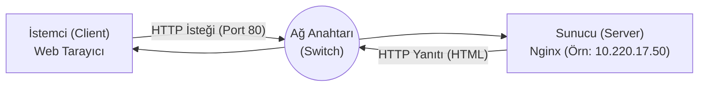

# Nginx Web Sunucusu Kurulumu ve Yerel Ağda İletişim

Ön Koşullar:
- İnternet bağlantısı.
- Sistemde Visual Studio Code (VS Code) yüklü olması.
- Tüm bilgisayarların aynı Yerel Ağa (Local Area Network - LAN) bağlı olması.

Gençler, bir bilgisayarın ağ üzerindeki temel işlevi, ya bir hizmet sunmak ya da sunulan bir hizmetten yararlanmaktır. Bu bağlamda iki temel kavram karşımıza çıkar: Sunucu (Server) ve İstemci (Client). Sunucu kelimesinin etimolojik kökeni Latince *servire* (hizmet etmek) fiiline dayanır; istemci ise yine Latince *cliens* (tabi olan, hizmet alan) kelimesinden türemiştir.

Bu çalışmada, bir web sunucusu (Web Server) kurarak kendi bilgisayarımızı ağdaki diğer cihazlara hizmet verecek yapıya getireceğiz.

## Adım 1: Nginx Web Sunucusunun Kurulumu

Nginx, günümüzde yüksek performanslı, eşzamanlı bağlantıları yönetme kabiliyetiyle öne çıkan bir web sunucusu yazılımıdır. Kuruluma başlamadan önce sistemdeki paket listelerini güncellemek gerekir.

```bash
sudo apt update
sudo apt install nginx -y
```

Burada kullandığımız `apt` (Advanced Package Tool - Gelişmiş Paket Aracı), sistemdeki yazılımları ve bağımlılıklarını yönetmemizi sağlar. Kurulum tamamlandığında Nginx arka planda otomatik olarak çalışmaya başlar. Bir tarayıcı açıp adres çubuğuna `http://localhost` yazdığınızda Nginx'in varsayılan sayfasını görmelisiniz. `localhost`, bilgisayarın kendisine (loopback - geri döngü) yaptığı donanımsal referanstır.

## Adım 2: Güvenlik Duvarı İzinlerini Ayarlama

Sunucu kendi içimizde sorunsuz çalışsa da, dışarıdan gelen isteklere kapalı olabilir. Güvenlik duvarı (Firewall), ağ trafiğini belirli kurallara göre denetleyen bir kalkandır. Ubuntu sistemlerinde genellikle UFW (Uncomplicated Firewall - Karmaşık Olmayan Güvenlik Duvarı) aracı kullanılır.

Ağ üzerindeki iletişim, belirli mantıksal kapılar üzerinden sağlanır. Bilişimde bu kapılara Port denir (Latince *porta* yani kapı kelimesinden gelir). Web trafiği olan HTTP (Hypertext Transfer Protocol - Hipermetin Aktarım Protokolü) standart olarak 80 numaralı portu kullanır.

Sistemdeki güvenlik duvarı profillerini listelemek için:
```bash
sudo ufw app list
```

HTTP trafiğine (80 portu) izin vermek için:
```bash
sudo ufw allow 'Nginx HTTP'
```

Durumu doğrulamak için:
```bash
sudo ufw status
```
Eğer sistem "inactive" yanıtı veriyorsa, güvenlik duvarı devrede değildir ve dışarıdan gelen tüm trafiğe zaten açıktır.

## Adım 3: Web Kök Dizininde Yetki Ayarlaması

Nginx, web sayfalarını varsayılan olarak `/var/www/html` dizininde barındırır. Linux tabanlı işletim sistemlerinde (POSIX standartları) güvenlik mimarisi gereği, bu dizinin sahibi en yetkili kullanıcı olan `root`'tur. Dosyaları doğrudan düzenleyebilmek için bu dizinin sahipliğini (ownership) aktif kullanıcıya devretmemiz gerekir.

```bash
sudo chown -R $USER:$USER /var/www/html
```

Bu komuttaki `chown` (Change Owner - Sahibi Değiştir) ifadesi, dizin hiyerarşisindeki yetkileri mevcut kullanıcımıza (`$USER`) atar. `-R` parametresi ise işlemin alt dizinler için de özyinelemeli (recursive) olarak uygulanmasını sağlar.

## Adım 4: İçerik Oluşturma

Kök dizinde yer alan varsayılan dosyayı bir kod düzenleyici ile açacağız.

```bash
code /var/www/html
```

VS Code açıldığında, dizindeki `index.nginx-debian.html` (veya `index.html`) dosyasını göreceksiniz. Açılan dosyadaki içeriği temizleyip, kendi metninizi barındıran basit bir HTML (HyperText Markup Language - Hipermetin İşaretleme Dili) kod bloğu ekleyebiliriz:

> **Alternatif Yöntem:** Mevcut dosyayı düzenlemek yerine, VS Code'da yeni boş bir metin belgesi oluşturup aşağıdaki HTML kodunu yapıştırdıktan sonra, **Dosya > Farklı Kaydet (File > Save As)** seçeneğini kullanarak doğrudan `/var/www/html` klasörünün içine `index.html` ismiyle de kaydedebilirsiniz.

```html
<!DOCTYPE html>
<html lang="tr">
<head>
    <meta charset="UTF-8">
    <title>Sistem Programlama - Nginx</title>
    <style>
        body {
            font-family: sans-serif;
            text-align: center;
            margin-top: 100px;
            background-color: #f4f4f9;
        }
        h1 { color: #2c3e50; }
        p { color: #7f8c8d; }
    </style>
</head>
<body>
    <h1>Merhaba!Buraya adınızı yazınki size bağlandığımız anlaşılsın.</h1>
    <p>Bu metin, yerel ağda çalışan bir Nginx sunucusundan iletilmektedir.</p>
</body>
</html>
```

Dosyayı kaydettikten sonra tarayıcıdan `http://localhost` adresini yenilediğinizde, metnin güncellendiğini göreceksiniz.

## Adım 5: Yerel IP Adresini Öğrenme ve Ağ Üzerinde İletişim

Yerel ağdaki diğer makinelerin sunucunuza erişebilmesi için, IP (Internet Protocol - İnternet Protokolü) adresinize ihtiyaçları vardır. IP adresi, ağ üzerindeki cihazların birbirini bulmasını sağlayan mantıksal bir numaralandırma sistemidir.

Terminal üzerinden IP adresinizi öğrenmek için şu komutu kullanın:
```bash
hostname -I
```

Çıktıda genellikle `192.168.x.x` veya `10.x.x.x` formatında bir adres yer alır. Bu adres, bulunduğunuz LAN içerisindeki kimliğiniz, yani bir nevi dijital ev adresinizdir.

Gençler, laboratuvardaki diğer arkadaşlarınızın sunucularına ulaşmak aslında son derece doğrusal bir işlemdir. Tıpkı bir arkadaşınıza posta göndermek için onun ev adresini zarfın üzerine yazmanız gerektiği gibi, ağ üzerindeki düğümler (Node - Latince *nodus*, bağ/düğüm anlamına gelir) de birbirleriyle konuşabilmek için bu IP adreslerini kullanırlar. 

Arkadaşınızın bilgisayarında çalışan web sunucusuna bağlanmak için kendi bilgisayarınızda Chrome, Firefox gibi bir web tarayıcısı (Web Browser) açın. Tarayıcının üst kısmında yer alan adres çubuğuna (URL Bar - Uniform Resource Locator), arkadaşınızın terminalinden az önce öğrendiği IP adresini yazıp Enter tuşuna basın. Örneğin, adres çubuğuna `http://10.220.1.50` gibi ip yazdığınızda, arkadaşınızın az önce hazırladığı HTML sayfasını kendi ekranınızda göreceksiniz.

Peki siz Enter tuşuna bastığınız anda arka planda tam olarak ne gerçekleşiyor? Tarayıcınız, girdiğiniz IP adresine doğru yola çıkmak üzere bir HTTP İsteği (Request) paketi hazırlar. Bu paket, bilgisayarınızdan çıkıp laboratuvarımızdaki Ağ Anahtarına (Switch) ulaşır. Switch, ağdaki cihazların fiziksel adresleri (MAC - Media Access Control) ile bu mantıksal IP adreslerini eşleştiren bir yönlendirme tablosu (Routing Table) tutar. İstediğiniz IP adresinin hangi kablonun ucunda olduğunu bilir ve paketinizi doğrudan o arkadaşınızın makinesine yönlendirir.

Arkadaşınızın bilgisayarında sessizce bekleyen Nginx sunucusu, 80 numaralı port üzerinden gelen bu isteği yakalar. Gelen isteğin içeriğine bakar, diskteki `/var/www/html/index.html` dosyasını okur ve sizin tarayıcınıza bir HTTP Yanıtı (Response) olarak geri gönderir. Son aşamada ise sizin tarayıcınız, gelen bu metin tabanlı kodları işleyerek (Rendering) ekranda okunabilir, düzenli bir web sayfası haline getirir.

Aşağıdaki şemada, bir yerel ağdaki istemci-sunucu iletişiminin temel modeli görülmektedir:



Bu mimaride istemci HTTP üzerinden 80 numaralı porta bir istek gönderir. Ağ anahtarı bu isteği doğru IP adresine yönlendirir ve sunucu işlediği belgeyi aynı yol üzerinden istemciye geri iletir. Bu yapı web teknolojilerinin temel çalışma prensibidir.
