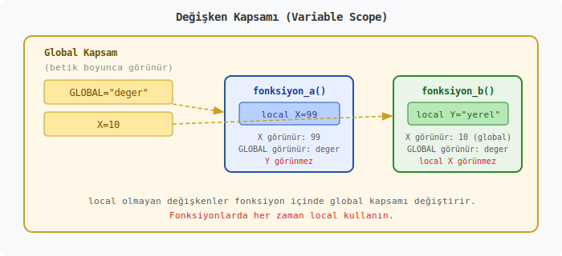
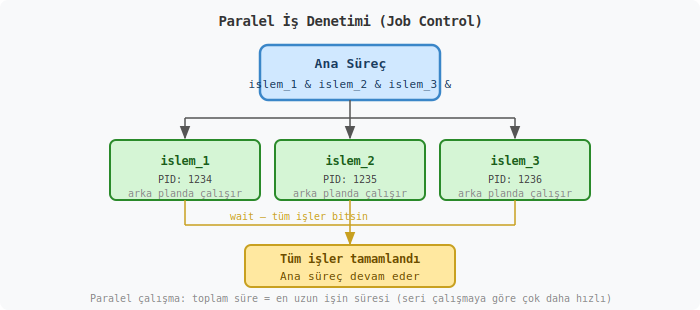

# Linux MATE Terminal Komutları Ders Notu

## Neden Linux ve Terminal?

MS-DOS ders notunda komut satırının bilgisayar mühendisinin İngiliz anahtarı olduğundan söz etmiştik. Linux dünyasında bu araç çok daha merkezi bir konumdadır. Windows'ta komut satırı bir alternatifken, Linux'ta terminal neredeyse birincil çalışma ortamıdır. Sunucuların büyük çoğunluğu Linux çalıştırır ve bu sunucuların çoğunda grafik arayüz bile kurulu değildir. Dolayısıyla terminale hakim olmak, bir bilgisayar mühendisi için seçenek değil zorunluluktur.

---

## Linux ve MATE Masaüstü Hakkında

Linux, 1991'de Linus Torvalds tarafından geliştirilmeye başlanan açık kaynaklı (open source) bir işletim sistemi çekirdeğidir (kernel). Çekirdek tek başına bir işletim sistemi oluşturmaz; üzerine eklenen araçlar, kütüphaneler ve masaüstü ortamlarıyla birlikte bir **dağıtım** (distribution, kısaca distro) haline gelir. Ubuntu, Fedora, Debian, Linux Mint bunlardan bazılarıdır.

**MATE** (okunuşu: "ma-te", Güney Amerika'da içilen mate bitkisinden gelir), GNOME 2 masaüstü ortamının devamı olan hafif ve geleneksel bir masaüstü ortamıdır. Klasik menü yapısı, panel düzeni ve düşük sistem kaynak tüketimiyle öne çıkar. Özellikle eski donanımlarda ve sunucu yönetimi yapan kullanıcılar arasında tercih edilir.

MATE'te terminali açmak için:

1. **Üst menü → Uygulamalar → Sistem Araçları → MATE Terminal**
2. Masaüstünde sağ tık → "Terminali Burada Aç"
3. Kısayol: Genellikle **Ctrl + Alt + T** (dağıtıma göre değişebilir)

Açıldığında şuna benzer bir satır görürsünüz:

```text
kullanici@bilgisayar:~$
```

Bu satıra **prompt** (komut istemi) denir. Parçalara ayırırsak:

- `kullanici` — oturum açmış kullanıcı adı
- `@` — "at" işareti, İngilizce "şuradaki" anlamında
- `bilgisayar` — makinenin adı (hostname)
- `:` — ayraç
- `~` — bulunduğunuz dizin (`~` ev dizininin kısaltmasıdır, yani `/home/kullanici`)
- `$` — normal kullanıcı olduğunuzu gösterir (`#` ise root/yönetici demektir)

Windows'taki `C:\Users\Kullanici>` satırının Linux karşılığı budur; ama daha fazla bilgi taşır.

---

## Shell Kavramı

Terminal bir penceredir; asıl komutları yorumlayan program **shell** (kabuk) adını taşır. Linux'ta en yaygın shell **Bash** (Bourne Again SHell — "Yeniden Doğan Bourne Kabuğu") olup, Stephen Bourne'un 1979'daki orijinal sh kabuğunun modern devamıdır. MATE Terminal varsayılan olarak Bash kullanır.

Hangi shell kullandığınızı görmek için:

```bash
echo $SHELL
/bin/bash
```

> **MS-DOS karşılaştırması:** Windows'ta cmd.exe ne ise, Linux'ta bash odur. Ama bash çok daha güçlüdür: değişken işlemleri, koşullar, döngüler, fonksiyonlar — hepsi doğrudan shell içinde yapılabilir.

---

## BÖLÜM 1 — Dosya Sistemi ve Temel Gezinme

### Linux Dosya Sistemi Yapısı

Windows'ta her sürücünün bir harfi vardır: `C:\`, `D:\`. Linux'ta böyle bir şey yoktur. Tek bir kök (root) dizin vardır ve o da `/` (eğik çizgi, slash) ile gösterilir. Her şey bu kökten dallanır — USB bellek de, ikinci hard disk de, ağ paylaşımları da bu ağaca bir noktadan bağlanır (mount edilir).

```text
/
├── bin/          Temel komutlar (binary — çalıştırılabilir dosyalar)
├── boot/         Önyükleme dosyaları
├── dev/          Aygıt dosyaları (device)
├── etc/          Yapılandırma dosyaları (editable text configuration)
├── home/         Kullanıcı ev dizinleri
│   ├── ali/
│   └── zeynep/
├── lib/          Kütüphaneler (library)
├── media/        Takılabilir aygıtlar (USB, CD)
├── mnt/          Geçici bağlama noktaları (mount)
├── opt/          Opsiyonel yazılımlar
├── proc/         Süreç bilgileri (process) — sanal dosya sistemi
├── root/         root kullanıcısının ev dizini
├── sbin/         Sistem yönetim komutları (system binary)
├── tmp/          Geçici dosyalar (temporary)
├── usr/          Kullanıcı programları ve verileri (Unix System Resources)
│   ├── bin/
│   ├── lib/
│   └── share/
└── var/          Değişken veriler (variable) — loglar, veritabanları
```

Her dizinin bir amacı vardır. `/etc` yapılandırma dosyalarını tutar — bir binanın teknik odası gibidir. `/home` kullanıcıların kişisel alanıdır — binadaki daireler gibi. `/tmp` geçici dosyalar içindir — binanın çöp odası gibi, düzenli olarak temizlenir.

Burada dikkat çeken bir fark: Linux'ta dizin ayracı `/` (slash), Windows'ta `\` (backslash) kullanılır. Bu basit fark, iki sistem arasında geçiş yapanlarda sık hata sebebidir.

> **Not:** Linux dosya sistemi **büyük-küçük harf duyarlıdır** (case-sensitive). `Rapor.txt`, `rapor.txt` ve `RAPOR.TXT` üç farklı dosyadır. Windows'ta bunlar aynı dosyayı ifade eder. Bu fark özellikle başlangıçta dikkat gerektirir.

---

### `pwd` — Neredeyim?

**pwd** (Print Working Directory — Çalışma Dizinini Yazdır) komutu, o an bulunduğunuz dizinin tam yolunu gösterir.

```bash
$ pwd
/home/kullanici
```

Windows'taki `cd` (parametresiz) komutunun karşılığıdır. Terminalde kaybolduğunuzda ilk yazacağınız komut budur.

---

### `ls` — Dizin İçeriğini Listele

**ls** (List — Listele) komutu, Windows'taki `dir` komutunun karşılığıdır.

```bash
$ ls
Belgeler  İndirilenler  Masaüstü  Müzik  Resimler  Videolar
```

Varsayılan çıktı sade ve yatay dizilimlidir. Detay için parametreler eklenir:

```bash
$ ls -l
toplam 24
drwxr-xr-x 2 kullanici kullanici 4096 Şub 16 10:30 Belgeler
drwxr-xr-x 2 kullanici kullanici 4096 Şub 16 09:15 İndirilenler
-rw-r--r-- 1 kullanici kullanici 1234 Şub 15 22:10 rapor.txt
```

Bu çıktıyı satır satır okuyalım. Soldaki `drwxr-xr-x` ifadesi dosya izinlerini (permissions) gösterir — buna ileride döneceğiz. Sonra bağlantı sayısı, sahip (owner), grup (group), boyut (bayt), tarih ve isim gelir.

**Sık kullanılan parametreler:**

| Parametre | Anlamı |
|-----------|--------|
| `ls -l` | Uzun (long) format — detaylı bilgi |
| `ls -a` | Gizli dosyalar dahil tüm (all) dosyalar |
| `ls -la` | İkisinin birleşimi — en yaygın kullanım |
| `ls -lh` | Boyutları okunabilir (human-readable) formatta göster (KB, MB, GB) |
| `ls -lt` | Tarihe (time) göre sırala, en yeni en üstte |
| `ls -lS` | Boyuta (size) göre sırala, en büyük en üstte |
| `ls -R` | Alt dizinleri de (recursive) listele |
| `ls -d */` | Sadece dizinleri listele |

```bash
$ ls -lh
-rw-r--r-- 1 kullanici kullanici 1.2K Şub 15 22:10 rapor.txt
```

`1.2K` ifadesi `1234` bayttan çok daha okunabilirdir.

> **Gizli dosyalar:** Linux'ta nokta (`.`) ile başlayan dosyalar gizlidir. Örneğin `.bashrc`, `.profile`. Bunları görmek için `-a` parametresi şarttır. Windows'taki `attrib +h` mekanizmasının aksine, burada gizlilik sadece isimlendirme kuralıyla sağlanır.

---

### `cd` — Dizin Değiştir

**cd** (Change Directory — Dizin Değiştir), her iki sistemde de aynı adı taşıyan nadir komutlardandır.

```bash
$ cd Belgeler
$ pwd
/home/kullanici/Belgeler

$ cd /var/log
$ pwd
/var/log
```

**Özel kısayollar:**

| Komut | Anlamı |
|-------|--------|
| `cd ..` | Bir üst dizine çık |
| `cd /` | Kök dizine git |
| `cd ~` | Ev dizinine git (veya sadece `cd`) |
| `cd -` | Bir önceki dizine dön |

`cd -` özellikle kullanışlıdır. İki dizin arasında sık sık gidip geliyorsanız, her seferinde uzun yol yazmak yerine `cd -` ile son bulunduğunuz yere dönersiniz. Televizyon kumandasındaki "önceki kanal" tuşu gibidir.

```bash
$ cd /var/log
$ cd /etc
$ cd -
/var/log
```

**Mutlak ve göreli yol:**

- **Mutlak yol:** Kökten başlar. `/home/kullanici/Belgeler`
- **Göreli yol:** Bulunduğunuz yerden başlar. `Belgeler/Raporlar`

Windows'tan farklı olarak Linux'ta sürücü harfi yoktur, dolayısıyla sürücü değiştirme diye bir kavram da yoktur.

---

### `mkdir` — Dizin Oluştur

**mkdir** (Make Directory — Dizin Oluştur), Windows'taki `md` komutunun karşılığıdır.

```bash
mkdir Projeler
mkdir -p Projeler/Odev1/Veriler
```

`-p` parametresi (parents — üst dizinler) iç içe dizinleri tek seferde oluşturur. Ara dizinler yoksa onları da yaratır. Windows'taki `md Projeler\Odev1\Veriler` komutu varsayılan olarak bunu yapar, Linux'ta ise `-p` parametresi açıkça belirtilmelidir.

---

### `rmdir` ve `rm` — Dizin ve Dosya Silme

**rmdir** (Remove Directory — Dizin Kaldır) sadece boş dizinleri siler:

```bash
rmdir BosKlasor
```

Pratikte `rmdir` az kullanılır çünkü dizinler çoğunlukla boş değildir. Dolu dizinleri silmek için `rm` komutu kullanılır:

```bash
rm -r Projeler
rm -rf Projeler
```

| Parametre | Anlam |
|-----------|-------|
| `-r` | Özyinelemeli (recursive) — alt dizinler dahil sil |
| `-f` | Zorla (force) — onay sorma |
| `-i` | Her dosya için onay iste (interactive) |

> ⚠️ **Dikkat:** `rm -rf /` komutu, sistemdeki her şeyi silmeye çalışır. Modern Linux dağıtımları `--no-preserve-root` olmadan buna izin vermez, ama yine de `rm -rf` komutunu yazmadan önce iki kere, hatta üç kere kontrol edin. Özellikle değişken kullanırken: `rm -rf $DIZIN/` yazıp `$DIZIN` boşsa, bu komut `rm -rf /` haline gelir. Bu hatayı yapan deneyimli sistem yöneticileri bile vardır.

---

### `tree` — Dizin Ağacını Görüntüle

Windows'taki `tree` komutuyla aynı işlevi görür. Çoğu dağıtımda varsayılan olarak kurulu gelmez:

```bash
$ sudo apt install tree    # Debian/Ubuntu tabanlı sistemlerde kurulum
$ tree
.
├── Belgeler
│   ├── Raporlar
│   └── Sunumlar
├── Kod
│   ├── Python
│   └── Java
└── Veriler
    ├── Ham
    └── Islemli
```

`tree -L 2` sadece iki seviye derinliğe kadar gösterir. `tree -f` tam dosya yollarını, `tree -h` dosya boyutlarını okunabilir formatta gösterir.

---

### `clear` — Ekranı Temizle

Windows'taki `cls` komutunun karşılığıdır.

```bash
clear
```

Kısayol: **Ctrl + L** aynı işi yapar ve daha hızlıdır. Parmaklarınız zamanla bunu otomatik yapacaktır.

---

### 🔨 Uygulama 1 — Dizin Yapısı Oluşturma ve Gezinme

```bash
# 1. Çalışma dizini oluştur
mkdir -p ~/DersTest
cd ~/DersTest

# 2. Proje yapısını oluştur
mkdir -p Belgeler/Raporlar
mkdir -p Belgeler/Sunumlar
mkdir -p Kod/Python
mkdir -p Kod/Java
mkdir -p Veriler/Ham
mkdir -p Veriler/Islemli

# 3. Yapıyı doğrula
tree

# 4. Gezinme pratiği
cd Kod/Python
pwd
cd ../Java
pwd
cd ~/DersTest
pwd
cd -

# 5. ls ile kontrol
ls -la
ls -R
```

`~` (tilde) karakteri ev dizininin kısayoludur. `~/DersTest` ifadesi `/home/kullanici/DersTest` anlamına gelir. Bu kısayol her kullanıcı için kendi ev dizinini gösterir — taşınabilir bir yol ifadesidir.

`#` ile başlayan satırlar yorum (comment) satırlarıdır. Bash bunları atlar. Windows'taki `REM` komutunun karşılığıdır.

---

## BÖLÜM 2 — Dosya İşlemleri

### `touch` — Dosya Oluştur / Zaman Damgasını Güncelle

**touch** komutu, dosya yoksa boş bir dosya yaratır, varsa zaman damgasını (timestamp) günceller.

```bash
touch dosya.txt
touch dosya1.txt dosya2.txt dosya3.txt
```

Latince *tangere* (dokunmak) kökünden gelen İngilizce "touch" kelimesi burada tam karşılığını bulur: dosyaya "dokunursunuz", ya yaratırsınız ya da zaman damgasını güncellersiniz.

> **MS-DOS karşılığı:** Windows'ta boş dosya yaratmak için `echo. > dosya.txt` veya `type nul > dosya.txt` yazılırdı. Linux'ta `touch` çok daha temiz bir çözümdür.

---

### `echo` ve Yönlendirme

Windows'taki gibi `echo` metni ekrana yazar ve yönlendirme operatörleriyle dosyaya yazabilir:

```bash
$ echo "Merhaba Dunya"
Merhaba Dunya

$ echo "Birinci satir" > dosya.txt
$ echo "Ikinci satir" >> dosya.txt
```

`>` üzerine yazar, `>>` ekler — bu mantık her iki sistemde de aynıdır.

Bash'te çift tırnak (`"`) ve tek tırnak (`'`) arasında fark vardır:

```bash
$ ISIM="Linux"
$ echo "Merhaba $ISIM"
Merhaba Linux

$ echo 'Merhaba $ISIM'
Merhaba $ISIM
```

Çift tırnak içinde değişkenler açılır (expand edilir), tek tırnak içinde her şey olduğu gibi kalır. Bu ayrım Bash programlamada sık karşılaşılan bir hatanın kaynağıdır.

---

### `cat` — Dosya İçeriğini Göster ve Birleştir

**cat** (Concatenate — Birleştir) komutu, Windows'taki `type` komutunun karşılığıdır ama daha yeteneklidir.

```bash
$ cat dosya.txt
Birinci satir
Ikinci satir
```

**Birden fazla dosyayı birleştirme:**

```bash
cat dosya1.txt dosya2.txt > birlesik.txt
```

Bu komut iki dosyanın içeriğini birleştirip yeni bir dosyaya yazar. `cat`'in asıl adının "concatenate" (birleştir) olmasının sebebi budur.

**Satır numarası ile gösterme:**

```bash
$ cat -n dosya.txt
     1  Birinci satir
     2  Ikinci satir
```

---

### `less` ve `more` — Sayfa Sayfa Okuma

Uzun dosyalarda `cat` her şeyi bir anda ekrana döker ve baş taraf kaybolur. `less` ve `more` komutları dosyayı sayfa sayfa gösterir.

```bash
less /var/log/syslog
more /var/log/syslog
```

`less`, `more`'un gelişmiş versiyonudur. Adı bir kelime oyunudur: "less is more" (az, çoktur).

| Tuş | İşlev (less içinde) |
|-----|---------------------|
| Space | Bir sayfa ileri |
| b | Bir sayfa geri |
| / | Metin ara (aşağı doğru) |
| ? | Metin ara (yukarı doğru) |
| n | Sonraki arama sonucu |
| g | Dosya başına git |
| G | Dosya sonuna git |
| q | Çık |

`less` içindeyken `/hata` yazıp Enter'a basarsanız, dosyada "hata" kelimesini arar. Büyük log dosyalarını incelerken vazgeçilmez bir yöntemdir.

---

### `head` ve `tail` — Dosyanın Başı ve Sonu

```bash
head dosya.txt           # İlk 10 satır (varsayılan)
head -n 5 dosya.txt      # İlk 5 satır
tail dosya.txt           # Son 10 satır
tail -n 20 dosya.txt     # Son 20 satır
tail -f /var/log/syslog  # Canlı takip (follow)
```

`tail -f` özellikle log dosyalarını izlerken çok kullanılır. `-f` (follow — takip et) parametresi, dosyaya yeni satır eklendikçe onu anında ekrana yansıtır. Bir güvenlik kamerasının canlı yayını gibidir: dosya büyüdükçe yeni satırları görürsünüz. Çıkmak için **Ctrl + C** basarsınız.

> **MS-DOS karşılığı:** Windows'ta `head` ve `tail` komutu yoktur. Benzer işlem ancak `more` veya `findstr` ile dolambaçlı yollardan yapılabilir.

---

### `cp` — Dosya Kopyala

**cp** (Copy — Kopyala), Windows'taki `copy` komutunun karşılığıdır.

```bash
cp dosya.txt yedek.txt
cp dosya.txt Belgeler/
cp dosya.txt Belgeler/yeni_isim.txt
```

**Dizin kopyalama:**

```bash
cp -r Kaynak/ Hedef/
```

`-r` (recursive — özyinelemeli) parametresi dizinleri alt dizinleriyle birlikte kopyalar. Windows'taki `xcopy /s` veya `robocopy` işlevinin karşılığıdır.

**Faydalı parametreler:**

| Parametre | Anlam |
|-----------|-------|
| `-r` | Dizinleri özyinelemeli kopyala |
| `-i` | Üzerine yazmadan önce sor (interactive) |
| `-v` | Her kopyalanan dosyayı göster (verbose — ayrıntılı) |
| `-p` | İzinleri ve zaman damgasını koru (preserve) |
| `-u` | Sadece daha yeni dosyaları kopyala (update) |

```bash
cp -rvi Projeler/ Yedek/
```

Bu komut Projeler dizinini Yedek'e kopyalar, her dosya için bilgi verir ve üzerine yazmadan önce sorar.

---

### `mv` — Taşı veya Yeniden Adlandır

**mv** (Move — Taşı), Windows'taki `move` ve `ren` komutlarının birleşimidir.

```bash
mv dosya.txt Belgeler/         # Taşı
mv eski_isim.txt yeni_isim.txt # Yeniden adlandır
mv Belgeler/rapor.txt .        # Belgeler'den bulunduğun dizine taşı
```

Sondaki `.` (nokta) "bulunduğum dizin" anlamına gelir. `..` bir üst dizin, `.` bulunduğunuz dizindir.

---

### `rm` — Dosya Sil

**rm** (Remove — Kaldır), Windows'taki `del` komutunun karşılığıdır.

```bash
rm dosya.txt
rm -i dosya.txt     # Onay iste
rm *.txt            # Tüm .txt dosyalarını sil
rm -r dizin/        # Dizini içeriğiyle birlikte sil
```

Linux'ta çöp kutusu kavramı terminal düzeyinde yoktur. `rm` ile silinen dosya gider. Masaüstü ortamında dosya yöneticisinden sildiğinizde çöp kutusuna gider, ama terminalden sildiğinizde doğrudan silinir.

---

### `ln` — Bağlantı Oluştur (Link)

**ln** (Link — Bağlantı) komutu, Windows'taki kısayolların (shortcut) daha güçlü bir versiyonunu oluşturur.

```bash
ln -s /var/log/syslog ~/loglar_kisayol    # Sembolik bağlantı
ln dosya.txt dosya_hardlink.txt            # Sert bağlantı
```

İki tür bağlantı vardır:

- **Sembolik bağlantı** (symbolic link, symlink): Bir dosyaya veya dizine işaret eden kısayoldur. `-s` parametresiyle oluşturulur. Orijinal silinirse bağlantı kırılır.
- **Sert bağlantı** (hard link): Aynı veriye farklı bir isim verir. Orijinal silinse bile veri erişilebilir kalır, çünkü veri diskte tek bir yerdedir ve iki isim aynı veriye işaret eder.

Sembolik bağlantılar çok daha yaygın kullanılır. Uzun dizin yollarına kısayol oluşturmak, farklı versiyonlar arasında geçiş yapmak gibi senaryolarda kullanılır.

---

### Joker Karakterler (Wildcards / Globbing)

Windows'ta da olan `*` ve `?` joker karakterleri Linux'ta da geçerlidir, üzerine birkaç ek vardır:

| Joker | Anlam | Örnek |
|-------|-------|-------|
| `*` | Sıfır veya daha fazla karakter | `*.txt` — tüm txt dosyaları |
| `?` | Tam bir karakter | `dosya?.txt` — dosya1.txt, dosyaA.txt |
| `[abc]` | Köşeli parantez içindeki karakterlerden biri | `dosya[123].txt` — dosya1.txt, dosya2.txt, dosya3.txt |
| `[a-z]` | Aralıktaki karakterlerden biri | `[a-z]*.txt` — küçük harfle başlayan txt dosyaları |
| `[!abc]` | Bu karakterler dışındakiler | `dosya[!0-9].txt` — sayı ile bitmeyenler |
| `{a,b,c}` | Küme parantezi — alternatifleri dener | `*.{txt,md,csv}` — txt, md veya csv uzantılı dosyalar |

```bash
ls *.{jpg,png,gif}      # Tüm resim dosyaları
cp rapor[1-5].txt Yedek/ # rapor1.txt'den rapor5.txt'ye kadar kopyala
```

Küme parantezi (`{}`) özelliği Bash'e özgüdür ve Windows cmd'de yoktur. Birden fazla uzantıyı tek satırda ele almak için çok pratiktir.

---

### 🔨 Uygulama 2 — Dosya İşlemleri Pratiği

```bash
# 1. Çalışma alanı oluştur
mkdir -p ~/DosyaPratik && cd ~/DosyaPratik

# 2. Dosyalar oluştur
echo "Birinci dosya icerigi" > dosya1.txt
echo "Ikinci dosya icerigi" > dosya2.txt
echo "Ucuncu dosya icerigi" > dosya3.txt

# 3. Dosyaları listele
ls -l

# 4. cat ile içeriği göster
cat dosya1.txt

# 5. Dosyaya ekleme yap
echo "Eklenen satir" >> dosya1.txt
cat -n dosya1.txt

# 6. Yedek dizini oluştur ve kopyala
mkdir Yedek
cp *.txt Yedek/
ls -l Yedek/

# 7. Dosya yeniden adlandır
mv dosya1.txt ana_dosya.txt
ls

# 8. Sembolik bağlantı oluştur
ln -s ~/DosyaPratik/ana_dosya.txt ~/Masaustu/kisayol.txt
ls -l ~/Masaustu/kisayol.txt

# 9. Bir dosyayı sil (onaylı)
rm -i dosya3.txt

# 10. Yapıyı kontrol et
tree ~/DosyaPratik
```

`&&` operatörü Windows'taki gibi çalışır: birinci komut başarılıysa ikinciyi çalıştırır.

---

## BÖLÜM 3 — Metin İşleme

Linux'un en güçlü yanlarından biri metin işleme araçlarıdır. Windows'ta `find` ve `findstr` ile yapılabilen işlemler, Linux'ta çok daha zengin bir araç setiyle yapılır.

### `grep` — Metin Ara

**grep** (Global Regular Expression Print — Genel Düzenli İfade Yazdırma) Linux'un en önemli komutlarından biridir.

```bash
grep "hata" log.txt
grep -i "hata" log.txt       # Büyük-küçük harf duyarsız
grep -n "hata" log.txt       # Satır numarası göster
grep -c "hata" log.txt       # Eşleşen satır sayısı
grep -r "TODO" ~/Projeler/   # Alt dizinlerde de ara
grep -v "bilgi" log.txt      # Eşleşmeyen satırları göster
```

| Parametre | Anlam |
|-----------|-------|
| `-i` | Büyük-küçük harf duyarsız (ignore case) |
| `-n` | Satır numarası (number) |
| `-c` | Eşleşme sayısı (count) |
| `-r` | Özyinelemeli arama (recursive) |
| `-v` | Ters eşleşme — eşleşmeyenleri göster (invert) |
| `-l` | Sadece dosya adlarını göster (files with matches) |
| `-w` | Tam kelime eşleştir (word) |
| `--color` | Eşleşen kısmı renklendir |

**Düzenli ifade (regex) örnekleri:**

```bash
grep "^hata" log.txt         # Satır başında "hata" olanlar
grep "hata$" log.txt         # Satır sonunda "hata" olanlar
grep "^$" dosya.txt          # Boş satırlar
grep -E "[0-9]{3}" log.txt   # Üç basamaklı sayı içeren satırlar
```

`-E` parametresi genişletilmiş düzenli ifadeleri (Extended Regular Expression) etkinleştirir. `grep -E` yerine `egrep` de yazılabilir.

> **MS-DOS karşılığı:** `grep` Windows'taki `findstr` komutunun çok daha güçlü bir versiyonudur. Bir İsviçre çakısı gibidir — metin işlemenin hemen her aşamasında karşınıza çıkar.

---

### `wc` — Sayma

**wc** (Word Count — Kelime Sayısı) dosyadaki satır, kelime ve karakter sayısını verir.

```bash
$ wc dosya.txt
  50  200 1234 dosya.txt
```

Çıktı sırasıyla: satır sayısı, kelime sayısı, bayt sayısı.

```bash
wc -l dosya.txt    # Sadece satır sayısı (lines)
wc -w dosya.txt    # Sadece kelime sayısı (words)
wc -c dosya.txt    # Sadece bayt sayısı (characters/bytes)
```

Pipe ile birleştirildiğinde çok kullanışlı olur:

```bash
ls -l | wc -l       # Dizindeki dosya/dizin sayısı
grep "hata" log.txt | wc -l  # "hata" içeren satır sayısı
```

---

### `sort` — Sırala

```bash
sort isimler.txt               # Alfabetik sırala
sort -r isimler.txt            # Ters sırala (reverse)
sort -n sayilar.txt            # Sayısal sırala (numeric)
sort -k 2 tablo.txt            # 2. sütuna göre sırala (key)
sort -u isimler.txt            # Tekrarları kaldır (unique)
sort -t ":" -k 3 -n /etc/passwd  # : ayracı ile 3. alana göre sayısal sırala
```

`-t` ayraç karakterini (delimiter), `-k` sıralama yapılacak sütunu belirtir.

---

### `cut` — Sütun Kes

**cut** komutu, her satırdan belirli sütunları veya alanları keser.

```bash
cut -d ":" -f 1 /etc/passwd     # : ile ayırıp 1. alanı al
cut -d ":" -f 1,3 /etc/passwd   # 1. ve 3. alanları al
cut -c 1-10 dosya.txt           # Her satırın ilk 10 karakteri
```

`-d` ayraç (delimiter), `-f` alan numarası (field), `-c` karakter pozisyonu belirtir.

---

### `uniq` — Tekrarları Kaldır

**uniq** (Unique — Benzersiz), ardışık tekrar eden satırları kaldırır. Ardışık olmayan tekrarlar için önce `sort` ile sıralamak gerekir.

```bash
sort isimler.txt | uniq          # Tekrarsız liste
sort isimler.txt | uniq -c       # Her satırın kaç kez tekrarlandığını göster
sort isimler.txt | uniq -d       # Sadece tekrar edenleri göster
```

`sort | uniq` birleşimi o kadar sık kullanılır ki neredeyse tek bir komut gibi düşünülür.

---

### `sed` — Akış Düzenleyici

**sed** (Stream Editor — Akış Düzenleyici), metin üzerinde bul-değiştir ve dönüşüm işlemleri yapar. Dosyayı açmadan, komut satırından düzenleme yapmak için kullanılır.

```bash
sed 's/eski/yeni/' dosya.txt         # Her satırdaki ilk eşleşmeyi değiştir
sed 's/eski/yeni/g' dosya.txt        # Tüm eşleşmeleri değiştir (global)
sed -i 's/eski/yeni/g' dosya.txt     # Dosyayı yerinde değiştir (in-place)
sed '5d' dosya.txt                    # 5. satırı sil (delete)
sed '/^#/d' dosya.txt                # # ile başlayan satırları sil
sed -n '10,20p' dosya.txt            # 10-20 arası satırları yazdır (print)
```

`s` komutu substitution (yer değiştirme) anlamına gelir. `g` bayrağı global (tümü) demektir — onsuz sadece her satırdaki ilk eşleşme değişir.

`-i` parametresi dosyayı doğrudan değiştirir, bu yüzden dikkatli kullanılmalıdır. Güvenli yol: önce `-i` olmadan çalıştırıp çıktıyı kontrol edin, sonra `-i` ekleyin.

---

### `awk` — Metin İşleme Dili

**awk** (yaratıcıları Aho, Weinberger, Kernighan'ın soyadlarının baş harfleri), başlı başına bir programlama dilidir ama çoğunlukla tek satırlık komutlarla kullanılır. Sütun bazlı veri işlemede son derece güçlüdür.

```bash
awk '{print $1}' dosya.txt            # Her satırın 1. sütunu
awk '{print $1, $3}' dosya.txt        # 1. ve 3. sütun
awk -F ":" '{print $1}' /etc/passwd   # : ayracı ile 1. alan
awk '$3 > 100' veri.txt               # 3. sütunu 100'den büyük satırlar
awk '{toplam += $1} END {print toplam}' sayilar.txt  # Toplam hesapla
```

`$1`, `$2`, `$3` sırasıyla birinci, ikinci, üçüncü sütunu ifade eder. `$0` tüm satırdır. `-F` alan ayracını belirtir (varsayılan boşluk/tab).

---

### Boru Hatları (Pipes) — Komutları Zincirleme

Linux'un felsefesi "tek bir işi iyi yapan küçük araçlar"dır. Bu araçlar `|` (pipe) ile birbirine bağlanarak karmaşık işlemler yapılır.

```bash
# En çok disk kullanan 5 dizini bul
du -sh /var/* 2>/dev/null | sort -rh | head -5

# Sistemdeki kullanıcıları alfabetik listele
cut -d ":" -f 1 /etc/passwd | sort

# Log dosyasında en çok tekrar eden hata mesajını bul
grep "ERROR" /var/log/syslog | awk '{print $6}' | sort | uniq -c | sort -rn | head -5

# Çalışan süreçleri bellek kullanımına göre sırala
ps aux | sort -k 4 -rn | head -10
```

Her `|` bir borunun bağlantı noktasıdır. Bir komutun çıktısı, bir sonraki komutun girdisi olur. Fabrikadaki montaj hattı gibi düşünün: her istasyon bir işlem yapar ve ürünü bir sonrakine geçirir.

---

### 🔨 Uygulama 3 — Metin İşleme Pratiği

```bash
# 1. Örnek veri dosyası oluştur
cat > ogrenciler.csv << 'EOF'
Ad,Soyad,Numara,Not
Ali,Yilmaz,2001,85
Zeynep,Kaya,2002,92
Mehmet,Demir,2003,78
Canan,Aksoy,2004,95
Burak,Celik,2005,88
Ayse,Sahin,2006,72
Emre,Ozturk,2007,91
Fatma,Acar,2008,65
Hasan,Yildiz,2009,83
Derya,Korkmaz,2010,97
EOF

# 2. Dosya içeriğini göster
cat -n ogrenciler.csv

# 3. Sadece isimleri listele (başlık hariç)
tail -n +2 ogrenciler.csv | cut -d "," -f 1

# 4. Notu 90 ve üzeri olanları bul
awk -F "," '$4 >= 90 {print $1, $2, $4}' ogrenciler.csv

# 5. İsimlere göre alfabetik sırala (başlık hariç)
tail -n +2 ogrenciler.csv | sort -t "," -k 1

# 6. Not ortalamasını hesapla
tail -n +2 ogrenciler.csv | awk -F "," '{toplam += $4; sayac++} END {print "Ortalama:", toplam/sayac}'

# 7. Kaç öğrenci var?
tail -n +2 ogrenciler.csv | wc -l

# 8. "Ali" veya "Ayse" içeren satırlar
grep -E "Ali|Ayse" ogrenciler.csv

# 9. Notlara göre azalan sırada listele
tail -n +2 ogrenciler.csv | sort -t "," -k 4 -rn

# 10. Sonuçları dosyaya kaydet
tail -n +2 ogrenciler.csv | sort -t "," -k 4 -rn > sirali_notlar.csv
cat sirali_notlar.csv
```

`tail -n +2` ifadesi "2. satırdan itibaren göster" anlamına gelir, böylece başlık satırını atlarsınız. `+` işareti burada "bu satırdan başla" demektir.

`<< 'EOF'` yapısı **here document** olarak adlandırılır. `EOF` etiketine kadar olan tüm satırları girdi olarak kullanır. Çok satırlı metin oluştururken pratiktir.

---

## BÖLÜM 4 — Dosya İzinleri ve Sahiplik

Linux çok kullanıcılı (multi-user) bir işletim sistemidir. Bu yüzden "bu dosyaya kim erişebilir, kim değiştirebilir" sorusu temel bir güvenlik meselesidir. Windows'ta da izin sistemi vardır ama GUI üzerinden yönetilir; Linux'ta izinler komut satırından yönetilir ve dosya sisteminin ayrılmaz bir parçasıdır.

### İzin Yapısı

`ls -l` çıktısını tekrar inceleyelim:

```text
-rw-r--r-- 1 kullanici grup 1234 Şub 15 22:10 rapor.txt
drwxr-xr-x 2 kullanici grup 4096 Şub 16 10:30 Belgeler
```

İlk sütundaki 10 karakterlik dizgiyi parçalayalım:

```text
-  rw-  r--  r--
│  │    │    │
│  │    │    └── Diğerleri (others) — herkes
│  │    └─────── Grup (group) — dosya sahibinin grubu
│  └──────────── Sahip (owner/user) — dosyanın sahibi
└─────────────── Tür: - dosya, d dizin, l bağlantı
```

Her üçlüde:

- `r` — okuma (read)
- `w` — yazma (write)
- `x` — çalıştırma (execute); dizinler için içine girme

`rw-r--r--` şu anlama gelir: sahip okuyup yazabilir, grup ve diğerleri sadece okuyabilir.

---

### `chmod` — İzinleri Değiştir

**chmod** (Change Mode — Mod Değiştir) komutu dosya izinlerini ayarlar.

**Sembolik (symbolic) yöntem:**

```bash
chmod u+x script.sh      # Sahibe çalıştırma izni ekle
chmod g+w dosya.txt       # Gruba yazma izni ekle
chmod o-r dosya.txt       # Diğerlerinden okuma iznini kaldır
chmod a+r dosya.txt       # Herkese okuma izni ekle
chmod u+rwx,g+rx,o+r dosya.txt  # Birden fazla ayar
```

| Harf | Kim | | Harf | Ne |
|------|-----|-|------|----|
| `u` | Sahip (user) | | `r` | Okuma (read) |
| `g` | Grup (group) | | `w` | Yazma (write) |
| `o` | Diğerleri (others) | | `x` | Çalıştırma (execute) |
| `a` | Herkes (all) | | | |

**Sayısal (octal) yöntem:**

Her izin bir sayıya karşılık gelir: `r=4`, `w=2`, `x=1`. Bunlar toplanarak üç basamaklı bir sayı oluşturulur.

```text
rwx = 4+2+1 = 7
rw- = 4+2+0 = 6
r-x = 4+0+1 = 5
r-- = 4+0+0 = 4
```

```bash
chmod 755 script.sh    # rwxr-xr-x — sahip her şey, diğerleri oku-çalıştır
chmod 644 dosya.txt    # rw-r--r-- — sahip oku-yaz, diğerleri sadece oku
chmod 700 gizli/       # rwx------ — sadece sahip erişebilir
chmod 600 sifre.txt    # rw------- — sadece sahip okuyup yazabilir
```

Yaygın izin kalıpları:

| Sayı | İzin | Kullanım |
|------|------|----------|
| `755` | rwxr-xr-x | Çalıştırılabilir dosyalar, dizinler |
| `644` | rw-r--r-- | Normal dosyalar |
| `700` | rwx------ | Özel dizinler |
| `600` | rw------- | Hassas dosyalar (anahtarlar, parolalar) |

---

### `chown` — Sahiplik Değiştir

**chown** (Change Owner — Sahip Değiştir) komutu dosyanın sahibini ve grubunu değiştirir. Root yetkisi gerektirir.

```bash
sudo chown ali dosya.txt           # Sahibi ali yap
sudo chown ali:gelistiriciler dosya.txt  # Sahip ve grubu değiştir
sudo chown -R ali:ali ~/Projeler/  # Özyinelemeli
```

---

### 🔨 Uygulama 4 — İzin Pratiği

```bash
# 1. Test dosyaları oluştur
cd ~/DersTest
echo '#!/bin/bash' > betik.sh
echo 'echo "Bu bir betik dosyasidir"' >> betik.sh

# 2. İzinleri incele
ls -l betik.sh

# 3. Çalıştırmayı dene (izin hatası alacaksınız)
./betik.sh

# 4. Çalıştırma izni ekle
chmod u+x betik.sh
ls -l betik.sh

# 5. Tekrar çalıştır
./betik.sh

# 6. Sayısal yöntemle izin ayarla
chmod 755 betik.sh
ls -l betik.sh

# 7. Gizli dosya oluştur ve izinlerini kısıtla
echo "gizli bilgi" > .sifreler.txt
chmod 600 .sifreler.txt
ls -la .sifreler.txt
```

`#!/bin/bash` satırına **shebang** denir. İşletim sistemine "bu dosyayı bash ile çalıştır" der. `#!` karakterlerinden sonra yorumlayıcının (interpreter) yolu yazılır.

---

## BÖLÜM 5 — Sistem Bilgisi ve Süreç Yönetimi

### `uname` — Sistem Kimliği

```bash
$ uname -a
Linux bilgisayar 5.15.0-92-generic #102-Ubuntu SMP x86_64 GNU/Linux
```

`-a` (all) parametresi çekirdek adı, sürümü, mimari ve diğer bilgileri tek satırda gösterir. Windows'taki `ver` komutunun genişletilmiş halidir.

---

### `hostname` — Bilgisayar Adı

```bash
$ hostname
bilgisayar

$ hostname -I    # IP adreslerini göster
192.168.1.105
```

---

### `whoami` ve `id` — Kullanıcı Bilgisi

```bash
$ whoami
kullanici

$ id
uid=1000(kullanici) gid=1000(kullanici) gruplar=1000(kullanici),27(sudo),100(users)
```

`id` komutu, kullanıcı kimliği (UID — User ID), grup kimliği (GID — Group ID) ve üye olunan grupları gösterir.

---

### `uptime` — Sistem Çalışma Süresi

```bash
$ uptime
 14:30:25 up 15 days,  3:22,  2 users,  load average: 0.15, 0.20, 0.18
```

Bu tek satır şunu söyler: saat 14:30, sistem 15 gündür açık, 2 kullanıcı bağlı, son 1-5-15 dakikadaki ortalama yük (load average) 0.15, 0.20, 0.18.

Load average değerleri, CPU üzerindeki iş yükünü gösterir. Tek çekirdekli bir işlemcide 1.0 tam kapasite demektir, 4 çekirdeklide 4.0.

---

### `df` — Disk Kullanımı

**df** (Disk Free — Boş Disk Alanı) komutu, bağlı dosya sistemlerinin kullanım durumunu gösterir.

```bash
$ df -h
Dosyasistemi    Boyut Kull. Boş  Kull% Bağ-noktası
/dev/sda1         50G   32G  16G   68% /
/dev/sda2        200G  120G  70G   63% /home
tmpfs             4G  200M  3.8G    5% /tmp
```

`-h` (human-readable) boyutları GB, MB cinsinden gösterir. Windows'taki `wmic logicaldisk` komutunun karşılığıdır ama çok daha okunabilir.

---

### `du` — Dizin Boyutu

**du** (Disk Usage — Disk Kullanımı) belirli bir dizinin ne kadar yer kapladığını gösterir.

```bash
$ du -sh ~/Belgeler
1.2G    /home/kullanici/Belgeler

$ du -sh ~/Belgeler/*     # Alt dizinlerin boyutları
200M    /home/kullanici/Belgeler/Raporlar
800M    /home/kullanici/Belgeler/Sunumlar
```

`-s` (summary — özet) toplamı gösterir, `-h` okunabilir birim kullanır.

---

### `free` — Bellek Kullanımı

```bash
$ free -h
               toplam    kullan.   boş      paylaş.  arabel.   kullan.
Bellek:         16Gi      8.2Gi    3.1Gi     512Mi    4.7Gi     7.3Gi
Takas:          4.0Gi     200Mi    3.8Gi
```

"Takas" (swap), RAM dolduğunda diske taşan bellek alanıdır. Fiziksel belleğin yetmediği durumlarda devreye girer ama diskten okuma RAM'den çok daha yavaş olduğu için performansı düşürür.

---

### `ps` — Çalışan Süreçler

**ps** (Process Status — Süreç Durumu), Windows'taki `tasklist` komutunun karşılığıdır.

```bash
ps                    # Sadece kendi terminal süreçleriniz
ps aux                # Tüm süreçler, detaylı
ps aux | grep firefox # firefox süreçlerini filtrele
```

`aux` parametreleri: `a` (all users — tüm kullanıcılar), `u` (user-oriented format — kullanıcı odaklı), `x` (terminalsiz süreçler dahil).

```text
USER       PID %CPU %MEM    VSZ   RSS TTY STAT START   TIME COMMAND
root         1  0.0  0.1 169012 11232 ?   Ss   Şub01   0:05 /sbin/init
kullanici 3456 12.5  5.2 2345678 845632 ? Sl  14:00   2:30 firefox
```

Sütunlar: kullanıcı, süreç kimliği (PID), CPU yüzdesi, bellek yüzdesi, sanal ve fiziksel bellek, terminal, durum, başlangıç, toplam CPU süresi, komut.

---

### `top` ve `htop` — Canlı Süreç İzleme

**top** komutu, süreçleri canlı olarak izler. Windows'taki Görev Yöneticisi'nin terminal karşılığıdır.

```bash
top
```

| Tuş | İşlev (top içinde) |
|-----|---------------------|
| q | Çık |
| M | Bellek kullanımına göre sırala |
| P | CPU kullanımına göre sırala |
| k | Süreç sonlandır (PID sor) |
| 1 | Her CPU çekirdeğini ayrı göster |

**htop** daha renkli ve kullanışlı bir alternatiftir (kurulum gerektirebilir):

```bash
sudo apt install htop
htop
```

---

### `kill` — Süreç Sonlandır

**kill** komutu, bir sürece sinyal (signal) gönderir. Windows'taki `taskkill` komutunun karşılığıdır.

```bash
kill 3456          # SIGTERM — nazikçe sonlandır (varsayılan)
kill -9 3456       # SIGKILL — zorla sonlandır
kill -15 3456      # SIGTERM — nazikçe sonlandır (açık belirtim)
```

`SIGTERM` (sinyal 15) programa "lütfen temiz bir şekilde kapan" der. Program kaydetmesi gerekenleri kaydedip kapanabilir. `SIGKILL` (sinyal 9) ise anında sonlandırır, program hiçbir temizlik yapamaz. Önce `kill` deneyin, cevap vermezse `kill -9` kullanın.

**killall** komut adına göre sonlandırır:

```bash
killall firefox
```

---

### 🔨 Uygulama 5 — Sistem İzleme

```bash
# 1. Sistem bilgilerini topla
echo "=== SISTEM BILGISI ===" > ~/sistem_raporu.txt
uname -a >> ~/sistem_raporu.txt

echo "" >> ~/sistem_raporu.txt
echo "=== BILGISAYAR ADI ===" >> ~/sistem_raporu.txt
hostname >> ~/sistem_raporu.txt

echo "" >> ~/sistem_raporu.txt
echo "=== CALISMA SURESI ===" >> ~/sistem_raporu.txt
uptime >> ~/sistem_raporu.txt

echo "" >> ~/sistem_raporu.txt
echo "=== BELLEK DURUMU ===" >> ~/sistem_raporu.txt
free -h >> ~/sistem_raporu.txt

echo "" >> ~/sistem_raporu.txt
echo "=== DISK KULLANIMI ===" >> ~/sistem_raporu.txt
df -h >> ~/sistem_raporu.txt

echo "" >> ~/sistem_raporu.txt
echo "=== EN COK CPU KULLANAN 10 SUREC ===" >> ~/sistem_raporu.txt
ps aux --sort=-%cpu | head -11 >> ~/sistem_raporu.txt

echo "" >> ~/sistem_raporu.txt
echo "=== EN COK BELLEK KULLANAN 10 SUREC ===" >> ~/sistem_raporu.txt
ps aux --sort=-%mem | head -11 >> ~/sistem_raporu.txt

# 2. Raporu görüntüle
less ~/sistem_raporu.txt
```

`ps aux --sort=-%cpu` süreçleri CPU kullanımına göre azalan sırada sıralar. Baştaki `-` azalan (descending) sıralama demektir.

---

## BÖLÜM 6 — Ağ (Network) Komutları

### `ip` — Ağ Yapılandırması

Eski `ifconfig` komutunun modern karşılığıdır. Windows'taki `ipconfig` ile karıştırmayın — isim benzerliği yanıltıcıdır.

```bash
ip addr show          # Tüm ağ arayüzlerini göster (veya kısaca: ip a)
ip addr show eth0     # Belirli arayüz
ip route show         # Yönlendirme tablosu (varsayılan ağ geçidi dahil)
ip link show          # Arayüz durumları
```

```text
2: eth0: <BROADCAST,MULTICAST,UP,LOWER_UP>
    inet 192.168.1.105/24 brd 192.168.1.255 scope global eth0
```

`192.168.1.105/24` ifadesindeki `/24` alt ağ maskesini (subnet mask) CIDR (Classless Inter-Domain Routing) notasyonuyla gösterir. `/24` demek `255.255.255.0` demektir.

> **Not:** Birçok eski kaynak ve kılavuz hâlâ `ifconfig` komutunu referans gösterir. Çoğu modern dağıtımda `ifconfig` varsayılan olarak kurulu gelmez, `ip` komutu tercih edilir. Ancak `ifconfig`'i bilmek eski sistemlerle çalışırken işe yarar:
>
> ```bash
> ifconfig           # Ağ arayüzlerini göster
> ifconfig eth0 up   # Arayüzü etkinleştir
> ```

---

### `ping` — Bağlantı Testi

Windows'takiyle neredeyse aynıdır, tek fark: Linux'ta `ping` varsayılan olarak sürekli çalışır (Windows'ta 4 paket gönderip durur).

```bash
ping google.com           # Sürekli ping (Ctrl+C ile durdur)
ping -c 4 google.com     # 4 paket gönder ve dur (count)
ping -c 4 -i 2 google.com # 2 saniye aralıkla (interval)
ping 192.168.1.1          # Yerel ağ geçidine
```

**Sorun giderme stratejisi** (Windows ders notundan hatırlayın):

1. `ping 127.0.0.1` → Loopback çalışıyor mu?
2. `ping 192.168.1.1` → Ağ geçidine ulaşılıyor mu?
3. `ping 8.8.8.8` → İnternete çıkılıyor mu?
4. `ping google.com` → DNS çalışıyor mu?

Aynı katmanlı yaklaşım her iki sistemde de geçerlidir.

---

### `traceroute` — Yol İzleme

Windows'taki `tracert` komutunun karşılığıdır.

```bash
traceroute google.com
traceroute -n google.com    # DNS çözümlemesi yapma (sadece IP göster)
traceroute -m 15 google.com # En fazla 15 hop dene
```

Kurulu değilse: `sudo apt install traceroute`

---

### `nslookup` ve `dig` — DNS Sorgusu

`nslookup` her iki sistemde de vardır. Linux'ta daha güçlü bir alternatif olan `dig` (Domain Information Groper — Alan Adı Bilgi Araştırıcısı) da mevcuttur.

```bash
nslookup google.com

dig google.com
dig google.com +short       # Sadece IP adresini göster
dig -x 142.250.187.206     # Ters DNS sorgusu (IP'den isme)
dig google.com MX           # E-posta sunucularını sorgula
```

`dig` çıktısı `nslookup`'a göre çok daha detaylıdır: sorgu süresi, yetki bilgisi, TTL değerleri hepsi görünür.

---

### `ss` — Ağ Bağlantıları

Eski `netstat` komutunun modern karşılığıdır (ss: Socket Statistics — Soket İstatistikleri).

```bash
ss -tuln              # TCP/UDP dinleyen portlar
ss -tunap             # Tüm bağlantılar, süreç bilgisiyle
```

| Parametre | Anlam |
|-----------|-------|
| `-t` | TCP bağlantıları |
| `-u` | UDP bağlantıları |
| `-l` | Dinleyen (listening) portlar |
| `-n` | Sayısal gösterim (numeric) |
| `-a` | Tüm bağlantılar (all) |
| `-p` | Süreç bilgisi (process) |

```bash
ss -tuln | grep 80       # 80 numaralı portu kullanan servisi bul
ss -tunap | grep ssh     # SSH bağlantılarını göster
```

> **netstat kullanımı:** Eski sistemlerde veya alışkanlıkla `netstat` de kullanılabilir:
>
> ```bash
> netstat -tulnp
> ```
>
> Parametreler `ss` ile benzerdir.

---

### `curl` ve `wget` — URL'den Veri Çekme

**curl** (Client URL) ve **wget** (Web Get) komutları, komut satırından web istekleri yapmayı sağlar.

```bash
curl https://example.com                  # Sayfayı ekrana yazdır
curl -o sayfa.html https://example.com    # Dosyaya kaydet (output)
curl -I https://example.com              # Sadece HTTP başlıklarını göster
curl -s https://api.example.com/veri     # Sessiz mod (silent) — ilerleme gösterme

wget https://example.com/dosya.zip       # Dosyayı indir
wget -c https://example.com/buyuk.iso    # Kesilen indirmeye devam et (continue)
```

`curl` özellikle API testlerinde çok kullanılır. REST API'lere istek göndermek, JSON yanıtlarını almak için standart araçtır:

```bash
curl -s https://api.github.com/users/torvalds | head -20
```

---

### 🔨 Uygulama 6 — Ağ Teşhisi

```bash
# 1. IP yapılandırması
echo "=== AG RAPORU ===" > ~/ag_raporu.txt
echo "Tarih: $(date)" >> ~/ag_raporu.txt

echo "" >> ~/ag_raporu.txt
echo "=== IP YAPILANDIRMASI ===" >> ~/ag_raporu.txt
ip addr show >> ~/ag_raporu.txt

echo "" >> ~/ag_raporu.txt
echo "=== VARSAYILAN AG GECIDI ===" >> ~/ag_raporu.txt
ip route show default >> ~/ag_raporu.txt

# 2. Bağlantı testleri
echo "" >> ~/ag_raporu.txt
echo "=== PING TESTI (localhost) ===" >> ~/ag_raporu.txt
ping -c 3 127.0.0.1 >> ~/ag_raporu.txt

echo "" >> ~/ag_raporu.txt
echo "=== PING TESTI (Google DNS) ===" >> ~/ag_raporu.txt
ping -c 3 8.8.8.8 >> ~/ag_raporu.txt

# 3. DNS sorgusu
echo "" >> ~/ag_raporu.txt
echo "=== DNS SORGUSU ===" >> ~/ag_raporu.txt
dig google.com +short >> ~/ag_raporu.txt

# 4. Açık portlar
echo "" >> ~/ag_raporu.txt
echo "=== ACIK PORTLAR ===" >> ~/ag_raporu.txt
ss -tuln >> ~/ag_raporu.txt

# 5. Raporu oku
less ~/ag_raporu.txt
```

`$(date)` ifadesi, `date` komutunun çıktısını satıra yerleştirir. Buna **komut ikamesi** (command substitution) denir.

---

## BÖLÜM 7 — Paket Yönetimi

Windows'ta program kurmak için genellikle bir web sitesinden .exe indirip çalıştırırsınız. Linux'ta ise merkezi bir **paket deposu** (package repository) sistemi vardır. Bir uygulama mağazası gibi düşünün, ama komut satırından yönetilen ve çok daha kapsamlı bir mağaza.

Debian/Ubuntu tabanlı sistemlerde (MATE genellikle bunlardan biriyle gelir) paket yöneticisi **apt** (Advanced Package Tool — Gelişmiş Paket Aracı) kullanılır.

```bash
sudo apt update                # Paket listesini güncelle
sudo apt upgrade               # Kurulu paketleri güncelle
sudo apt install htop          # Paket kur
sudo apt remove htop           # Paketi kaldır
sudo apt purge htop            # Paketi yapılandırmasıyla birlikte kaldır
sudo apt search "metin editoru" # Paket ara
apt list --installed           # Kurulu paketleri listele
```

`sudo` (Super User DO — Süper Kullanıcı Olarak Yap) komutu, bir komutu yönetici (root) yetkisiyle çalıştırır. Windows'taki "Yönetici olarak çalıştır" seçeneğinin karşılığıdır. Paket kurma ve kaldırma gibi sistem değişikliği gerektiren işlemler `sudo` gerektirir.

**Sık kullanılan paket işlemleri:**

```bash
sudo apt update && sudo apt upgrade -y  # Güncelle (onay sorma)
dpkg -l | grep firefox                  # Kurulu paketlerde firefox ara
apt show htop                           # Paket hakkında bilgi göster
```

`dpkg` (Debian Package), apt'nin alt seviye aracıdır. `dpkg -l` tüm kurulu paketleri listeler.

---


## BÖLÜM 8 — Kabuk Programlama (Shell Programming)

Şimdiye kadar ele aldığımız komutların hepsi etkileşimli kullanım içindi: bir komut yazarsınız, sistem cevap verir, siz bir sonraki komutu yazarsınız. Kabuk programlama bu süreci tersine çevirir: ne yapılacağını önce bir dosyaya yazarsınız, sonra sisteme "git, bunu çalıştır" dersiniz. Sistem dosyayı okur, komutları sırayla yürütür.

Bu yaklaşım iki temel gözlemden doğar. Birincisi, bilgisayar mühendisliğinde tekrarlayan görevler vardır — her sabah log dosyalarını incelemek, her hafta yedek almak, her gece rapor üretmek. Bunları elle yapmak hem yorucu hem hata yaratıcıdır. İkincisi, insanlar tutarsızdır; bilgisayarlar tutarlıdır. Bir betik her çalıştığında aynı adımları, aynı sırayla uygular.

Bir mutfak şefi tarifi yazıp aşçılara verdiğinde, her aşçı o tarifi takip ederek aynı yemeği üretir. Betik de tam olarak tarif gibidir: adım adım talimatları içeren bir metin dosyası.

---

### 8.1 Betik Dosyası Yapısı

Bash betiği (bash script), `.sh` uzantılı — uzantı zorunlu değil, geleneğe uygundur — düz metin dosyasıdır. Çalıştırılabilmesi için iki koşul gerekir: çalıştırma izni (`chmod +x`) ve geçerli bir sözdizimi (syntax).

```bash
nano ilk_betik.sh
```

İçeriği:

```bash
#!/bin/bash
# ilk_betik.sh — İlk betik örneği
# Yorum satırları # ile başlar, bash bunları atlar

echo "Merhaba, $(whoami)!"
echo "Bugün: $(date '+%d %B %Y')"
echo "Çalışma dizini: $(pwd)"
```

Kaydet ve çalıştır:

```bash
chmod +x ilk_betik.sh
./ilk_betik.sh
```

---

### 8.2 Shebang Satırı

`#!/bin/bash` satırı iki parçadan oluşur:

- `#!` — **shebang** (sharp + bang, yani `#` + `!`). Çekirdek bu iki karakteri görünce yorumlayıcıya yönlenir.
- `/bin/bash` — yorumlayıcının (interpreter — Latince *interpretari*, "açıklamak") tam yolu.

Çekirdeğin yaptığı şudur: dosyayı açar, ilk iki baytı okur; `#!` görürse gerisi yorumlayıcının yoludur. O programı başlatır ve betiği argüman olarak verir. Yani `./betik.sh` çalıştırmak ile `/bin/bash betik.sh` yazmak arasında çekirdek düzeyinde hiçbir fark yoktur — shebang bunu otomatik hale getirir.


**Taşınabilir shebang:**

```bash
#!/usr/bin/env bash
```

`env` (environment — ortam) komutu PATH içindeki ilk `bash`'i bulur. Farklı Linux dağıtımlarında bash `/usr/local/bin/bash` konumunda da olabilir; `#!/usr/bin/env bash` her zaman doğru yeri bulur ve betik farklı sistemlerde de çalışır.

---

### 8.3 Değişkenler (Variables)

Bash'te değişken tanımı sade ama kuralları kesindir.

```bash
ISIM="Ahmet"             # Metin (string)
YAS=22                   # Sayı (bash bunu da metin olarak saklar)
PROJE_DIZIN=/home/kullanici/proje
BOS=                     # Boş değişken (geçerlidir)
```

**Kural: `=` etrafında boşluk olmaz.**

`ISIM = "Ahmet"` yazarsanız bash bunu "ISIM adlı komutu çalıştır, argüman `=` ve `Ahmet`" olarak yorumlar — hata verir. Bu kural başlangıçta şaşırtıcı gelir ama Bash'in sözdizimi tasarımından kaynaklanır.

Değişkene erişmek için başına `$` koyulur:

```bash
echo $ISIM         # Ahmet
echo "$ISIM"       # Ahmet — tercih edilen biçim
echo "${ISIM}"     # Ahmet — belirsizlik olduğunda zorunlu
```

**Neden her zaman tırnak içinde kullanmalısınız?**

```bash
DOSYA="benim dosyam.txt"

rm $DOSYA     # bash 3 ayrı kelime görür: rm benim dosyam.txt — hata!
rm "$DOSYA"   # bash bir argüman görür: rm "benim dosyam.txt" — doğru
```

Boşluk içeren değerlerde tırnak güvenlik ağıdır. Bu kuralı içselleştirmek pek çok beklenmedik hatanın önüne geçer.

#### 8.3.1 Özel Değişkenler (Special Variables)

| Değişken | Anlam |
|----------|-------|
| `$0` | Betiğin adı veya yolu |
| `$1`, `$2`, ... `$9` | Konumsal parametreler (positional parameters) |
| `${10}`, `${11}`, ... | 9'dan büyük indisler için `{}` zorunlu |
| `$#` | Parametre sayısı |
| `$@` | Tüm parametreler — her biri ayrı kelime |
| `$*` | Tüm parametreler — tek metin olarak |
| `$?` | Son komutun çıkış kodu (exit code) |
| `$$` | Geçerli betiğin süreç kimliği (PID) |
| `$!` | Son arka plan sürecinin PID'i |

```bash
#!/bin/bash
echo "Betik adı    : $0"
echo "1. parametre : $1"
echo "2. parametre : $2"
echo "Tüm params   : $@"
echo "Param sayısı : $#"
```

Çalıştırma: `./betik.sh merhaba dunya`

```
Betik adı    : ./betik.sh
1. parametre : merhaba
2. parametre : dunya
Tüm params   : merhaba dunya
Param sayısı : 2
```

`$@` ve `$*` arasındaki fark ince ama önemlidir. `"$@"` her parametreyi ayrı kelime olarak korur; `"$*"` hepsini tek metin olarak birleştirir. Döngülerde ve fonksiyon çağrılarında her zaman `"$@"` tercih edilmelidir.

#### 8.3.2 Ortam Değişkenleri (Environment Variables)

Ortam değişkenleri, işletim sistemi tarafından sağlanan veya kullanıcı tarafından `export` ile dışarı açılan değişkenlerdir. Bu değişkenler alt süreçler (child processes) tarafından görünür.

```bash
echo $HOME        # /home/kullanici
echo $PATH        # /usr/local/bin:/usr/bin:/bin:...
echo $USER        # kullanici
echo $SHELL       # /bin/bash
echo $PWD         # Geçerli dizin
echo $OLDPWD      # Önceki dizin
echo $LANG        # tr_TR.UTF-8
```

`env` komutu tüm ortam değişkenlerini listeler. `export` bir değişkeni ortama ekler:

```bash
export PROJE_KOK="/home/kullanici/proje"
```

`export` olmadan tanımlanan değişken yalnızca geçerli betik içinde görünürdür — alt süreçlere geçmez. Bunu bir bina katı olarak düşünebilirsiniz: `export` olmadan değişken yalnızca kendi katında görünür; `export` ile alt katlara da iner.

#### 8.3.3 Salt Okunur ve Silinemeyen Değişkenler

```bash
readonly PI=3.14159
PI=3.2            # Hata! bash: PI: readonly variable

unset GECICI      # Değişkeni kaldır
```

---

### 8.4 Tırnak İşaretleri ve Genişleme (Quoting and Expansion)

| Tırnak Türü | Davranış |
|-------------|----------|
| Çift tırnak `"..."` | Değişkenler ve komut ikameleri genişler |
| Tek tırnak `'...'` | Hiçbir genişleme olmaz; her şey olduğu gibi kalır |
| Ters tırnak `` `...` `` | Komut ikamesi (eski sözdizimi, `$(...)` tercih edilir) |

```bash
ISIM="Linux"

echo "Merhaba $ISIM"      # Merhaba Linux
echo 'Merhaba $ISIM'      # Merhaba $ISIM
echo "Tarih: $(date)"     # Tarih: Pzt Nis 13 ...
echo 'Tarih: $(date)'     # Tarih: $(date)
```

**Komut ikamesi (command substitution):**

```bash
SATIR_SAYISI=$(wc -l < dosya.txt)
DISK_KULLANIM=$(df -h / | tail -1 | awk '{print $5}')
echo "Disk doluluk oranı: $DISK_KULLANIM"
```

`$()` yapısı komutu çalıştırır ve çıktısını metin olarak yerine koyar. İç içe kullanılabilir; eski backtick sözdiziminde bu çok zordu, `$()` ile doğaldır.

**Aritmetik genişleme (arithmetic expansion):**

```bash
SONUC=$((5 * 8 + 3))        # 43
SONUC=$(( (10 + 5) * 2 ))   # 30
```

**Küme ayracı genişlemesi (brace expansion):**

```bash
echo dosya{1,2,3}.txt      # dosya1.txt dosya2.txt dosya3.txt
echo {a..e}                # a b c d e
echo {1..10..2}            # 1 3 5 7 9 (adım 2)
mkdir -p proje/{src,lib,test,doc}    # 4 dizini tek seferde
cp config.{conf,conf.bak}            # konfig dosyasını yedekle
```

---

### 8.5 Aritmetik İşlemler (Arithmetic Operations)

#### `$(( ))` ile Tam Sayı Aritmetiği

```bash
A=10
B=3

echo $((A + B))    # 13
echo $((A - B))    # 7
echo $((A * B))    # 30
echo $((A / B))    # 3  — tam sayı bölmesi (3.333... değil)
echo $((A % B))    # 1  — modulo (kalan)
echo $((A ** B))   # 1000 — üs alma (Bash 4+)

SAYAC=0
((SAYAC++))        # Artır
((SAYAC += 5))     # 5 ekle
((SAYAC *= 2))     # 2 ile çarp
echo $SAYAC        # 12
```

`(( ))` dönüş değeri de üretir: ifade sıfırdan farklıysa başarılı (0), sıfırsa başarısız (1) döner. Bu özellik koşullarda kullanışlıdır:

```bash
if (( A > B )); then
    echo "A büyüktür"
fi
```

#### `bc` ile Ondalıklı Aritmetik

Bash kendi başına ondalıklı sayı işleyemez. `bc` (Basic Calculator — Temel Hesap Makinesi) bu boşluğu doldurur:

```bash
echo "scale=4; 22 / 7" | bc          # 3.1428
echo "scale=2; sqrt(2)" | bc -l      # 1.41  (-l matematik kütüphanesi)

PI=$(echo "scale=10; 4 * a(1)" | bc -l)   # a(1) = arctan(1), pi/4
echo $PI
```

`scale=N` ondalık basamak sayısını belirler. `bc` içinde `-l` parametresi sin, cos, sqrt gibi matematik fonksiyonlarını etkinleştirir.

---

### 8.6 Parametre Genişletme (Parameter Expansion)

Bash'in `${}` sözdizimi içindeki genişletme seçenekleri, metin işleme için harici komutlara gerek kalmadan pek çok işlemi doğrudan yapmanızı sağlar.

| Sözdizimi | Anlamı |
|-----------|--------|
| `${var}` | Değişkeni genişlet |
| `${var:-varsayilan}` | var boşsa varsayılan değeri kullan (atama yapmaz) |
| `${var:=varsayilan}` | var boşsa varsayılanı ata ve kullan |
| `${var:?mesaj}` | var boşsa hata mesajı ver ve çık |
| `${var:+deger}` | var doluysa değeri kullan, boşsa boş bırak |
| `${#var}` | Değerin karakter uzunluğu |
| `${var:N}` | N. karakterden itibaren |
| `${var:N:L}` | N. karakterden itibaren L karakter |
| `${var%patern}` | Sondaki en kısa eşleşmeyi kaldır |
| `${var%%patern}` | Sondaki en uzun eşleşmeyi kaldır |
| `${var#patern}` | Baştaki en kısa eşleşmeyi kaldır |
| `${var##patern}` | Baştaki en uzun eşleşmeyi kaldır |
| `${var/eski/yeni}` | İlk eşleşmeyi değiştir |
| `${var//eski/yeni}` | Tüm eşleşmeleri değiştir |
| `${var^^}` | Tüm harfleri büyüt |
| `${var,,}` | Tüm harfleri küçült |

Örnekler:

```bash
DOSYA="/home/kullanici/belgeler/rapor.txt"

echo ${#DOSYA}           # 38 — uzunluk
echo ${DOSYA##*/}        # rapor.txt — son / sonrası (basename işlevi)
echo ${DOSYA%/*}         # /home/kullanici/belgeler — son / öncesi (dirname)
echo ${DOSYA##*.}        # txt — uzantı
echo ${DOSYA%.*}         # /home/kullanici/belgeler/rapor — uzantısız

METIN="linux programlama"
echo ${METIN^}           # Linux programlama
echo ${METIN^^}          # LINUX PROGRAMLAMA

# Varsayılan değer — argüman yoksa "misafir" kullan
KULLANICI=${1:-"misafir"}
echo "Hos geldin, $KULLANICI"
```

Bu özellikler sed veya awk kullanmadan metin dönüşümü yapmanızı sağlar. Her harici komut yeni bir süreç başlatır; parametre genişletme ise shell içinde gerçekleşir — hem daha hızlıdır hem de daha az kaynak harcar.

---

### 8.7 Diziler (Arrays)

#### İndisli Dizi (Indexed Array)

```bash
MEYVELER=("elma" "armut" "kiraz" "uzum")

echo ${MEYVELER[0]}      # elma
echo ${MEYVELER[2]}      # kiraz
echo ${MEYVELER[-1]}     # uzum — son eleman (Bash 4.3+)
echo ${MEYVELER[@]}      # elma armut kiraz uzum — tüm elemanlar
echo ${#MEYVELER[@]}     # 4 — eleman sayısı
echo ${!MEYVELER[@]}     # 0 1 2 3 — indisler

MEYVELER+=("mango")      # Sonuna ekle
MEYVELER[5]="nar"        # Belirli indise yaz

for meyve in "${MEYVELER[@]}"; do
    echo "  - $meyve"
done

echo ${MEYVELER[@]:1:3}  # armut kiraz uzum — dilim: index 1'den 3 eleman
```

#### İlişkisel Dizi (Associative Array) — Bash 4+

İlişkisel dizi, sayısal indis yerine metin anahtar kullanan yapıdır. Python'daki sözlük (dictionary) veya Java'daki `HashMap` ile aynı mantıktadır.

```bash
declare -A NOTLAR

NOTLAR["Ali"]=85
NOTLAR["Zeynep"]=92
NOTLAR["Mehmet"]=78

echo ${NOTLAR["Ali"]}     # 85
echo ${!NOTLAR[@]}        # Anahtarlar: Ali Zeynep Mehmet (sıra garantisi yok)
echo ${NOTLAR[@]}         # Değerler: 85 92 78

for ogrenci in "${!NOTLAR[@]}"; do
    echo "$ogrenci: ${NOTLAR[$ogrenci]}"
done
```

---

### 8.8 Giriş/Çıkış Yönetimi (I/O Management)

#### Dosya Tanımlayıcıları (File Descriptors)

Her Linux süreci başladığında üç akış (stream) açık gelir. Latince *filum* (iplik) kökünden türeyen "file" kelimesi burada bir veri kanalını simgeler; dosya tanımlayıcı ise bu kanala açılan numaralı bir kapıdır.

| FD | Ad | Varsayılan Hedef |
|----|----|----|
| 0 | stdin (Standard Input — Standart Giriş) | Klavye |
| 1 | stdout (Standard Output — Standart Çıkış) | Terminal |
| 2 | stderr (Standard Error — Standart Hata) | Terminal |


```bash
komut > dosya.txt          # stdout'u dosyaya yaz (üzerine)
komut >> dosya.txt         # stdout'u dosyaya ekle (sonuna)
komut 2> hatalar.txt       # stderr'i dosyaya yaz
komut > cikti.txt 2>&1     # stdout ve stderr'i aynı dosyaya
komut &> cikti.txt         # Kısaltma (Bash'e özgü)
komut < girdi.txt          # stdin'i dosyadan oku
komut 2>/dev/null          # Hata mesajlarını yok say
komut > /dev/null 2>&1     # Her şeyi yok say
```

`2>&1` ifadesi "stderr (FD 2) yönünü, stdout (FD 1) nereye gidiyorsa oraya bağla" demektir. **Sıra önemlidir:** önce stdout dosyaya yönlendirilmeli, sonra stderr stdout'a bağlanmalıdır. Ters yazılırsa stderr terminale gitmeye devam eder.

#### Here Document (Satır İçi Belge)

```bash
# Değişken genişlemesi olan (EOF tırnaksız)
cat << EOF
Hostname: $(hostname)
Kullanici: $USER
EOF

# Değişken genişlemesi olmayan (EOF tek tırnaklı)
cat << 'EOF'
Bu satırda $ISIM ve $(komut) olduğu gibi kalır.
EOF

# Doğrudan dosyaya yazma
cat > yapilandirma.conf << 'EOF'
HOST=localhost
PORT=8080
DEBUG=false
EOF
```

Etiket herhangi bir kelime olabilir — `EOF` (End of File — Dosya Sonu) bir konvansiyondur.

#### Here String (Satır İçi Metin)

```bash
grep "linux" <<< "Linux bir isletim sistemidir"
wc -w <<< "bir iki uc dort bes"    # 5
```

`<<<` tek bir metin değerini komutun stdin'ine gönderir.

---

### 8.9 Koşullu İfadeler (Conditional Statements)

#### Test Yapıları

Bash'te üç farklı test mekanizması vardır:

| Yapı | Açıklama |
|------|----------|
| `[ ]` | POSIX (Portable Operating System Interface — Taşınabilir İşletim Sistemi Arayüzü) uyumlu test |
| `[[ ]]` | Bash genişletmesi — regex desteği, daha güvenli |
| `(( ))` | Aritmetik test |

**Metin (string) testleri:**

```bash
[ "$A" = "$B" ]     # Eşit mi?
[ "$A" != "$B" ]    # Eşit değil mi?
[ -z "$A" ]         # Boş mu? (zero length)
[ -n "$A" ]         # Boş değil mi? (non-zero length)
```

**Sayısal testler:**

| Operatör | Anlam | İngilizce |
|----------|-------|-----------|
| `-eq` | Eşit | Equal |
| `-ne` | Eşit değil | Not Equal |
| `-lt` | Küçük | Less Than |
| `-le` | Küçük veya eşit | Less or Equal |
| `-gt` | Büyük | Greater Than |
| `-ge` | Büyük veya eşit | Greater or Equal |

**Dosya testleri:**

| Test | Anlam |
|------|-------|
| `-e dosya` | Var mı? (exists) |
| `-f dosya` | Düz dosya mı? (regular file) |
| `-d dosya` | Dizin mi? (directory) |
| `-l dosya` | Sembolik bağlantı mı? (link) |
| `-r dosya` | Okunabilir mi? (readable) |
| `-w dosya` | Yazılabilir mi? (writable) |
| `-x dosya` | Çalıştırılabilir mi? (executable) |
| `-s dosya` | Boyutu > 0 mü? (size) |
| `f1 -nt f2` | f1 daha yeni mi? (newer than) |
| `f1 -ot f2` | f1 daha eski mi? (older than) |

#### `[[ ]]` ile Genişletilmiş Test

```bash
[[ "$ISIM" == "Ali" ]]           # Metin eşitliği
[[ "$ISIM" =~ ^[A-Z] ]]         # Regex eşleştirme (=~ operatörü)
[[ "$A" -gt 5 && "$A" -lt 10 ]] # AND, tek ifade içinde
[[ -f "$DOSYA" || -d "$DOSYA" ]] # OR, tek ifade içinde
```

`[[ ]]` boşluklu metinleri tırnak gerekmeksizin doğru işler ve regex operatörü `=~` içerir. Bash yazarken `[[ ]]` tercih edilir.

#### if / elif / else

```bash
#!/bin/bash

read -p "Notunuzu girin (0-100): " NOT

if [[ ! "$NOT" =~ ^[0-9]+$ ]]; then
    echo "Hata: Gecerli bir sayi giriniz." >&2
    exit 1
elif (( NOT >= 90 )); then
    echo "AA — Mukemmel"
elif (( NOT >= 80 )); then
    echo "BA — Iyi"
elif (( NOT >= 70 )); then
    echo "BB — Orta"
elif (( NOT >= 60 )); then
    echo "CB — Gecer"
else
    echo "FF — Basarisiz"
fi
```

Hata mesajları her zaman `>&2` ile stderr'e gönderilmelidir. Bu sayede programın normal çıktısını hata mesajlarından ayırt etmek, log kayıtlarında ve pipe zincirlerinde büyük önem taşır.

#### case

`case`, birden fazla olası değeri `if`'ten çok daha temiz biçimde ele alır:

```bash
#!/bin/bash

read -p "Secim yapın [b/g/c/q]: " SECIM

case "$SECIM" in
    b|B|bas)
        echo "Baslatiliyor..."
        ;;
    g|G|goster)
        echo "Gosteriliyor..."
        ;;
    c|C|cik)
        echo "Cikiliyor."
        exit 0
        ;;
    q|Q)
        exit 0
        ;;
    *)
        echo "Bilinmeyen secim: $SECIM" >&2
        exit 1
        ;;
esac
```

`;;` her dalın sonunu işaret eder. `|` birden fazla deseni aynı dala bağlar. `*)` varsayılan dal — C dilindeki `default:` gibidir.

---

### 8.10 Döngüler (Loops)

#### for Döngüsü — Liste Üzerinde

```bash
# Metin listesi
for isim in Ali Zeynep Mehmet; do
    echo "Merhaba, $isim!"
done

# Glob ile dosya listesi
for dosya in *.log; do
    echo "Log dosyasi: $dosya ($(wc -l < "$dosya") satir)"
done

# Aralık
for i in {1..10}; do
    echo "Adim $i"
done

# Adım miktarıyla (Bash 4+)
for i in {0..20..5}; do    # 0, 5, 10, 15, 20
    echo $i
done
```

> `for i in $(komut)` yazmak yerine `while IFS= read -r` tercih edilir; komut çıktısında boşluk veya özel karakter varsa `for ... $(...)` beklenmedik davranışlar gösterir.

#### for Döngüsü — C Tarzı

```bash
for ((i=0; i<10; i++)); do
    echo $i
done

# Geri sayım
for ((i=10; i>=1; i--)); do
    echo "$i..."
done
```

#### while Döngüsü

```bash
SAYAC=1
while (( SAYAC <= 5 )); do
    echo "Adim $SAYAC"
    (( SAYAC++ ))
done

# Dosyadan satır satır okuma
while IFS= read -r satir; do
    echo ">> $satir"
done < dosya.txt
```

`IFS=` (Internal Field Separator — İç Alan Ayırıcı), satır başı/sonu boşluklarını korumak için boş bırakılır. `-r` ters eğik çizgileri özel karakter olarak yorumlamaz.

#### until Döngüsü

`until`, koşul yanlış olduğu sürece çalışır — `while`'ın tersine çevrilmiş halidir:

```bash
SAYAC=1
until (( SAYAC > 5 )); do
    echo "Adim $SAYAC"
    (( SAYAC++ ))
done
```

#### break ve continue

```bash
for i in {1..20}; do
    (( i % 2 == 0 )) && continue   # Çift sayıları atla
    (( i > 15 ))     && break      # 15'ten sonra dur
    echo $i
done
# Çıktı: 1 3 5 7 9 11 13 15
```

`break N` ile N seviye iç içe döngüden çıkılabilir.

---

### 8.11 Fonksiyonlar (Functions)

Fonksiyonlar, bir grup komutu adlandırılmış bir blok altında toplar. Aynı kodu farklı yerlerde kullanmayı ve betiği parçalara bölmeyi sağlar.

```bash
# İki sözdizim de geçerlidir
selamla() {
    echo "Merhaba, $1!"
}

function selamla2 {
    echo "Hos geldin, $1!"
}

selamla "Ahmet"
selamla2 "Zeynep"
```

Fonksiyonun kendi `$1`, `$2`, `$#`, `$@` değişkenleri vardır; bunlar betiğin komut satırı argümanlarından **bağımsızdır**.

#### Dönüş Değerleri (Return Values)

Bash'te `return` yalnızca 0-255 arasında bir sayı döndürür (çıkış kodu). Gerçek bir değer döndürmek için `echo` ve komut ikamesi kullanılır:

```bash
karesi_al() {
    local sayi=$1
    echo $(( sayi * sayi ))    # Sonucu stdout'a yaz
}

SONUC=$(karesi_al 7)
echo "7'nin karesi: $SONUC"    # 49

# Hata kodu döndürme
dosya_kontrol() {
    [[ -f "$1" ]] && return 0 || return 1
}

if dosya_kontrol "/etc/passwd"; then
    echo "Dosya mevcut."
fi
```

#### Yerel Değişkenler (Local Variables)

```bash
x=10   # Global

fonksiyon() {
    local x=99                 # Yalnızca bu fonksiyona ait
    echo "Fonksiyon ici: $x"  # 99
}

fonksiyon
echo "Disarida: $x"           # 10 — değişmedi
```

`local` kullanmazsanız fonksiyon içindeki değişken global kapsamı değiştirir. Beklenmedik hatalara yol açar. Fonksiyonlarda her zaman `local` kullanın.



#### Özyinelemeli Fonksiyon (Recursive Function)

```bash
faktoriyel() {
    local n=$1
    if (( n <= 1 )); then
        echo 1
    else
        local alt=$(faktoriyel $(( n - 1 )))
        echo $(( n * alt ))
    fi
}

echo "5! = $(faktoriyel 5)"    # 120
```

Bash özyinelemeyi destekler ama her çağrı yeni bir alt süreç oluşturduğundan büyük değerlerde performans düşer. Gerçek sayısal hesaplamalar için Python veya C daha uygun seçimlerdir.

---

### 8.12 Hata Yönetimi (Error Handling)

#### Çıkış Kodları (Exit Codes)

Her komut çalıştıktan sonra bir çıkış kodu üretir. `0` başarıyı, `1-255` arası hataları ifade eder. Bu Unix'te evrensel bir sözleşmedir.

```bash
ls /var/log > /dev/null 2>&1
echo $?    # 0 — başarılı

ls /olmayan/dizin > /dev/null 2>&1
echo $?    # 2 — dizin bulunamadı
```

`exit N` betiği N koduyla sonlandırır. Standart kullanım: `exit 0` başarı, `exit 1` genel hata.

#### Savunmacı Betik — `set` Seçenekleri

```bash
#!/bin/bash
set -e          # Herhangi bir komut hata dönerse betiği durdur (exit on error)
set -u          # Tanımlanmamış değişken kullanımını hata say (unset)
set -o pipefail # Pipe içindeki herhangi bir komut hata dönerse hata say
```

Bu üçü birlikte sık kullanılır:

```bash
#!/bin/bash
set -euo pipefail
```

`set -e` olmadan yanlış giden bir komut sessizce atlanıp betik devam edebilir. Bu, fark edilmeden veri kaybına veya sistemin tutarsız bir duruma girmesine neden olabilir.

**`set -u` neden kritik:**

```bash
# set -u olmadan
DIZIN=""
rm -rf $DIZIN/   # rm -rf / çalışır — felakete giden yol!

# set -u ile
DIZIN=""
rm -rf $DIZIN/   # Hata: unbound variable — betik durur
```

#### trap — Sinyal Yakalama

`trap`, betik sonlandığında veya belirli bir sinyal (signal) geldiğinde çalışacak kodu tanımlar:

```bash
#!/bin/bash
set -euo pipefail

temizle() {
    echo "Temizleniyor..." >&2
    rm -f /tmp/gecici_$$
}

trap temizle EXIT    # Betik her nasıl çıkarsa çıksın
trap 'echo "Iptal edildi." >&2; exit 1' INT   # Ctrl+C

touch /tmp/gecici_$$
echo "Islemler yurutüluyor..."
sleep 5
echo "Tamamlandi."
```

`$$` betiğin PID'idir. Geçici dosyaları `_$$` ile adlandırmak, birden fazla betik aynı anda çalışırken çakışmayı önler — her betiğin kendi PID'i farklıdır.

| Sinyal | Kodu | Anlamı |
|--------|------|--------|
| `EXIT` | — | Betik her türlü çıkışta |
| `INT` | 2 | Ctrl+C (interrupt — kesme) |
| `TERM` | 15 | `kill` ile yumuşak sonlandırma (terminate) |
| `ERR` | — | `set -e` ile hata oluştuğunda |
| `HUP` | 1 | Terminal kapandığında (hangup) |

---

### 8.13 Betik Hata Ayıklama (Debugging)

#### set -x ile İzleme

```bash
#!/bin/bash
set -x    # Her komut çalıştırılmadan önce ekrana yazdır
```

Ya da yalnızca belirli bir bölümü izlemek için:

```bash
set -x
# Hata aranan kod
set +x
```

Dışarıdan da başlatılabilir:

```bash
bash -x betik.sh
```

`set -x` çıktısı `+` ile işaretlenir:

```
+ echo "Merhaba"
Merhaba
+ ls /etc/passwd
/etc/passwd
```

#### Sözdizimi Kontrolü (Syntax Check)

```bash
bash -n betik.sh    # Çalıştırmadan sözdizimi denetle
```

#### Sık Yapılan Hatalar

| Hata | Açıklama | Doğrusu |
|------|----------|---------|
| `ISIM = "Ali"` | `=` etrafında boşluk | `ISIM="Ali"` |
| `if[$A -gt 0]` | `[` sonrası boşluk zorunlu | `if [ "$A" -gt 0 ]` |
| `rm $DOSYA` | Boşluklu isimlerde bozulur | `rm "$DOSYA"` |
| `[ $A == $B ]` | Boş değişken sözdizimi hatasına yol açar | `[ "$A" == "$B" ]` |
| `for i in $(ls)` | ls çıktısı güvenilmez | `for f in *.ext` |
| `exit` unutmak | Hatalı yol `exit 1` ile bitmeli | `exit 0` / `exit 1` ekleyin |

---

### 8.14 İş Denetimi (Job Control)

Bash betiği içinde süreçleri arka planda çalıştırmak ve yönetmek mümkündür. Bu özellik özellikle paralel işlem gerektiren durumlarda — örneğin çok sayıda sunucuya aynı anda bağlanmak veya birden fazla dosyayı eş zamanlı işlemek — vazgeçilmez olur.

```bash
uzun_islem &
ISLEM_PID=$!       # Arka plan sürecinin PID'i

echo "Arka plan islemi calisiyor, PID: $ISLEM_PID"
# Bu arada başka işler yapılabilir

wait $ISLEM_PID    # Tamamlanmasını bekle
echo "Islem tamamlandi."
```

#### Paralel Çalıştırma Deseni

```bash
#!/bin/bash
set -euo pipefail

islem() {
    local id=$1
    echo "Islem $id basladi"
    sleep $(( RANDOM % 5 + 1 ))
    echo "Islem $id bitti"
}

# 5 işlemi paralel başlat
PIDLER=()
for i in {1..5}; do
    islem "$i" &
    PIDLER+=($!)
done

# Hepsinin bitmesini bekle
for pid in "${PIDLER[@]}"; do
    wait "$pid"
done

echo "Tüm islemler tamamlandi."
```



Bunu bir fabrika montaj hattına benzetebilirsiniz: her işçi (süreç) kendi istasyonunda bağımsız çalışır; `wait` ise kalite kontrol noktasıdır — tüm istasyonlar tamamlamadan hat ilerlemez. Seri çalışmada toplam süre tüm işlerin sürelerinin toplamıdır; paralel çalışmada ise en uzun işin süresidir.

`RANDOM` Bash'in yerleşik sözde rastgele sayı üreticisidir — 0 ile 32767 arasında değer verir.

---

### 🔨 Uygulama 8 — Log Analiz Betiği

Aşağıdaki betiği `log_analiz.sh` olarak kaydedin:

```bash
#!/bin/bash
# log_analiz.sh — Sistem log dosyasını analiz eder

set -euo pipefail

LOG_DOSYASI="${1:-/var/log/syslog}"
RAPOR_DIZINI="$HOME/raporlar"
TARIH=$(date '+%Y%m%d_%H%M%S')
RAPOR="$RAPOR_DIZINI/log_analiz_${TARIH}.txt"

temizle() {
    [[ -f "$RAPOR" && ! -s "$RAPOR" ]] && rm -f "$RAPOR"
}
trap temizle EXIT

mkdir -p "$RAPOR_DIZINI"

if [[ ! -f "$LOG_DOSYASI" ]]; then
    echo "Hata: $LOG_DOSYASI bulunamadi." >&2
    exit 1
fi

if [[ ! -r "$LOG_DOSYASI" ]]; then
    echo "Hata: $LOG_DOSYASI okunamıyor (yetki yetersiz)." >&2
    exit 1
fi

{
    echo "================================================"
    echo "  LOG ANALIZ RAPORU"
    echo "  Tarih   : $(date)"
    echo "  Dosya   : $LOG_DOSYASI"
    echo "  Boyut   : $(du -sh "$LOG_DOSYASI" | cut -f1)"
    echo "  Satır   : $(wc -l < "$LOG_DOSYASI")"
    echo "================================================"
    echo ""

    echo "--- OZET ---"
    printf "ERROR : %d\n" "$(grep -c -i "error"   "$LOG_DOSYASI" || echo 0)"
    printf "WARN  : %d\n" "$(grep -c -i "warning" "$LOG_DOSYASI" || echo 0)"
    printf "INFO  : %d\n" "$(grep -c -i "info"    "$LOG_DOSYASI" || echo 0)"
    echo ""

    echo "--- EN FAZLA HATA URETEN KAYNAKLAR (Ilk 10) ---"
    grep -i "error" "$LOG_DOSYASI" \
        | awk '{print $5}' \
        | sort \
        | uniq -c \
        | sort -rn \
        | head -10
    echo ""

    echo "--- SON 20 HATA SATIRI ---"
    grep -i "error" "$LOG_DOSYASI" | tail -20

} > "$RAPOR"

echo "Rapor olusturuldu: $RAPOR"
```

Çalıştırma:

```bash
chmod +x log_analiz.sh
./log_analiz.sh                       # Varsayılan: /var/log/syslog
./log_analiz.sh /var/log/auth.log     # Farklı log dosyası
```

`{ } > "$RAPOR"` yapısı birden fazla komutun çıktısını gruplayıp tek bir yönlendirmeyle dosyaya yazar. Her satıra ayrı ayrı `>> "$RAPOR"` yazmaktan çok daha temiz ve hızlıdır.

---

## BÖLÜM 9 — Faydalı İleri Komutlar

### `find` — Dosya Bul

`find` komutu, dosya sisteminde güçlü koşullarla arama yapar. Basit bir isim aramasından, belirli yaş, boyut, izin ve kullanıcıya göre karmaşık sorgulara kadar genişletilebilir.

```bash
find /home -name "*.txt"                    # İsme göre bul
find /home -iname "*.TXT"                   # Büyük-küçük harf duyarsız
find /home -name "*.txt" -mtime -7          # Son 7 günde değiştirilmiş
find /var/log -size +10M                    # 10 MB'dan büyük
find . -type d -name "test"                 # "test" adlı dizinler
find . -name "*.tmp" -delete               # Bul ve sil
find . -name "*.java" -exec grep -l "main" {} \;   # main içeren Java dosyaları
find . -newer referans.txt                  # referans.txt'den daha yeni
find . -empty                               # Boş dosya ve dizinler
```

| Parametre | Anlam |
|-----------|-------|
| `-name` | Dosya adına göre |
| `-iname` | Büyük-küçük harf duyarsız |
| `-type f` | Düz dosya |
| `-type d` | Dizin |
| `-type l` | Sembolik bağlantı |
| `-size +10M` | 10 MB'dan büyük |
| `-mtime -7` | Son 7 günde değiştirilmiş |
| `-newer dosya` | dosya'dan daha yeni |
| `-user ali` | ali kullanıcısına ait |
| `-perm 644` | İzni 644 |
| `-exec cmd {} \;` | Her eşleşme için komut çalıştır |
| `-exec cmd {} +` | Tüm eşleşmeleri tek komuta topla (daha hızlı) |

`-exec ... {} \;` her dosya için ayrı komut çağırır. `-exec ... {} +` ise tüm dosyaları tek komuta argüman olarak toplar — çok daha hızlıdır.

**Betik içinde kullanım:**

```bash
# 30 günden eski log dosyalarını temizle
find /var/log -name "*.log" -mtime +30 -exec rm -f {} +

# Büyük dosyaları bul ve boyutlarıyla raporla
find "$HOME" -size +100M -exec du -sh {} \; | sort -rh
```

---

### `tar` — Arşivleme

**tar** (Tape Archive — Bant Arşivi), birden fazla dosyayı tek pakette toplar. Adı manyetik bant döneminden kalmadır ama günümüzde disk ve ağ yedeklemelerinde yaygın olarak kullanılmaktadır.

```bash
# Oluştur ve gzip ile sıkıştır
tar -czvf yedek.tar.gz Projeler/

# İçeriği listele
tar -tzvf yedek.tar.gz

# Aç
tar -xzvf yedek.tar.gz

# Belirli dizine aç
tar -xzvf yedek.tar.gz -C /hedef/

# bzip2 ile sıkıştır (daha iyi sıkıştırma, daha yavaş)
tar -cjvf yedek.tar.bz2 Projeler/

# xz ile sıkıştır (en iyi oran, en yavaş)
tar -cJvf yedek.tar.xz Projeler/
```

| Parametre | Anlam |
|-----------|-------|
| `-c` | Oluştur (create) |
| `-x` | Aç/çıkar (extract) |
| `-t` | İçeriği listele (list) |
| `-z` | gzip sıkıştırması |
| `-j` | bzip2 sıkıştırması |
| `-J` | xz sıkıştırması |
| `-v` | Ayrıntılı çıktı (verbose) |
| `-f` | Dosya adı belirt (file) |
| `-C` | Hedef dizin (change directory) |

`.tar.gz` hem arşivlenmiş hem sıkıştırılmış demektir. `tar` arşivler, `gzip` sıkıştırır — iki ayrı iş, iki ayrı araç. Windows'taki `.zip` bu iki işi tek adımda yapar; Linux'ta kavramlar ayrıdır.

---

### `which`, `whereis`, `type` — Komut Konumu

```bash
$ which python3
/usr/bin/python3

$ which -a python     # Tüm eşleşmeler
/usr/bin/python
/usr/local/bin/python

$ whereis python3
python3: /usr/bin/python3 /usr/lib/python3 /usr/share/man/man1/python3.1.gz

$ type ls
ls, `/usr/bin/ls' icin takma addır

$ type cd
cd bir yerlesik kabuk komutudur
```

`which` çalıştırılabilir dosyanın yolunu gösterir. `whereis` kaynak kodu ve kılavuz sayfasını da bulur. `type` ise komutun ne olduğunu — alias, function, builtin, ya da harici dosya — açıklar.

---

### `man` — Kılavuz Sayfaları

**man**, Latince *manualis* (elle tutulan, elle taşınan) kökünden gelir. Her komutun ayrıntılı kılavuz sayfası vardır ve bu sayfalar `less` ile gösterilir.

```bash
man ls
man 5 passwd     # Bölüm 5: dosya formatları (/etc/passwd açıklaması)
man -k "copy"    # "copy" ile ilgili tüm kılavuzları ara
apropos copy     # man -k ile eşdeğerdir
```

Kılavuz sayfaları bölümlere ayrılmıştır:

| Bölüm | İçerik |
|-------|--------|
| 1 | Kullanıcı komutları |
| 2 | Sistem çağrıları (system calls) |
| 3 | C kütüphane fonksiyonları |
| 5 | Dosya formatları |
| 8 | Sistem yönetim komutları |

`man 2 open` sistem programlamada sıkça kullanılır — `open()` sistem çağrısının C arayüzünü açıklar. Sistem programlama derslerinde bu bölüm özellikle değerli olacaktır.

---

### `alias` — Komut Kısayolu

```bash
alias ll='ls -la'
alias la='ls -A'
alias guncelle='sudo apt update && sudo apt upgrade -y'

# Mevcut aliasları listele
alias

# Alias kaldır
unalias ll
```

Kalıcı aliaslar için `~/.bashrc` dosyasına eklenmesi gerekir:

```bash
echo "alias ll='ls -la'" >> ~/.bashrc
source ~/.bashrc    # Değişiklikleri bu terminal oturumuna uygula
```

---

### `history` — Komut Geçmişi

```bash
history            # Tüm geçmiş
history 20         # Son 20 komut
!100               # 100. komutu tekrar çalıştır
!!                 # Son komutu tekrar çalıştır
!grep              # "grep" ile başlayan son komutu çalıştır
!$                 # Son komutun son argümanı
```

`sudo !!` yaygın bir kısayoldur: yetki hatası alan bir komutu `sudo !!` ile yönetici yetkisiyle tekrar çalıştırmak.

Geçmiş dosyası `~/.bash_history`'de saklanır. `HISTSIZE` bellekte, `HISTFILESIZE` dosyada tutulan komut sayısını belirler.

**Ctrl+R** ile geçmişte interaktif arama yapılır: tuşa basın, kelimeyi yazın, eşleşen komut görünür; Enter ile çalıştırın ya da ok tuşuyla düzenleyin.

---

### `cron` — Zamanlanmış Görevler (Scheduled Tasks)

`cron`, belirli zamanlarda otomatik komut çalıştıran bir servis programıdır (daemon — arka plan servisi). Latince daemonlar gibi arka planda sessizce çalışır; görünmez ama iş yapar. Windows'taki Görev Zamanlayıcı'nın (Task Scheduler) terminal karşılığıdır.

```bash
crontab -e    # Cron görevlerini düzenle
crontab -l    # Mevcut görevleri listele
crontab -r    # Tüm görevleri sil (dikkatli!)
```

**Cron sözdizimi:**

```
# Dakika  Saat  GunAy  Ay  GunHafta  Komut
  *       *     *      *   *         /path/to/komut
```

| Alan | Değer Aralığı | Özel Sözdizimi |
|------|--------------|---------------|
| Dakika | 0-59 | `*/5` her 5 dakikada |
| Saat | 0-23 | `0` gece yarısı |
| Gün (ay) | 1-31 | |
| Ay | 1-12 | |
| Gün (hafta) | 0-7 (0 ve 7 = Pazar) | `1-5` hafta içi |

```
# Her gece 02:00'de yedek al
0 2 * * * /home/kullanici/yedekle.sh >> /var/log/yedek.log 2>&1

# Her 15 dakikada kontrol et
*/15 * * * * /home/kullanici/kontrol.sh

# Hafta ici her sabah 09:00'da rapor gönder
0 9 * * 1-5 /home/kullanici/rapor.sh

# Her ayin 1'i gece 23:30'da aylik arsiv
30 23 1 * * /home/kullanici/aylik_arsiv.sh
```

Cron görevlerinin çıktısını log dosyasına yönlendirmek iyi bir alışkanlıktır:

```
0 2 * * * /home/kullanici/yedekle.sh >> /var/log/yedek.log 2>&1
```

---

### Ortam ve Başlangıç Dosyaları (Startup Files)

Bash başladığında belirli dosyaları sırayla okur. Bu dosyalar PATH, alias ve fonksiyon tanımlarının kalıcı olmasını sağlar.

**Login shell (oturum açma kabuğu) için:**
1. `/etc/profile` — sistem geneli
2. `~/.bash_profile` veya `~/.bash_login` veya `~/.profile` — kullanıcıya özel

**Interactive non-login shell (yeni terminal penceresi/sekmesi) için:**
1. `/etc/bash.bashrc` — sistem geneli
2. `~/.bashrc` — kullanıcıya özel

MATE Terminal'de yeni sekme açıldığında genellikle non-login interactive shell başlar; bu yüzden `~/.bashrc` en sık düzenlenen yapılandırma dosyasıdır.

```bash
# ~/.bashrc içine ekleme örnekleri
echo 'export PATH="$HOME/.local/bin:$PATH"' >> ~/.bashrc
echo 'alias ll="ls -la"'                    >> ~/.bashrc
echo 'export EDITOR=nano'                   >> ~/.bashrc
source ~/.bashrc    # Değişiklikleri hemen uygula
```

---

### Boru Hatları (Pipes) — Komutları Zincirleme


Linux'un felsefesi "tek bir işi iyi yapan küçük araçlar"dır. Bu araçlar `|` (pipe — boru) ile birbirine bağlanarak karmaşık işlemler gerçekleştirilir. Bir komutun stdout'u, bir sonraki komutun stdin'ine bağlanır.

```bash
# En çok disk kullanan 5 dizini bul
du -sh /var/* 2>/dev/null | sort -rh | head -5

# Sistemdeki kullanıcıları alfabetik listele
cut -d ":" -f 1 /etc/passwd | sort

# Log'da en çok tekrar eden hata kaynağını bul
grep "ERROR" /var/log/syslog | awk '{print $5}' | sort | uniq -c | sort -rn | head -10
```

Her `|` bir montaj hattının bağlantı noktasıdır. Fabrikada her istasyon bir işlem yapar ve ürünü bir sonrakine geçirir. Pipe zincirlerinde de her komut veriyi işler ve sonucu bir sonraki komuta aktarır.

---

## Komut Referans Tablosu — MS-DOS ve Linux Karşılaştırması

| İşlev | MS-DOS / cmd | Linux / Bash |
|-------|-------------|--------------|
| Dizin listele | `dir` | `ls` |
| Dizin değiştir | `cd` | `cd` |
| Dizin oluştur | `md` / `mkdir` | `mkdir` |
| Dizin sil | `rd` / `rmdir` | `rmdir` / `rm -r` |
| Ağaç göster | `tree` | `tree` |
| Neredeyim | `cd` (parametresiz) | `pwd` |
| Ekran temizle | `cls` | `clear` / Ctrl+L |
| Dosya içeriği | `type` | `cat` / `less` / `more` |
| Dosya kopyala | `copy` / `xcopy` | `cp` |
| Dosya taşı | `move` | `mv` |
| Dosya sil | `del` | `rm` |
| Yeniden adlandır | `ren` | `mv` |
| Metin ara | `find` / `findstr` | `grep` |
| Sırala | `sort` | `sort` |
| Ekrana yaz | `echo` | `echo` |
| Ortam değişkenleri | `set` | `env` / `export` |
| Sistem bilgisi | `systeminfo` | `uname -a` / `lsb_release -a` |
| Bilgisayar adı | `hostname` | `hostname` |
| Kullanıcı bilgisi | `whoami` | `whoami` / `id` |
| IP yapılandırması | `ipconfig` | `ip addr` / `ifconfig` |
| Bağlantı testi | `ping` | `ping` |
| Yol izleme | `tracert` | `traceroute` |
| DNS sorgusu | `nslookup` | `nslookup` / `dig` |
| Ağ bağlantıları | `netstat` | `ss` / `netstat` |
| Süreç listesi | `tasklist` | `ps` / `top` / `htop` |
| Süreç sonlandır | `taskkill` | `kill` / `killall` |
| Dosya bul | `dir /s` / `where` | `find` / `which` / `locate` |
| Yardım | `komut /?` | `man komut` / `komut --help` |
| Yorum satırı | `REM` | `#` |
| Batch/Script | `.bat` | `.sh` |
| Disk kullanımı | `wmic logicaldisk` | `df -h` |
| Kapatma | `shutdown /s` | `shutdown -h now` / `poweroff` |
| Yeniden başlat | `shutdown /r` | `shutdown -r now` / `reboot` |
| Dosya izinleri | `attrib` | `chmod` / `chown` |
| Paket kurma | (yok — .exe indirme) | `apt install` |
| Arşivleme | (yok — harici araç) | `tar` |
| Zamanlanmış görev | Görev Zamanlayıcı (GUI) | `cron` / `crontab` |

---

## Ek: Terminal Kısayolları

| Kısayol | İşlev |
|---------|-------|
| **Tab** | Otomatik tamamlama (dosya, dizin, komut) |
| **Ctrl + C** | Çalışan komutu durdur |
| **Ctrl + Z** | Komutu arka plana gönder (duraklat) |
| **Ctrl + D** | Oturumu kapat (exit) |
| **Ctrl + L** | Ekranı temizle (clear) |
| **Ctrl + R** | Komut geçmişinde ara |
| **Ctrl + A** | İmleci satır başına götür |
| **Ctrl + E** | İmleci satır sonuna götür |
| **Ctrl + W** | Son kelimeyi sil |
| **Ctrl + U** | İmleçten satır başına kadar sil |
| **Ctrl + K** | İmleçten satır sonuna kadar sil |
| **Yukarı/Aşağı Ok** | Önceki komutlar arasında gezin |
| **!!** | Son komutu tekrar çalıştır |
| **!$** | Son komutun son argümanı |

Bu kısayollar terminal hızını belirgin biçimde artırır. Özellikle **Tab** ve **Ctrl+R** günlük kullanımda en çok vakit kazandıran ikidir.

---

## İlerisi için Tavsiyeler

Kabuk programlama, öğrenilmesi kolay ama ustalaşılması zaman isteyen bir alandır. Komutları tek tek ezberlemekten çok "bu işi nasıl otomatize edebilirim?" sorusunu sormayı alışkanlık haline getirmek, uzun vadede çok daha değerlidir.

Güçlü bir sistem programcısı olmanın yolu bash içinde her şeyi çözmeye çalışmaktan değil, bash'in sınırlarını bilip doğru araçları seçmekten geçer. Metin işleme için `awk`, `sed`, `grep`; sistem yönetimi otomasyonu için bash; veri analizi ve API çağrıları için Python; performans gerektiren görevler için C/C++ — her aracın bir amacı ve bir sınırı vardır.

Bir sonraki adım olarak şu konular önerilir:

- **Düzenli ifadeler (Regular Expressions):** `grep -E`, `sed`, `awk` ile ileri metin işleme; sistem programlamada log analizi ve protokol ayrıştırmasında günlük ihtiyaç
- **Python scripting:** Bash'in zayıf kaldığı sayısal işlemler, HTTP istekleri, JSON işleme için
- **Ansible:** Büyük ölçekli sistem otomasyonu — birden fazla sunucuya aynı anda betik uygulamak
- **Docker ve konteyner yönetimi:** Shell bilgisi Dockerfile ve konteyner orkestrasyon betiklerinde doğrudan kullanılır
- **Git hooks:** Commit, push gibi git olaylarında otomatik betik çalıştırma — kod kalitesini otomatik denetleme
- **Systemd unit dosyaları:** Servisleri systemd ile yönetme — cron'un modern alternatifi
- **Advanced Bash Scripting Guide (TLDP):** Kapsamlı, ücretsiz açık kaynaklı referans

Komutları bir ağaç gibi düşünün: kökleri sağlam oturursa — süreç, dosya, akış, izin gibi temel kavramlar — dallar kendiliğinden anlamlı hale gelir. Her yeni komut öğrenildiğinde "bu nereye oturur, hangi problemi çözer?" diye sormak, ezber yerine anlayışla öğrenmeyi getirir.
