# Linux MATE Terminal Komutları Ders Notu

## Neden Linux ve Terminal?

MS-DOS ders notunda komut satırının bilgisayar mühendisinin İngiliz anahtarı olduğundan söz etmiştik. Linux dünyasında bu araç çok daha merkezi bir konumdadır. Windows'ta komut satırı bir alternatifken, Linux'ta terminal neredeyse birincil çalışma ortamıdır. Sunucuların büyük çoğunluğu Linux çalıştırır ve bu sunucuların çoğunda grafik arayüz bile kurulu değildir. Dolayısıyla terminale hakim olmak, bir bilgisayar mühendisi için seçenek değil zorunluluktur.

---

## Linux ve MATE Masaüstü Hakkında

Linux, 1991'de Linus Torvalds tarafından geliştirilmeye başlanan açık kaynaklı (open source) bir işletim sistemi çekirdeğidir (kernel). Çekirdek tek başına bir işletim sistemi oluşturmaz; üzerine eklenen araçlar, kütüphaneler ve masaüstü ortamlarıyla birlikte bir **dağıtım** (distribution, kısaca distro) haline gelir. Ubuntu, Fedora, Debian, Linux Mint bunlardan bazılarıdır.

**MATE** (okunuşu: "ma-te", Güney Amerika'da içilen mate bitkisinden gelir), GNOME 2 masaüstü ortamının devamı olan hafif ve geleneksel bir masaüstü ortamıdır. Klasik menü yapısı, panel düzeni ve düşük sistem kaynak tüketimiyle öne çıkar. Özellikle eski donanımlarda ve sunucu yönetimi yapan kullanıcılar arasında tercih edilir.

MATE'te terminali açmak için:

1. **Üst menü → Uygulamalar → Sistem Araçları → MATE Terminal**
2. Masaüstünde sağ tık → "Terminali Burada Aç"
3. Kısayol: Genellikle **Ctrl + Alt + T** (dağıtıma göre değişebilir)

Açıldığında şuna benzer bir satır görürsünüz:

```text
kullanici@bilgisayar:~$
```

Bu satıra **prompt** (komut istemi) denir. Parçalara ayırırsak:

- `kullanici` — oturum açmış kullanıcı adı
- `@` — "at" işareti, İngilizce "şuradaki" anlamında
- `bilgisayar` — makinenin adı (hostname)
- `:` — ayraç
- `~` — bulunduğunuz dizin (`~` ev dizininin kısaltmasıdır, yani `/home/kullanici`)
- `$` — normal kullanıcı olduğunuzu gösterir (`#` ise root/yönetici demektir)

Windows'taki `C:\Users\Kullanici>` satırının Linux karşılığı budur; ama daha fazla bilgi taşır.

---

## Shell Kavramı

Terminal bir penceredir; asıl komutları yorumlayan program **shell** (kabuk) adını taşır. Linux'ta en yaygın shell **Bash** (Bourne Again SHell — "Yeniden Doğan Bourne Kabuğu") olup, Stephen Bourne'un 1979'daki orijinal sh kabuğunun modern devamıdır. MATE Terminal varsayılan olarak Bash kullanır.

Hangi shell kullandığınızı görmek için:

```bash
echo $SHELL
/bin/bash
```

> **MS-DOS karşılaştırması:** Windows'ta cmd.exe ne ise, Linux'ta bash odur. Ama bash çok daha güçlüdür: değişken işlemleri, koşullar, döngüler, fonksiyonlar — hepsi doğrudan shell içinde yapılabilir.

---

## BÖLÜM 1 — Dosya Sistemi ve Temel Gezinme

### Linux Dosya Sistemi Yapısı

Windows'ta her sürücünün bir harfi vardır: `C:\`, `D:\`. Linux'ta böyle bir şey yoktur. Tek bir kök (root) dizin vardır ve o da `/` (eğik çizgi, slash) ile gösterilir. Her şey bu kökten dallanır — USB bellek de, ikinci hard disk de, ağ paylaşımları da bu ağaca bir noktadan bağlanır (mount edilir).

```text
/
├── bin/          Temel komutlar (binary — çalıştırılabilir dosyalar)
├── boot/         Önyükleme dosyaları
├── dev/          Aygıt dosyaları (device)
├── etc/          Yapılandırma dosyaları (editable text configuration)
├── home/         Kullanıcı ev dizinleri
│   ├── ali/
│   └── zeynep/
├── lib/          Kütüphaneler (library)
├── media/        Takılabilir aygıtlar (USB, CD)
├── mnt/          Geçici bağlama noktaları (mount)
├── opt/          Opsiyonel yazılımlar
├── proc/         Süreç bilgileri (process) — sanal dosya sistemi
├── root/         root kullanıcısının ev dizini
├── sbin/         Sistem yönetim komutları (system binary)
├── tmp/          Geçici dosyalar (temporary)
├── usr/          Kullanıcı programları ve verileri (Unix System Resources)
│   ├── bin/
│   ├── lib/
│   └── share/
└── var/          Değişken veriler (variable) — loglar, veritabanları
```

Her dizinin bir amacı vardır. `/etc` yapılandırma dosyalarını tutar — bir binanın teknik odası gibidir. `/home` kullanıcıların kişisel alanıdır — binadaki daireler gibi. `/tmp` geçici dosyalar içindir — binanın çöp odası gibi, düzenli olarak temizlenir.

Burada dikkat çeken bir fark: Linux'ta dizin ayracı `/` (slash), Windows'ta `\` (backslash) kullanılır. Bu basit fark, iki sistem arasında geçiş yapanlarda sık hata sebebidir.

> **Not:** Linux dosya sistemi **büyük-küçük harf duyarlıdır** (case-sensitive). `Rapor.txt`, `rapor.txt` ve `RAPOR.TXT` üç farklı dosyadır. Windows'ta bunlar aynı dosyayı ifade eder. Bu fark özellikle başlangıçta dikkat gerektirir.

---

### `pwd` — Neredeyim?

**pwd** (Print Working Directory — Çalışma Dizinini Yazdır) komutu, o an bulunduğunuz dizinin tam yolunu gösterir.

```bash
$ pwd
/home/kullanici
```

Windows'taki `cd` (parametresiz) komutunun karşılığıdır. Terminalde kaybolduğunuzda ilk yazacağınız komut budur.

---

### `ls` — Dizin İçeriğini Listele

**ls** (List — Listele) komutu, Windows'taki `dir` komutunun karşılığıdır.

```bash
$ ls
Belgeler  İndirilenler  Masaüstü  Müzik  Resimler  Videolar
```

Varsayılan çıktı sade ve yatay dizilimlidir. Detay için parametreler eklenir:

```bash
$ ls -l
toplam 24
drwxr-xr-x 2 kullanici kullanici 4096 Şub 16 10:30 Belgeler
drwxr-xr-x 2 kullanici kullanici 4096 Şub 16 09:15 İndirilenler
-rw-r--r-- 1 kullanici kullanici 1234 Şub 15 22:10 rapor.txt
```

Bu çıktıyı satır satır okuyalım. Soldaki `drwxr-xr-x` ifadesi dosya izinlerini (permissions) gösterir — buna ileride döneceğiz. Sonra bağlantı sayısı, sahip (owner), grup (group), boyut (bayt), tarih ve isim gelir.

**Sık kullanılan parametreler:**

| Parametre | Anlamı |
|-----------|--------|
| `ls -l` | Uzun (long) format — detaylı bilgi |
| `ls -a` | Gizli dosyalar dahil tüm (all) dosyalar |
| `ls -la` | İkisinin birleşimi — en yaygın kullanım |
| `ls -lh` | Boyutları okunabilir (human-readable) formatta göster (KB, MB, GB) |
| `ls -lt` | Tarihe (time) göre sırala, en yeni en üstte |
| `ls -lS` | Boyuta (size) göre sırala, en büyük en üstte |
| `ls -R` | Alt dizinleri de (recursive) listele |
| `ls -d */` | Sadece dizinleri listele |

```bash
$ ls -lh
-rw-r--r-- 1 kullanici kullanici 1.2K Şub 15 22:10 rapor.txt
```

`1.2K` ifadesi `1234` bayttan çok daha okunabilirdir.

> **Gizli dosyalar:** Linux'ta nokta (`.`) ile başlayan dosyalar gizlidir. Örneğin `.bashrc`, `.profile`. Bunları görmek için `-a` parametresi şarttır. Windows'taki `attrib +h` mekanizmasının aksine, burada gizlilik sadece isimlendirme kuralıyla sağlanır.

---

### `cd` — Dizin Değiştir

**cd** (Change Directory — Dizin Değiştir), her iki sistemde de aynı adı taşıyan nadir komutlardandır.

```bash
$ cd Belgeler
$ pwd
/home/kullanici/Belgeler

$ cd /var/log
$ pwd
/var/log
```

**Özel kısayollar:**

| Komut | Anlamı |
|-------|--------|
| `cd ..` | Bir üst dizine çık |
| `cd /` | Kök dizine git |
| `cd ~` | Ev dizinine git (veya sadece `cd`) |
| `cd -` | Bir önceki dizine dön |

`cd -` özellikle kullanışlıdır. İki dizin arasında sık sık gidip geliyorsanız, her seferinde uzun yol yazmak yerine `cd -` ile son bulunduğunuz yere dönersiniz. Televizyon kumandasındaki "önceki kanal" tuşu gibidir.

```bash
$ cd /var/log
$ cd /etc
$ cd -
/var/log
```

**Mutlak ve göreli yol:**

- **Mutlak yol:** Kökten başlar. `/home/kullanici/Belgeler`
- **Göreli yol:** Bulunduğunuz yerden başlar. `Belgeler/Raporlar`

Windows'tan farklı olarak Linux'ta sürücü harfi yoktur, dolayısıyla sürücü değiştirme diye bir kavram da yoktur.

---

### `mkdir` — Dizin Oluştur

**mkdir** (Make Directory — Dizin Oluştur), Windows'taki `md` komutunun karşılığıdır.

```bash
mkdir Projeler
mkdir -p Projeler/Odev1/Veriler
```

`-p` parametresi (parents — üst dizinler) iç içe dizinleri tek seferde oluşturur. Ara dizinler yoksa onları da yaratır. Windows'taki `md Projeler\Odev1\Veriler` komutu varsayılan olarak bunu yapar, Linux'ta ise `-p` parametresi açıkça belirtilmelidir.

---

### `rmdir` ve `rm` — Dizin ve Dosya Silme

**rmdir** (Remove Directory — Dizin Kaldır) sadece boş dizinleri siler:

```bash
rmdir BosKlasor
```

Pratikte `rmdir` az kullanılır çünkü dizinler çoğunlukla boş değildir. Dolu dizinleri silmek için `rm` komutu kullanılır:

```bash
rm -r Projeler
rm -rf Projeler
```

| Parametre | Anlam |
|-----------|-------|
| `-r` | Özyinelemeli (recursive) — alt dizinler dahil sil |
| `-f` | Zorla (force) — onay sorma |
| `-i` | Her dosya için onay iste (interactive) |

> ⚠️ **Dikkat:** `rm -rf /` komutu, sistemdeki her şeyi silmeye çalışır. Modern Linux dağıtımları `--no-preserve-root` olmadan buna izin vermez, ama yine de `rm -rf` komutunu yazmadan önce iki kere, hatta üç kere kontrol edin. Özellikle değişken kullanırken: `rm -rf $DIZIN/` yazıp `$DIZIN` boşsa, bu komut `rm -rf /` haline gelir. Bu hatayı yapan deneyimli sistem yöneticileri bile vardır.

---

### `tree` — Dizin Ağacını Görüntüle

Windows'taki `tree` komutuyla aynı işlevi görür. Çoğu dağıtımda varsayılan olarak kurulu gelmez:

```bash
$ sudo apt install tree    # Debian/Ubuntu tabanlı sistemlerde kurulum
$ tree
.
├── Belgeler
│   ├── Raporlar
│   └── Sunumlar
├── Kod
│   ├── Python
│   └── Java
└── Veriler
    ├── Ham
    └── Islemli
```

`tree -L 2` sadece iki seviye derinliğe kadar gösterir. `tree -f` tam dosya yollarını, `tree -h` dosya boyutlarını okunabilir formatta gösterir.

---

### `clear` — Ekranı Temizle

Windows'taki `cls` komutunun karşılığıdır.

```bash
clear
```

Kısayol: **Ctrl + L** aynı işi yapar ve daha hızlıdır. Parmaklarınız zamanla bunu otomatik yapacaktır.

---

### 🔨 Uygulama 1 — Dizin Yapısı Oluşturma ve Gezinme

```bash
# 1. Çalışma dizini oluştur
mkdir -p ~/DersTest
cd ~/DersTest

# 2. Proje yapısını oluştur
mkdir -p Belgeler/Raporlar
mkdir -p Belgeler/Sunumlar
mkdir -p Kod/Python
mkdir -p Kod/Java
mkdir -p Veriler/Ham
mkdir -p Veriler/Islemli

# 3. Yapıyı doğrula
tree

# 4. Gezinme pratiği
cd Kod/Python
pwd
cd ../Java
pwd
cd ~/DersTest
pwd
cd -

# 5. ls ile kontrol
ls -la
ls -R
```

`~` (tilde) karakteri ev dizininin kısayoludur. `~/DersTest` ifadesi `/home/kullanici/DersTest` anlamına gelir. Bu kısayol her kullanıcı için kendi ev dizinini gösterir — taşınabilir bir yol ifadesidir.

`#` ile başlayan satırlar yorum (comment) satırlarıdır. Bash bunları atlar. Windows'taki `REM` komutunun karşılığıdır.

---

## BÖLÜM 2 — Dosya İşlemleri

### `touch` — Dosya Oluştur / Zaman Damgasını Güncelle

**touch** komutu, dosya yoksa boş bir dosya yaratır, varsa zaman damgasını (timestamp) günceller.

```bash
touch dosya.txt
touch dosya1.txt dosya2.txt dosya3.txt
```

Latince *tangere* (dokunmak) kökünden gelen İngilizce "touch" kelimesi burada tam karşılığını bulur: dosyaya "dokunursunuz", ya yaratırsınız ya da zaman damgasını güncellersiniz.

> **MS-DOS karşılığı:** Windows'ta boş dosya yaratmak için `echo. > dosya.txt` veya `type nul > dosya.txt` yazılırdı. Linux'ta `touch` çok daha temiz bir çözümdür.

---

### `echo` ve Yönlendirme

Windows'taki gibi `echo` metni ekrana yazar ve yönlendirme operatörleriyle dosyaya yazabilir:

```bash
$ echo "Merhaba Dunya"
Merhaba Dunya

$ echo "Birinci satir" > dosya.txt
$ echo "Ikinci satir" >> dosya.txt
```

`>` üzerine yazar, `>>` ekler — bu mantık her iki sistemde de aynıdır.

Bash'te çift tırnak (`"`) ve tek tırnak (`'`) arasında fark vardır:

```bash
$ ISIM="Linux"
$ echo "Merhaba $ISIM"
Merhaba Linux

$ echo 'Merhaba $ISIM'
Merhaba $ISIM
```

Çift tırnak içinde değişkenler açılır (expand edilir), tek tırnak içinde her şey olduğu gibi kalır. Bu ayrım Bash programlamada sık karşılaşılan bir hatanın kaynağıdır.

---

### `cat` — Dosya İçeriğini Göster ve Birleştir

**cat** (Concatenate — Birleştir) komutu, Windows'taki `type` komutunun karşılığıdır ama daha yeteneklidir.

```bash
$ cat dosya.txt
Birinci satir
Ikinci satir
```

**Birden fazla dosyayı birleştirme:**

```bash
cat dosya1.txt dosya2.txt > birlesik.txt
```

Bu komut iki dosyanın içeriğini birleştirip yeni bir dosyaya yazar. `cat`'in asıl adının "concatenate" (birleştir) olmasının sebebi budur.

**Satır numarası ile gösterme:**

```bash
$ cat -n dosya.txt
     1  Birinci satir
     2  Ikinci satir
```

---

### `less` ve `more` — Sayfa Sayfa Okuma

Uzun dosyalarda `cat` her şeyi bir anda ekrana döker ve baş taraf kaybolur. `less` ve `more` komutları dosyayı sayfa sayfa gösterir.

```bash
less /var/log/syslog
more /var/log/syslog
```

`less`, `more`'un gelişmiş versiyonudur. Adı bir kelime oyunudur: "less is more" (az, çoktur).

| Tuş | İşlev (less içinde) |
|-----|---------------------|
| Space | Bir sayfa ileri |
| b | Bir sayfa geri |
| / | Metin ara (aşağı doğru) |
| ? | Metin ara (yukarı doğru) |
| n | Sonraki arama sonucu |
| g | Dosya başına git |
| G | Dosya sonuna git |
| q | Çık |

`less` içindeyken `/hata` yazıp Enter'a basarsanız, dosyada "hata" kelimesini arar. Büyük log dosyalarını incelerken vazgeçilmez bir yöntemdir.

---

### `head` ve `tail` — Dosyanın Başı ve Sonu

```bash
head dosya.txt           # İlk 10 satır (varsayılan)
head -n 5 dosya.txt      # İlk 5 satır
tail dosya.txt           # Son 10 satır
tail -n 20 dosya.txt     # Son 20 satır
tail -f /var/log/syslog  # Canlı takip (follow)
```

`tail -f` özellikle log dosyalarını izlerken çok kullanılır. `-f` (follow — takip et) parametresi, dosyaya yeni satır eklendikçe onu anında ekrana yansıtır. Bir güvenlik kamerasının canlı yayını gibidir: dosya büyüdükçe yeni satırları görürsünüz. Çıkmak için **Ctrl + C** basarsınız.

> **MS-DOS karşılığı:** Windows'ta `head` ve `tail` komutu yoktur. Benzer işlem ancak `more` veya `findstr` ile dolambaçlı yollardan yapılabilir.

---

### `cp` — Dosya Kopyala

**cp** (Copy — Kopyala), Windows'taki `copy` komutunun karşılığıdır.

```bash
cp dosya.txt yedek.txt
cp dosya.txt Belgeler/
cp dosya.txt Belgeler/yeni_isim.txt
```

**Dizin kopyalama:**

```bash
cp -r Kaynak/ Hedef/
```

`-r` (recursive — özyinelemeli) parametresi dizinleri alt dizinleriyle birlikte kopyalar. Windows'taki `xcopy /s` veya `robocopy` işlevinin karşılığıdır.

**Faydalı parametreler:**

| Parametre | Anlam |
|-----------|-------|
| `-r` | Dizinleri özyinelemeli kopyala |
| `-i` | Üzerine yazmadan önce sor (interactive) |
| `-v` | Her kopyalanan dosyayı göster (verbose — ayrıntılı) |
| `-p` | İzinleri ve zaman damgasını koru (preserve) |
| `-u` | Sadece daha yeni dosyaları kopyala (update) |

```bash
cp -rvi Projeler/ Yedek/
```

Bu komut Projeler dizinini Yedek'e kopyalar, her dosya için bilgi verir ve üzerine yazmadan önce sorar.

---

### `mv` — Taşı veya Yeniden Adlandır

**mv** (Move — Taşı), Windows'taki `move` ve `ren` komutlarının birleşimidir.

```bash
mv dosya.txt Belgeler/         # Taşı
mv eski_isim.txt yeni_isim.txt # Yeniden adlandır
mv Belgeler/rapor.txt .        # Belgeler'den bulunduğun dizine taşı
```

Sondaki `.` (nokta) "bulunduğum dizin" anlamına gelir. `..` bir üst dizin, `.` bulunduğunuz dizindir.

---

### `rm` — Dosya Sil

**rm** (Remove — Kaldır), Windows'taki `del` komutunun karşılığıdır.

```bash
rm dosya.txt
rm -i dosya.txt     # Onay iste
rm *.txt            # Tüm .txt dosyalarını sil
rm -r dizin/        # Dizini içeriğiyle birlikte sil
```

Linux'ta çöp kutusu kavramı terminal düzeyinde yoktur. `rm` ile silinen dosya gider. Masaüstü ortamında dosya yöneticisinden sildiğinizde çöp kutusuna gider, ama terminalden sildiğinizde doğrudan silinir.

---

### `ln` — Bağlantı Oluştur (Link)

**ln** (Link — Bağlantı) komutu, Windows'taki kısayolların (shortcut) daha güçlü bir versiyonunu oluşturur.

```bash
ln -s /var/log/syslog ~/loglar_kisayol    # Sembolik bağlantı
ln dosya.txt dosya_hardlink.txt            # Sert bağlantı
```

İki tür bağlantı vardır:

- **Sembolik bağlantı** (symbolic link, symlink): Bir dosyaya veya dizine işaret eden kısayoldur. `-s` parametresiyle oluşturulur. Orijinal silinirse bağlantı kırılır.
- **Sert bağlantı** (hard link): Aynı veriye farklı bir isim verir. Orijinal silinse bile veri erişilebilir kalır, çünkü veri diskte tek bir yerdedir ve iki isim aynı veriye işaret eder.

Sembolik bağlantılar çok daha yaygın kullanılır. Uzun dizin yollarına kısayol oluşturmak, farklı versiyonlar arasında geçiş yapmak gibi senaryolarda kullanılır.

---

### Joker Karakterler (Wildcards / Globbing)

Windows'ta da olan `*` ve `?` joker karakterleri Linux'ta da geçerlidir, üzerine birkaç ek vardır:

| Joker | Anlam | Örnek |
|-------|-------|-------|
| `*` | Sıfır veya daha fazla karakter | `*.txt` — tüm txt dosyaları |
| `?` | Tam bir karakter | `dosya?.txt` — dosya1.txt, dosyaA.txt |
| `[abc]` | Köşeli parantez içindeki karakterlerden biri | `dosya[123].txt` — dosya1.txt, dosya2.txt, dosya3.txt |
| `[a-z]` | Aralıktaki karakterlerden biri | `[a-z]*.txt` — küçük harfle başlayan txt dosyaları |
| `[!abc]` | Bu karakterler dışındakiler | `dosya[!0-9].txt` — sayı ile bitmeyenler |
| `{a,b,c}` | Küme parantezi — alternatifleri dener | `*.{txt,md,csv}` — txt, md veya csv uzantılı dosyalar |

```bash
ls *.{jpg,png,gif}      # Tüm resim dosyaları
cp rapor[1-5].txt Yedek/ # rapor1.txt'den rapor5.txt'ye kadar kopyala
```

Küme parantezi (`{}`) özelliği Bash'e özgüdür ve Windows cmd'de yoktur. Birden fazla uzantıyı tek satırda ele almak için çok pratiktir.

---

### 🔨 Uygulama 2 — Dosya İşlemleri Pratiği

```bash
# 1. Çalışma alanı oluştur
mkdir -p ~/DosyaPratik && cd ~/DosyaPratik

# 2. Dosyalar oluştur
echo "Birinci dosya icerigi" > dosya1.txt
echo "Ikinci dosya icerigi" > dosya2.txt
echo "Ucuncu dosya icerigi" > dosya3.txt

# 3. Dosyaları listele
ls -l

# 4. cat ile içeriği göster
cat dosya1.txt

# 5. Dosyaya ekleme yap
echo "Eklenen satir" >> dosya1.txt
cat -n dosya1.txt

# 6. Yedek dizini oluştur ve kopyala
mkdir Yedek
cp *.txt Yedek/
ls -l Yedek/

# 7. Dosya yeniden adlandır
mv dosya1.txt ana_dosya.txt
ls

# 8. Sembolik bağlantı oluştur
ln -s ~/DosyaPratik/ana_dosya.txt ~/Masaustu/kisayol.txt
ls -l ~/Masaustu/kisayol.txt

# 9. Bir dosyayı sil (onaylı)
rm -i dosya3.txt

# 10. Yapıyı kontrol et
tree ~/DosyaPratik
```

`&&` operatörü Windows'taki gibi çalışır: birinci komut başarılıysa ikinciyi çalıştırır.

---

## BÖLÜM 3 — Metin İşleme

Linux'un en güçlü yanlarından biri metin işleme araçlarıdır. Windows'ta `find` ve `findstr` ile yapılabilen işlemler, Linux'ta çok daha zengin bir araç setiyle yapılır.

### `grep` — Metin Ara

**grep** (Global Regular Expression Print — Genel Düzenli İfade Yazdırma) Linux'un en önemli komutlarından biridir.

```bash
grep "hata" log.txt
grep -i "hata" log.txt       # Büyük-küçük harf duyarsız
grep -n "hata" log.txt       # Satır numarası göster
grep -c "hata" log.txt       # Eşleşen satır sayısı
grep -r "TODO" ~/Projeler/   # Alt dizinlerde de ara
grep -v "bilgi" log.txt      # Eşleşmeyen satırları göster
```

| Parametre | Anlam |
|-----------|-------|
| `-i` | Büyük-küçük harf duyarsız (ignore case) |
| `-n` | Satır numarası (number) |
| `-c` | Eşleşme sayısı (count) |
| `-r` | Özyinelemeli arama (recursive) |
| `-v` | Ters eşleşme — eşleşmeyenleri göster (invert) |
| `-l` | Sadece dosya adlarını göster (files with matches) |
| `-w` | Tam kelime eşleştir (word) |
| `--color` | Eşleşen kısmı renklendir |

**Düzenli ifade (regex) örnekleri:**

```bash
grep "^hata" log.txt         # Satır başında "hata" olanlar
grep "hata$" log.txt         # Satır sonunda "hata" olanlar
grep "^$" dosya.txt          # Boş satırlar
grep -E "[0-9]{3}" log.txt   # Üç basamaklı sayı içeren satırlar
```

`-E` parametresi genişletilmiş düzenli ifadeleri (Extended Regular Expression) etkinleştirir. `grep -E` yerine `egrep` de yazılabilir.

> **MS-DOS karşılığı:** `grep` Windows'taki `findstr` komutunun çok daha güçlü bir versiyonudur. Bir İsviçre çakısı gibidir — metin işlemenin hemen her aşamasında karşınıza çıkar.

---

### `wc` — Sayma

**wc** (Word Count — Kelime Sayısı) dosyadaki satır, kelime ve karakter sayısını verir.

```bash
$ wc dosya.txt
  50  200 1234 dosya.txt
```

Çıktı sırasıyla: satır sayısı, kelime sayısı, bayt sayısı.

```bash
wc -l dosya.txt    # Sadece satır sayısı (lines)
wc -w dosya.txt    # Sadece kelime sayısı (words)
wc -c dosya.txt    # Sadece bayt sayısı (characters/bytes)
```

Pipe ile birleştirildiğinde çok kullanışlı olur:

```bash
ls -l | wc -l       # Dizindeki dosya/dizin sayısı
grep "hata" log.txt | wc -l  # "hata" içeren satır sayısı
```

---

### `sort` — Sırala

```bash
sort isimler.txt               # Alfabetik sırala
sort -r isimler.txt            # Ters sırala (reverse)
sort -n sayilar.txt            # Sayısal sırala (numeric)
sort -k 2 tablo.txt            # 2. sütuna göre sırala (key)
sort -u isimler.txt            # Tekrarları kaldır (unique)
sort -t ":" -k 3 -n /etc/passwd  # : ayracı ile 3. alana göre sayısal sırala
```

`-t` ayraç karakterini (delimiter), `-k` sıralama yapılacak sütunu belirtir.

---

### `cut` — Sütun Kes

**cut** komutu, her satırdan belirli sütunları veya alanları keser.

```bash
cut -d ":" -f 1 /etc/passwd     # : ile ayırıp 1. alanı al
cut -d ":" -f 1,3 /etc/passwd   # 1. ve 3. alanları al
cut -c 1-10 dosya.txt           # Her satırın ilk 10 karakteri
```

`-d` ayraç (delimiter), `-f` alan numarası (field), `-c` karakter pozisyonu belirtir.

---

### `uniq` — Tekrarları Kaldır

**uniq** (Unique — Benzersiz), ardışık tekrar eden satırları kaldırır. Ardışık olmayan tekrarlar için önce `sort` ile sıralamak gerekir.

```bash
sort isimler.txt | uniq          # Tekrarsız liste
sort isimler.txt | uniq -c       # Her satırın kaç kez tekrarlandığını göster
sort isimler.txt | uniq -d       # Sadece tekrar edenleri göster
```

`sort | uniq` birleşimi o kadar sık kullanılır ki neredeyse tek bir komut gibi düşünülür.

---

### `sed` — Akış Düzenleyici

**sed** (Stream Editor — Akış Düzenleyici), metin üzerinde bul-değiştir ve dönüşüm işlemleri yapar. Dosyayı açmadan, komut satırından düzenleme yapmak için kullanılır.

```bash
sed 's/eski/yeni/' dosya.txt         # Her satırdaki ilk eşleşmeyi değiştir
sed 's/eski/yeni/g' dosya.txt        # Tüm eşleşmeleri değiştir (global)
sed -i 's/eski/yeni/g' dosya.txt     # Dosyayı yerinde değiştir (in-place)
sed '5d' dosya.txt                    # 5. satırı sil (delete)
sed '/^#/d' dosya.txt                # # ile başlayan satırları sil
sed -n '10,20p' dosya.txt            # 10-20 arası satırları yazdır (print)
```

`s` komutu substitution (yer değiştirme) anlamına gelir. `g` bayrağı global (tümü) demektir — onsuz sadece her satırdaki ilk eşleşme değişir.

`-i` parametresi dosyayı doğrudan değiştirir, bu yüzden dikkatli kullanılmalıdır. Güvenli yol: önce `-i` olmadan çalıştırıp çıktıyı kontrol edin, sonra `-i` ekleyin.

---

### `awk` — Metin İşleme Dili

**awk** (yaratıcıları Aho, Weinberger, Kernighan'ın soyadlarının baş harfleri), başlı başına bir programlama dilidir ama çoğunlukla tek satırlık komutlarla kullanılır. Sütun bazlı veri işlemede son derece güçlüdür.

```bash
awk '{print $1}' dosya.txt            # Her satırın 1. sütunu
awk '{print $1, $3}' dosya.txt        # 1. ve 3. sütun
awk -F ":" '{print $1}' /etc/passwd   # : ayracı ile 1. alan
awk '$3 > 100' veri.txt               # 3. sütunu 100'den büyük satırlar
awk '{toplam += $1} END {print toplam}' sayilar.txt  # Toplam hesapla
```

`$1`, `$2`, `$3` sırasıyla birinci, ikinci, üçüncü sütunu ifade eder. `$0` tüm satırdır. `-F` alan ayracını belirtir (varsayılan boşluk/tab).

---

### Boru Hatları (Pipes) — Komutları Zincirleme

Linux'un felsefesi "tek bir işi iyi yapan küçük araçlar"dır. Bu araçlar `|` (pipe) ile birbirine bağlanarak karmaşık işlemler yapılır.

```bash
# En çok disk kullanan 5 dizini bul
du -sh /var/* 2>/dev/null | sort -rh | head -5

# Sistemdeki kullanıcıları alfabetik listele
cut -d ":" -f 1 /etc/passwd | sort

# Log dosyasında en çok tekrar eden hata mesajını bul
grep "ERROR" /var/log/syslog | awk '{print $6}' | sort | uniq -c | sort -rn | head -5

# Çalışan süreçleri bellek kullanımına göre sırala
ps aux | sort -k 4 -rn | head -10
```

Her `|` bir borunun bağlantı noktasıdır. Bir komutun çıktısı, bir sonraki komutun girdisi olur. Fabrikadaki montaj hattı gibi düşünün: her istasyon bir işlem yapar ve ürünü bir sonrakine geçirir.

---

### 🔨 Uygulama 3 — Metin İşleme Pratiği

```bash
# 1. Örnek veri dosyası oluştur
cat > ogrenciler.csv << 'EOF'
Ad,Soyad,Numara,Not
Ali,Yilmaz,2001,85
Zeynep,Kaya,2002,92
Mehmet,Demir,2003,78
Canan,Aksoy,2004,95
Burak,Celik,2005,88
Ayse,Sahin,2006,72
Emre,Ozturk,2007,91
Fatma,Acar,2008,65
Hasan,Yildiz,2009,83
Derya,Korkmaz,2010,97
EOF

# 2. Dosya içeriğini göster
cat -n ogrenciler.csv

# 3. Sadece isimleri listele (başlık hariç)
tail -n +2 ogrenciler.csv | cut -d "," -f 1

# 4. Notu 90 ve üzeri olanları bul
awk -F "," '$4 >= 90 {print $1, $2, $4}' ogrenciler.csv

# 5. İsimlere göre alfabetik sırala (başlık hariç)
tail -n +2 ogrenciler.csv | sort -t "," -k 1

# 6. Not ortalamasını hesapla
tail -n +2 ogrenciler.csv | awk -F "," '{toplam += $4; sayac++} END {print "Ortalama:", toplam/sayac}'

# 7. Kaç öğrenci var?
tail -n +2 ogrenciler.csv | wc -l

# 8. "Ali" veya "Ayse" içeren satırlar
grep -E "Ali|Ayse" ogrenciler.csv

# 9. Notlara göre azalan sırada listele
tail -n +2 ogrenciler.csv | sort -t "," -k 4 -rn

# 10. Sonuçları dosyaya kaydet
tail -n +2 ogrenciler.csv | sort -t "," -k 4 -rn > sirali_notlar.csv
cat sirali_notlar.csv
```

`tail -n +2` ifadesi "2. satırdan itibaren göster" anlamına gelir, böylece başlık satırını atlarsınız. `+` işareti burada "bu satırdan başla" demektir.

`<< 'EOF'` yapısı **here document** olarak adlandırılır. `EOF` etiketine kadar olan tüm satırları girdi olarak kullanır. Çok satırlı metin oluştururken pratiktir.

---

## BÖLÜM 4 — Dosya İzinleri ve Sahiplik

Linux çok kullanıcılı (multi-user) bir işletim sistemidir. Bu yüzden "bu dosyaya kim erişebilir, kim değiştirebilir" sorusu temel bir güvenlik meselesidir. Windows'ta da izin sistemi vardır ama GUI üzerinden yönetilir; Linux'ta izinler komut satırından yönetilir ve dosya sisteminin ayrılmaz bir parçasıdır.

### İzin Yapısı

`ls -l` çıktısını tekrar inceleyelim:

```text
-rw-r--r-- 1 kullanici grup 1234 Şub 15 22:10 rapor.txt
drwxr-xr-x 2 kullanici grup 4096 Şub 16 10:30 Belgeler
```

İlk sütundaki 10 karakterlik dizgiyi parçalayalım:

```text
-  rw-  r--  r--
│  │    │    │
│  │    │    └── Diğerleri (others) — herkes
│  │    └─────── Grup (group) — dosya sahibinin grubu
│  └──────────── Sahip (owner/user) — dosyanın sahibi
└─────────────── Tür: - dosya, d dizin, l bağlantı
```

Her üçlüde:

- `r` — okuma (read)
- `w` — yazma (write)
- `x` — çalıştırma (execute); dizinler için içine girme

`rw-r--r--` şu anlama gelir: sahip okuyup yazabilir, grup ve diğerleri sadece okuyabilir.

---

### `chmod` — İzinleri Değiştir

**chmod** (Change Mode — Mod Değiştir) komutu dosya izinlerini ayarlar.

**Sembolik (symbolic) yöntem:**

```bash
chmod u+x script.sh      # Sahibe çalıştırma izni ekle
chmod g+w dosya.txt       # Gruba yazma izni ekle
chmod o-r dosya.txt       # Diğerlerinden okuma iznini kaldır
chmod a+r dosya.txt       # Herkese okuma izni ekle
chmod u+rwx,g+rx,o+r dosya.txt  # Birden fazla ayar
```

| Harf | Kim | | Harf | Ne |
|------|-----|-|------|----|
| `u` | Sahip (user) | | `r` | Okuma (read) |
| `g` | Grup (group) | | `w` | Yazma (write) |
| `o` | Diğerleri (others) | | `x` | Çalıştırma (execute) |
| `a` | Herkes (all) | | | |

**Sayısal (octal) yöntem:**

Her izin bir sayıya karşılık gelir: `r=4`, `w=2`, `x=1`. Bunlar toplanarak üç basamaklı bir sayı oluşturulur.

```text
rwx = 4+2+1 = 7
rw- = 4+2+0 = 6
r-x = 4+0+1 = 5
r-- = 4+0+0 = 4
```

```bash
chmod 755 script.sh    # rwxr-xr-x — sahip her şey, diğerleri oku-çalıştır
chmod 644 dosya.txt    # rw-r--r-- — sahip oku-yaz, diğerleri sadece oku
chmod 700 gizli/       # rwx------ — sadece sahip erişebilir
chmod 600 sifre.txt    # rw------- — sadece sahip okuyup yazabilir
```

Yaygın izin kalıpları:

| Sayı | İzin | Kullanım |
|------|------|----------|
| `755` | rwxr-xr-x | Çalıştırılabilir dosyalar, dizinler |
| `644` | rw-r--r-- | Normal dosyalar |
| `700` | rwx------ | Özel dizinler |
| `600` | rw------- | Hassas dosyalar (anahtarlar, parolalar) |

---

### `chown` — Sahiplik Değiştir

**chown** (Change Owner — Sahip Değiştir) komutu dosyanın sahibini ve grubunu değiştirir. Root yetkisi gerektirir.

```bash
sudo chown ali dosya.txt           # Sahibi ali yap
sudo chown ali:gelistiriciler dosya.txt  # Sahip ve grubu değiştir
sudo chown -R ali:ali ~/Projeler/  # Özyinelemeli
```

---

### 🔨 Uygulama 4 — İzin Pratiği

```bash
# 1. Test dosyaları oluştur
cd ~/DersTest
echo '#!/bin/bash' > betik.sh
echo 'echo "Bu bir betik dosyasidir"' >> betik.sh

# 2. İzinleri incele
ls -l betik.sh

# 3. Çalıştırmayı dene (izin hatası alacaksınız)
./betik.sh

# 4. Çalıştırma izni ekle
chmod u+x betik.sh
ls -l betik.sh

# 5. Tekrar çalıştır
./betik.sh

# 6. Sayısal yöntemle izin ayarla
chmod 755 betik.sh
ls -l betik.sh

# 7. Gizli dosya oluştur ve izinlerini kısıtla
echo "gizli bilgi" > .sifreler.txt
chmod 600 .sifreler.txt
ls -la .sifreler.txt
```

`#!/bin/bash` satırına **shebang** denir. İşletim sistemine "bu dosyayı bash ile çalıştır" der. `#!` karakterlerinden sonra yorumlayıcının (interpreter) yolu yazılır.

---

## BÖLÜM 5 — Sistem Bilgisi ve Süreç Yönetimi

### `uname` — Sistem Kimliği

```bash
$ uname -a
Linux bilgisayar 5.15.0-92-generic #102-Ubuntu SMP x86_64 GNU/Linux
```

`-a` (all) parametresi çekirdek adı, sürümü, mimari ve diğer bilgileri tek satırda gösterir. Windows'taki `ver` komutunun genişletilmiş halidir.

---

### `hostname` — Bilgisayar Adı

```bash
$ hostname
bilgisayar

$ hostname -I    # IP adreslerini göster
192.168.1.105
```

---

### `whoami` ve `id` — Kullanıcı Bilgisi

```bash
$ whoami
kullanici

$ id
uid=1000(kullanici) gid=1000(kullanici) gruplar=1000(kullanici),27(sudo),100(users)
```

`id` komutu, kullanıcı kimliği (UID — User ID), grup kimliği (GID — Group ID) ve üye olunan grupları gösterir.

---

### `uptime` — Sistem Çalışma Süresi

```bash
$ uptime
 14:30:25 up 15 days,  3:22,  2 users,  load average: 0.15, 0.20, 0.18
```

Bu tek satır şunu söyler: saat 14:30, sistem 15 gündür açık, 2 kullanıcı bağlı, son 1-5-15 dakikadaki ortalama yük (load average) 0.15, 0.20, 0.18.

Load average değerleri, CPU üzerindeki iş yükünü gösterir. Tek çekirdekli bir işlemcide 1.0 tam kapasite demektir, 4 çekirdeklide 4.0.

---

### `df` — Disk Kullanımı

**df** (Disk Free — Boş Disk Alanı) komutu, bağlı dosya sistemlerinin kullanım durumunu gösterir.

```bash
$ df -h
Dosyasistemi    Boyut Kull. Boş  Kull% Bağ-noktası
/dev/sda1         50G   32G  16G   68% /
/dev/sda2        200G  120G  70G   63% /home
tmpfs             4G  200M  3.8G    5% /tmp
```

`-h` (human-readable) boyutları GB, MB cinsinden gösterir. Windows'taki `wmic logicaldisk` komutunun karşılığıdır ama çok daha okunabilir.

---

### `du` — Dizin Boyutu

**du** (Disk Usage — Disk Kullanımı) belirli bir dizinin ne kadar yer kapladığını gösterir.

```bash
$ du -sh ~/Belgeler
1.2G    /home/kullanici/Belgeler

$ du -sh ~/Belgeler/*     # Alt dizinlerin boyutları
200M    /home/kullanici/Belgeler/Raporlar
800M    /home/kullanici/Belgeler/Sunumlar
```

`-s` (summary — özet) toplamı gösterir, `-h` okunabilir birim kullanır.

---

### `free` — Bellek Kullanımı

```bash
$ free -h
               toplam    kullan.   boş      paylaş.  arabel.   kullan.
Bellek:         16Gi      8.2Gi    3.1Gi     512Mi    4.7Gi     7.3Gi
Takas:          4.0Gi     200Mi    3.8Gi
```

"Takas" (swap), RAM dolduğunda diske taşan bellek alanıdır. Fiziksel belleğin yetmediği durumlarda devreye girer ama diskten okuma RAM'den çok daha yavaş olduğu için performansı düşürür.

---

### `ps` — Çalışan Süreçler

**ps** (Process Status — Süreç Durumu), Windows'taki `tasklist` komutunun karşılığıdır.

```bash
ps                    # Sadece kendi terminal süreçleriniz
ps aux                # Tüm süreçler, detaylı
ps aux | grep firefox # firefox süreçlerini filtrele
```

`aux` parametreleri: `a` (all users — tüm kullanıcılar), `u` (user-oriented format — kullanıcı odaklı), `x` (terminalsiz süreçler dahil).

```text
USER       PID %CPU %MEM    VSZ   RSS TTY STAT START   TIME COMMAND
root         1  0.0  0.1 169012 11232 ?   Ss   Şub01   0:05 /sbin/init
kullanici 3456 12.5  5.2 2345678 845632 ? Sl  14:00   2:30 firefox
```

Sütunlar: kullanıcı, süreç kimliği (PID), CPU yüzdesi, bellek yüzdesi, sanal ve fiziksel bellek, terminal, durum, başlangıç, toplam CPU süresi, komut.

---

### `top` ve `htop` — Canlı Süreç İzleme

**top** komutu, süreçleri canlı olarak izler. Windows'taki Görev Yöneticisi'nin terminal karşılığıdır.

```bash
top
```

| Tuş | İşlev (top içinde) |
|-----|---------------------|
| q | Çık |
| M | Bellek kullanımına göre sırala |
| P | CPU kullanımına göre sırala |
| k | Süreç sonlandır (PID sor) |
| 1 | Her CPU çekirdeğini ayrı göster |

**htop** daha renkli ve kullanışlı bir alternatiftir (kurulum gerektirebilir):

```bash
sudo apt install htop
htop
```

---

### `kill` — Süreç Sonlandır

**kill** komutu, bir sürece sinyal (signal) gönderir. Windows'taki `taskkill` komutunun karşılığıdır.

```bash
kill 3456          # SIGTERM — nazikçe sonlandır (varsayılan)
kill -9 3456       # SIGKILL — zorla sonlandır
kill -15 3456      # SIGTERM — nazikçe sonlandır (açık belirtim)
```

`SIGTERM` (sinyal 15) programa "lütfen temiz bir şekilde kapan" der. Program kaydetmesi gerekenleri kaydedip kapanabilir. `SIGKILL` (sinyal 9) ise anında sonlandırır, program hiçbir temizlik yapamaz. Önce `kill` deneyin, cevap vermezse `kill -9` kullanın.

**killall** komut adına göre sonlandırır:

```bash
killall firefox
```

---

### 🔨 Uygulama 5 — Sistem İzleme

```bash
# 1. Sistem bilgilerini topla
echo "=== SISTEM BILGISI ===" > ~/sistem_raporu.txt
uname -a >> ~/sistem_raporu.txt

echo "" >> ~/sistem_raporu.txt
echo "=== BILGISAYAR ADI ===" >> ~/sistem_raporu.txt
hostname >> ~/sistem_raporu.txt

echo "" >> ~/sistem_raporu.txt
echo "=== CALISMA SURESI ===" >> ~/sistem_raporu.txt
uptime >> ~/sistem_raporu.txt

echo "" >> ~/sistem_raporu.txt
echo "=== BELLEK DURUMU ===" >> ~/sistem_raporu.txt
free -h >> ~/sistem_raporu.txt

echo "" >> ~/sistem_raporu.txt
echo "=== DISK KULLANIMI ===" >> ~/sistem_raporu.txt
df -h >> ~/sistem_raporu.txt

echo "" >> ~/sistem_raporu.txt
echo "=== EN COK CPU KULLANAN 10 SUREC ===" >> ~/sistem_raporu.txt
ps aux --sort=-%cpu | head -11 >> ~/sistem_raporu.txt

echo "" >> ~/sistem_raporu.txt
echo "=== EN COK BELLEK KULLANAN 10 SUREC ===" >> ~/sistem_raporu.txt
ps aux --sort=-%mem | head -11 >> ~/sistem_raporu.txt

# 2. Raporu görüntüle
less ~/sistem_raporu.txt
```

`ps aux --sort=-%cpu` süreçleri CPU kullanımına göre azalan sırada sıralar. Baştaki `-` azalan (descending) sıralama demektir.

---

## BÖLÜM 6 — Ağ (Network) Komutları

### `ip` — Ağ Yapılandırması

Eski `ifconfig` komutunun modern karşılığıdır. Windows'taki `ipconfig` ile karıştırmayın — isim benzerliği yanıltıcıdır.

```bash
ip addr show          # Tüm ağ arayüzlerini göster (veya kısaca: ip a)
ip addr show eth0     # Belirli arayüz
ip route show         # Yönlendirme tablosu (varsayılan ağ geçidi dahil)
ip link show          # Arayüz durumları
```

```text
2: eth0: <BROADCAST,MULTICAST,UP,LOWER_UP>
    inet 192.168.1.105/24 brd 192.168.1.255 scope global eth0
```

`192.168.1.105/24` ifadesindeki `/24` alt ağ maskesini (subnet mask) CIDR (Classless Inter-Domain Routing) notasyonuyla gösterir. `/24` demek `255.255.255.0` demektir.

> **Not:** Birçok eski kaynak ve kılavuz hâlâ `ifconfig` komutunu referans gösterir. Çoğu modern dağıtımda `ifconfig` varsayılan olarak kurulu gelmez, `ip` komutu tercih edilir. Ancak `ifconfig`'i bilmek eski sistemlerle çalışırken işe yarar:
>
> ```bash
> ifconfig           # Ağ arayüzlerini göster
> ifconfig eth0 up   # Arayüzü etkinleştir
> ```

---

### `ping` — Bağlantı Testi

Windows'takiyle neredeyse aynıdır, tek fark: Linux'ta `ping` varsayılan olarak sürekli çalışır (Windows'ta 4 paket gönderip durur).

```bash
ping google.com           # Sürekli ping (Ctrl+C ile durdur)
ping -c 4 google.com     # 4 paket gönder ve dur (count)
ping -c 4 -i 2 google.com # 2 saniye aralıkla (interval)
ping 192.168.1.1          # Yerel ağ geçidine
```

**Sorun giderme stratejisi** (Windows ders notundan hatırlayın):

1. `ping 127.0.0.1` → Loopback çalışıyor mu?
2. `ping 192.168.1.1` → Ağ geçidine ulaşılıyor mu?
3. `ping 8.8.8.8` → İnternete çıkılıyor mu?
4. `ping google.com` → DNS çalışıyor mu?

Aynı katmanlı yaklaşım her iki sistemde de geçerlidir.

---

### `traceroute` — Yol İzleme

Windows'taki `tracert` komutunun karşılığıdır.

```bash
traceroute google.com
traceroute -n google.com    # DNS çözümlemesi yapma (sadece IP göster)
traceroute -m 15 google.com # En fazla 15 hop dene
```

Kurulu değilse: `sudo apt install traceroute`

---

### `nslookup` ve `dig` — DNS Sorgusu

`nslookup` her iki sistemde de vardır. Linux'ta daha güçlü bir alternatif olan `dig` (Domain Information Groper — Alan Adı Bilgi Araştırıcısı) da mevcuttur.

```bash
nslookup google.com

dig google.com
dig google.com +short       # Sadece IP adresini göster
dig -x 142.250.187.206     # Ters DNS sorgusu (IP'den isme)
dig google.com MX           # E-posta sunucularını sorgula
```

`dig` çıktısı `nslookup`'a göre çok daha detaylıdır: sorgu süresi, yetki bilgisi, TTL değerleri hepsi görünür.

---

### `ss` — Ağ Bağlantıları

Eski `netstat` komutunun modern karşılığıdır (ss: Socket Statistics — Soket İstatistikleri).

```bash
ss -tuln              # TCP/UDP dinleyen portlar
ss -tunap             # Tüm bağlantılar, süreç bilgisiyle
```

| Parametre | Anlam |
|-----------|-------|
| `-t` | TCP bağlantıları |
| `-u` | UDP bağlantıları |
| `-l` | Dinleyen (listening) portlar |
| `-n` | Sayısal gösterim (numeric) |
| `-a` | Tüm bağlantılar (all) |
| `-p` | Süreç bilgisi (process) |

```bash
ss -tuln | grep 80       # 80 numaralı portu kullanan servisi bul
ss -tunap | grep ssh     # SSH bağlantılarını göster
```

> **netstat kullanımı:** Eski sistemlerde veya alışkanlıkla `netstat` de kullanılabilir:
>
> ```bash
> netstat -tulnp
> ```
>
> Parametreler `ss` ile benzerdir.

---

### `curl` ve `wget` — URL'den Veri Çekme

**curl** (Client URL) ve **wget** (Web Get) komutları, komut satırından web istekleri yapmayı sağlar.

```bash
curl https://example.com                  # Sayfayı ekrana yazdır
curl -o sayfa.html https://example.com    # Dosyaya kaydet (output)
curl -I https://example.com              # Sadece HTTP başlıklarını göster
curl -s https://api.example.com/veri     # Sessiz mod (silent) — ilerleme gösterme

wget https://example.com/dosya.zip       # Dosyayı indir
wget -c https://example.com/buyuk.iso    # Kesilen indirmeye devam et (continue)
```

`curl` özellikle API testlerinde çok kullanılır. REST API'lere istek göndermek, JSON yanıtlarını almak için standart araçtır:

```bash
curl -s https://api.github.com/users/torvalds | head -20
```

---

### 🔨 Uygulama 6 — Ağ Teşhisi

```bash
# 1. IP yapılandırması
echo "=== AG RAPORU ===" > ~/ag_raporu.txt
echo "Tarih: $(date)" >> ~/ag_raporu.txt

echo "" >> ~/ag_raporu.txt
echo "=== IP YAPILANDIRMASI ===" >> ~/ag_raporu.txt
ip addr show >> ~/ag_raporu.txt

echo "" >> ~/ag_raporu.txt
echo "=== VARSAYILAN AG GECIDI ===" >> ~/ag_raporu.txt
ip route show default >> ~/ag_raporu.txt

# 2. Bağlantı testleri
echo "" >> ~/ag_raporu.txt
echo "=== PING TESTI (localhost) ===" >> ~/ag_raporu.txt
ping -c 3 127.0.0.1 >> ~/ag_raporu.txt

echo "" >> ~/ag_raporu.txt
echo "=== PING TESTI (Google DNS) ===" >> ~/ag_raporu.txt
ping -c 3 8.8.8.8 >> ~/ag_raporu.txt

# 3. DNS sorgusu
echo "" >> ~/ag_raporu.txt
echo "=== DNS SORGUSU ===" >> ~/ag_raporu.txt
dig google.com +short >> ~/ag_raporu.txt

# 4. Açık portlar
echo "" >> ~/ag_raporu.txt
echo "=== ACIK PORTLAR ===" >> ~/ag_raporu.txt
ss -tuln >> ~/ag_raporu.txt

# 5. Raporu oku
less ~/ag_raporu.txt
```

`$(date)` ifadesi, `date` komutunun çıktısını satıra yerleştirir. Buna **komut ikamesi** (command substitution) denir.

---

## BÖLÜM 7 — Paket Yönetimi

Windows'ta program kurmak için genellikle bir web sitesinden .exe indirip çalıştırırsınız. Linux'ta ise merkezi bir **paket deposu** (package repository) sistemi vardır. Bir uygulama mağazası gibi düşünün, ama komut satırından yönetilen ve çok daha kapsamlı bir mağaza.

Debian/Ubuntu tabanlı sistemlerde (MATE genellikle bunlardan biriyle gelir) paket yöneticisi **apt** (Advanced Package Tool — Gelişmiş Paket Aracı) kullanılır.

```bash
sudo apt update                # Paket listesini güncelle
sudo apt upgrade               # Kurulu paketleri güncelle
sudo apt install htop          # Paket kur
sudo apt remove htop           # Paketi kaldır
sudo apt purge htop            # Paketi yapılandırmasıyla birlikte kaldır
sudo apt search "metin editoru" # Paket ara
apt list --installed           # Kurulu paketleri listele
```

`sudo` (Super User DO — Süper Kullanıcı Olarak Yap) komutu, bir komutu yönetici (root) yetkisiyle çalıştırır. Windows'taki "Yönetici olarak çalıştır" seçeneğinin karşılığıdır. Paket kurma ve kaldırma gibi sistem değişikliği gerektiren işlemler `sudo` gerektirir.

**Sık kullanılan paket işlemleri:**

```bash
sudo apt update && sudo apt upgrade -y  # Güncelle (onay sorma)
dpkg -l | grep firefox                  # Kurulu paketlerde firefox ara
apt show htop                           # Paket hakkında bilgi göster
```

`dpkg` (Debian Package), apt'nin alt seviye aracıdır. `dpkg -l` tüm kurulu paketleri listeler.

---


## BÖLÜM 8 — Kabuk Programlama (Shell Programming)

Şimdiye kadar komutları tek tek çalıştırdık. Bu kullanım biçimi etkileşimli (Interactive) çalışmadır. Komutu yazarsınız, kabuk (Shell) onu yorumlar, çekirdek (Kernel) uygular, sonra sizden yeni komut beklenir. Kabuk programlama (Shell Programming) ise bu tekil adımları sıraya koyup iş akışına dönüştürür.

Bir işletim sistemi (Operating System, OS) katmanlı yapıdadır. En altta donanım (Hardware), onun üzerinde çekirdek, kullanıcıya dönük yüzeyde ise kabuk bulunur. Kullanıcı doğrudan çekirdekle konuşmaz; kabuk aradaki düzenleyici katmandır. Fabrikadaki ana elektrik panosuna herkesin elini uzatması nasıl doğru değilse, çekirdeğe doğrudan yaklaşmak da o ölçüde risklidir. Kabuk, bu işi düzenli düğmeler ve kurallarla yapan kontrol masasıdır.

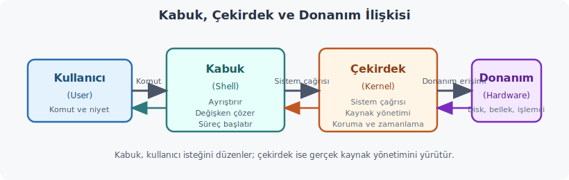

Kabuk bilgisi yalnızca betik yazanlar için gerekli değildir. Linux açılırken hizmetlerin devreye alınması, oturum ortamının hazırlanması, bakım görevlerinin zamanlanması ve sistem günlüklerinin işlenmesi gibi pek çok işin arkasında kabuk mantığı vardır. Bir sistem yöneticisi sıfırdan betik yazmasa bile, var olan betiği okuyabilmeli, ne yaptığını anlayabilmeli ve gerektiğinde düzeltebilmelidir.

Kabuk özellikle şu işlerde güçlüdür:

| İş Türü | Neden Uygun? |
|---------|--------------|
| Günlük bakım işleri | Dosya temizleme, arşivleme, yedekleme ve raporlama kısa komut zincirleriyle yapılır. |
| Log inceleme | `grep`, `awk`, `sort`, `uniq` gibi araçlar birlikte çok verimli çalışır. |
| Hızlı prototip | Büyük bir yazılım kurmadan önce iş akışını küçük ölçekte sınamak kolaydır. |
| Sistem otomasyonu | Kurulum, servis başlatma, dosya üretme ve görev planlama rahatça betikleştirilebilir. |
| Araçları birleştirme | Kabuk tek başına dev bir araç değil, küçük araçları birbirine bağlayan iskelettir. |

Burada önemli olan nokta şudur: kabuk çoğu zaman işin tamamını tek başına yapan araç değildir. Daha çok, atölyedeki tezgahlar arasında malzeme taşıyan düzenli bir üretim bandı gibi çalışır. `grep` ayıklar, `awk` biçimler, `sort` sıralar, `uniq` tekrarları sayar; kabuk ise bunların sırasını kurar.

Kabuk programlama her işe uygun değildir. Aşağıdaki durumlarda başka araçlar daha doğru seçim olur:

* **Yoğun işlem gücü isteyen hesaplamalar:** Yorumlanan yapı, derlenen dillere göre daha yavaştır.
* **Karmaşık matematik:** Ondalıklı ve hassas hesaplamalarda ek araç gerekir.
* **Doğrudan donanım erişimi:** Bellek, port ve sürücü düzeyi işler için C benzeri araçlar daha uygundur.
* **Karmaşık veri yapıları:** Çok katmanlı veri modellerinde kabuk sınırlı kalır.
* **Büyük ve modüler projeler:** Derleme zinciri ve tip denetimi gereken işlerde başka diller daha düzenlidir.

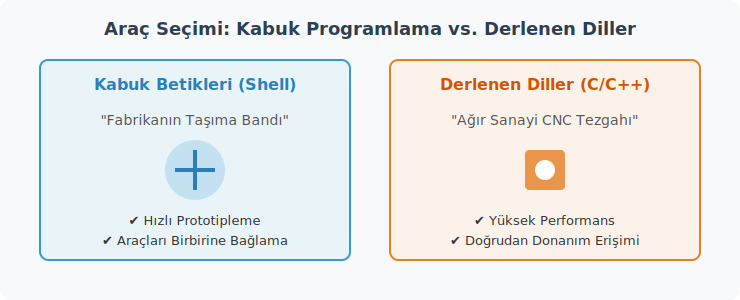

Kabuk betiğini mutfaktaki yazılı reçeteye benzetmek yerindedir. Usta aynı yemeği her seferinde aynı düzende çıkarmak istediğinde talimatı yazar. Betik de çekirdeğe hangi adımların hangi sırayla uygulanacağını söyleyen bu yazılı düzenin sayısal karşılığıdır.

---

### 8.1 Betik Dosyası Yapısı

Bash betiği (Bash Script), düz metin dosyasıdır. `.sh` uzantısı zorunlu değildir, ama yerleşik ve okunur bir tercihtir. Çalıştırılabilmesi için iki temel koşul vardır:

1. Çalıştırma izni taşıması
2. Geçerli bir sözdizimine (Syntax, Eski Yunanca *syntaxis*, düzen) sahip olması

Örnek bir betik:

```bash
#!/usr/bin/env bash

echo "Kullanıcı: $USER"
echo "Bugün: $(date '+%d %B %Y')"
echo "Çalışma dizini: $PWD"
```

Çalıştırma:

```bash
chmod u+rx ilk_betik.sh
./ilk_betik.sh
```

Bir betiği şu yollarla da çağırabilirsiniz:

```bash
bash ilk_betik.sh
sh ilk_betik.sh
./ilk_betik.sh
```

En doğal kullanım `./ilk_betik.sh` biçimidir. Çünkü bu çağrı, dosyanın başındaki yorumlayıcı satırına uyar. `sh < betik.sh` biçimi ise genellikle tercih edilmez; betiğin standart girdisini (Standard Input, stdin) kendi üzerine kapatabildiği için `read` gibi yapılarda beklenmeyen sonuç üretebilir.

---

### 8.2 Shebang Satırı

`#!/usr/bin/env bash` satırı iki parçadan oluşur:

- `#!` işareti: *shebang* adı verilir.
- Sonraki yol ya da komut: yorumlayıcıyı (Interpreter, Latince *interpretari*, açıklamak) belirtir.

Çekirdek dosyayı açar, ilk iki baytı okur, `#!` görürse devamındaki programı çalıştırır ve betiği ona verir. Yani `./betik.sh` ile `/usr/bin/env bash betik.sh` çağrıları aynı yürütme mantığına bağlanır; shebang bunu dosyanın içine yerleştirilmiş hale getirir.

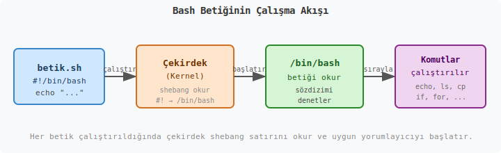

`#!/bin/bash` yazımı da yaygındır. Ancak `#!/usr/bin/env bash` daha taşınabilir çözümdür. Çünkü sistemde `bash` yorumlayıcısı her zaman aynı dizinde bulunmayabilir.

---

### 8.3 Değişkenler ve Parametreler (Variables and Parameters)

Kabukta değişkenlerin büyük bölümü metin gibi ele alınır. Bu nedenle değişkeni, üzerine etiket yapıştırılmış bir kavanoz gibi düşünmek yararlı olur. Etiket isimdir, kavanozun içeriği değerdir. Bash bu bakımdan tip bağımsızdır (Untyped); sayı da çoğu zaman metin gibi taşınır.

```bash
DERS_ADI="Sistem Programlama"
HAFTA=8
RAPOR_DOSYASI="hafta_08_rapor.txt"
```

Temel kural kesindir: `=` işaretinin çevresinde boşluk bırakılmaz.

```bash
ISIM="Ayse"      # doğru
ISIM = "Ayse"    # yanlış
```

İkinci satırda kabuk bunu atama değil, `ISIM` adlı bir komut çağrısı olarak algılar.

Değişkene erişmek için başına `$` koyarız:

```bash
echo "$DERS_ADI"
echo "${DERS_ADI}"
```

Tırnak kullanımı burada güvenlik ağı gibidir. Özellikle boşluk içeren değerlerde çok önemlidir:

```bash
DOSYA="benim dosyam.txt"

rm $DOSYA      # yanlış
rm "$DOSYA"    # doğru
```

#### 8.3.1 Özel Değişkenler (Special Variables)

| Değişken | Anlamı |
|----------|--------|
| `$0` | Betiğin adı veya yolu |
| `$1`, `$2`, ... `$9` | Konumsal parametreler (Positional Parameters) |
| `${10}`, `${11}` | 9'dan büyük indisler için açık yazım |
| `$#` | Parametre sayısı |
| `$@` | Tüm parametreler |
| `$*` | Tüm parametreler, tek metne daha yatkın açılım |
| `$?` | Son komutun çıkış kodu (Exit Code) |
| `$$` | Geçerli betiğin süreç kimliği (Process ID, PID) |
| `$!` | Son arka plan sürecinin PID değeri |

```bash
#!/usr/bin/env bash

echo "Betik adı    : $0"
echo "1. parametre : $1"
echo "2. parametre : $2"
echo "Param sayısı : $#"
echo "Tum parametreler: $@"
```

`"$@"` ile `"$*"` arasındaki fark küçük görünür ama önemlidir. `"$@"` her parametreyi ayrı kelime olarak korur. Fonksiyon çağrılarında ve döngülerde daha güvenli seçim odur.

Gençler, tablodaki bu özel değişkenleri (Special Variables) ve özellikle `"$@"` ile `"$*"` arasındaki farkı somutlaştırmak için bir kargo dağıtım merkezi benzetmesi kullanalım. 

Bir komut satırından betiği çalıştırdığınızda, işletim sistemine bir iş emri vermiş olursunuz. Parametreler (Parameter - Eski Yunanca *para* "yanında" ve *metron* "ölçü" kelimelerinden gelir; yan ölçüt, belirleyici) bu iş emrinin detaylarıdır.

Bunu bir nakliye kamyonunun depoya yanaşması gibi düşünün. Kamyonun bir plakası vardır (`$$` - Süreç Kimliği, Process ID). Kamyonun kendisi veya taşıdığı işin genel adı `$0`'dır. Kamyonun kasasında kasalar (argümanlar) bulunur. Bu kasaların toplam sayısı `$#` ile ifade edilir. Kasalar sırasıyla `$1`, `$2`, `$3` olarak etiketlenmiştir.

Eğer kasaların tamamını tek bir büyük brandanın içine sarıp devasa tek bir paket haline getirirseniz, bu `"$*"` olur. Ancak her bir kasayı kendi ayrı paketinde, bağımsız birer birim olarak indirirseniz, bu da `"$@"` yapısına karşılık gelir. Fonksiyon çağrılarında veya döngülerde, kasaların birbirine karışmamasını, örneğin adında boşluk olan bir dosyanın iki ayrı dosya gibi algılanmamasını istiyorsak her zaman `"$@"` kullanırız.

Aşağıdaki koda ve diyagrama bakalım.

!Özel Değişkenler ve Parametre Aktarımı

```bash
#!/usr/bin/env bash

# teslimat.sh adında bir betik düşünelim.
# Çalıştırma şekli: ./teslimat.sh "Ankara Depo" "Kutu 1" "Kutu 2"

echo "--- Nakliye İrsaliyesi ---"
echo "Görev Adı (Script Name - \$0) : $0"
echo "Teslimat Noktası (\$1)        : $1"
echo "Gelen Toplam Kasa (\$#)       : $#"
echo "Kamyonun Plakası (PID - \$$)  : $$"

echo "--------------------------"
echo 'Tüm kasalar tek bir branda altında ("$*"):'
for paket in "$*"; do
    echo " -> İndirilen: $paket"
done
# Çıktı tek bir satır olacaktır:
# -> İndirilen: Ankara Depo Kutu 1 Kutu 2

echo "--------------------------"
echo 'Tüm kasalar ayrı ayrı kutularda ("$@"):'
for paket in "$@"; do
    echo " -> İndirilen: $paket"
done
# Çıktı üç ayrı satır olacaktır:
# -> İndirilen: Ankara Depo
# -> İndirilen: Kutu 1
# -> İndirilen: Kutu 2

echo "--------------------------"
# Arka planda bir sistem kontrolü başlatalım (Background Job)
sleep 2 &
echo "Arka planda çalışan kontrolün PID'si (\$!): $!"

# Bilinçli olarak hatalı bir komut çalıştıralım
ls /olmayan/bir/dizin > /dev/null 2>&1
echo "Hatalı işlemin çıkış kodu (Exit Code - \$?): $?"
# Çıkış kodu 0'dan farklı (genellikle 2) olacaktır.
```

Bu betiği çalıştırdığımızda işletim sistemi, bash yorumlayıcısına (Interpreter) hafızada yeni bir süreç (Process) alanı açar. `$$` bu alanın sistemdeki adresidir. İşletim sistemi her işlemin ardından bir durum raporu (Exit Status) üretir; `$?` bu raporun sayısal özetidir. Sıfır değeri "sorun yok, işlem başarılı" anlamına gelirken, sıfır dışındaki değerler sistemin bize "bir şeyler ters gitti" deme şeklidir.

#### 8.3.2 Ortam Değişkenleri (Environment Variables)

Bir süreç (process) başladığında işletim sistemi ona iki farklı türde bilgi verir. Birincisi komut satırı argümanlarıdır; bunları önceki bölümde inceledik. İkincisi ise **ortam** (environment) adı verilen bir anahtar-değer (key-value) çiftleri tablosudur. Bu tablonun içindekilere ortam değişkenleri (environment variables) denir.

Normal bir kabuk değişkeni yalnızca oluşturulduğu süreçte yaşar. Bir alt süreç (child process) başlatıldığında üst sürecin (parent process) sıradan değişkenlerine erişemez. Ancak `export` komutuyla ortama çıkarılan değişkenler bu tabloya eklenir ve alt süreçler bu tabloyu **kalıtım** (inheritance) yoluyla devralır.

Bunu bir fabrikadaki çalışma ortamıyla düşünebiliriz. Fabrika müdürünün (üst kabuk) masasındaki notlar (yerel değişkenler) yalnızca kendisine aittir; alt yükleniciler (child processes) o notlara erişemez. Buna karşın müdürün tüm çalışanlara dağıttığı resmi genelgeler (export edilmiş değişkenler) şirket ortam tablosuna girer ve her çalışan bu bilgilere ulaşabilir.

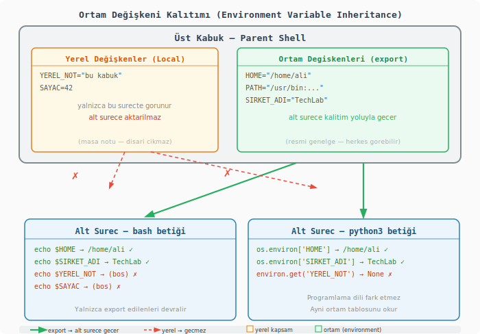

Sistemin hazır olarak sağladığı önemli ortam değişkenleri şunlardır:

```bash
echo "$HOME"    # Kullanıcının ev dizini: /home/ali
echo "$PATH"    # Çalıştırılabilir dosyaların arandığı dizin listesi
echo "$USER"    # Oturum açmış kullanıcı adı
echo "$SHELL"   # Aktif kabuk programının tam yolu: /bin/bash
echo "$PWD"     # Geçerli çalışma dizini (Present Working Directory)
echo "$OLDPWD"  # Bir önceki çalışma dizini; cd - komutu bunu kullanır
echo "$LANG"    # Sistem dili ve karakter kodlaması: tr_TR.UTF-8
```

`env` ve `printenv` komutları geçerli ortamı listelemek için kullanılır. `env` tüm ortamı dökerken `printenv` tek bir değişkenin değerini yazdırmak için de kullanılabilir:

```bash
env | sort       # Tüm ortam değişkenlerini alfabetik sıralar
printenv HOME    # Yalnızca HOME değişkenini yazdırır
```

Yeni bir değişkeni ortama eklemek için `export` kullanılır:

```bash
export PROJE_KOK="$PWD/proje"
```

`export` sözcüğü Latince *exportare*'den gelir: "dışarıya taşımak." Değişkeni kabuğun yerel alanından çıkarıp işletim sisteminin ortam tablosuna taşır; oradan tüm alt süreçler bu değişkeni miras alır.

Bu davranışı somut bir betikle görelim:

```bash
#!/usr/bin/env bash
# Dosya adı: ortam_demo.sh
# Çalıştırma: bash ortam_demo.sh

# ─── 1. DEĞİŞKEN TÜRLERİ ────────────────────────────────────────

# Yerel değişken: yalnızca bu kabuk sürecinde yaşar.
YEREL_NOT="Sadece bu kabuk beni görür"

# Ortam değişkeni: export ile işletim sisteminin ortam tablosuna taşınır.
# Bu tabloyu alt süreçler kalıtım yoluyla devralır.
export SIRKET_ADI="TechLab"
export PROJE_KOK="$HOME/projeler/demo"

echo "=== Üst Kabuk (Parent Shell) ==="
echo "  YEREL_NOT    : $YEREL_NOT"
echo "  SIRKET_ADI   : $SIRKET_ADI"
echo "  PROJE_KOK    : $PROJE_KOK"
echo

# ─── 2. ALT KABUK DAVRANIŞI ──────────────────────────────────────

# ( ) parantezleri bir alt kabuk (subshell) başlatır.
# Üst sürecin ortam tablosu devralınır; yerel değişkenler devralınmaz.

echo "=== Alt Kabuk (Subshell / Child Process) ==="
(
    # ${DEG:-'metin'} kalıbı: DEG tanımsız ya da boşsa 'metin'i döndürür.
    echo "  SIRKET_ADI   [export edildi]  : ${SIRKET_ADI:-'(tanımsız)'}"
    echo "  PROJE_KOK    [export edildi]  : ${PROJE_KOK:-'(tanımsız)'}"
    echo "  YEREL_NOT    [export edilmedi]: ${YEREL_NOT:-'(tanımsız)'}"
)
echo

# ─── 3. SİSTEM DEĞİŞKENLERİ ─────────────────────────────────────

echo "=== Sistemin Hazır Sağladığı Ortam Değişkenleri ==="
echo "  HOME  : $HOME"
echo "  USER  : $USER"
echo "  SHELL : $SHELL"
echo "  LANG  : $LANG"
echo "  PWD   : $PWD"
echo

# ─── 4. ORTAMDAN ÇIKARMA ─────────────────────────────────────────

# export -n: ortam özelliğini kaldırır; değişken bu kabukta hâlâ var.
export -n SIRKET_ADI

echo "=== export -n Sonrası ==="
echo "  Üst kabukta hâlâ erişilir : $SIRKET_ADI"
(
    echo "  Alt kabukta artık görünmez : ${SIRKET_ADI:-'(tanımsız)'}"
)
echo

# ─── 5. TÜM ORTAMI LİSTELEMEK ───────────────────────────────────

echo "=== env Komutu (ilk 10 satır) ==="
env | sort | head -10
```

Betiği çalıştırdığınızda terminalde şuna benzer bir çıktı görürsünüz:

```text
=== Üst Kabuk (Parent Shell) ===
  YEREL_NOT    : Sadece bu kabuk beni görür
  SIRKET_ADI   : TechLab
  PROJE_KOK    : /home/ali/projeler/demo

=== Alt Kabuk (Subshell / Child Process) ===
  SIRKET_ADI   [export edildi]  : TechLab
  PROJE_KOK    [export edildi]  : /home/ali/projeler/demo
  YEREL_NOT    [export edilmedi]: (tanımsız)

=== Sistemin Hazır Sağladığı Ortam Değişkenleri ===
  HOME  : /home/ali
  USER  : ali
  SHELL : /bin/bash
  LANG  : tr_TR.UTF-8
  PWD   : /home/ali

=== export -n Sonrası ===
  Üst kabukta hâlâ erişilir : TechLab
  Alt kabukta artık görünmez : (tanımsız)
```

`${DEG:-'varsayılan'}` sözdizimi burada ilk kez karşımıza çıktı. Değişken tanımsız ya da boşsa belirtilen varsayılan değeri döndürür; aksi hâlde asıl değeri gösterir. Bu kalıba **parametre genişlemesi** (parameter expansion) denir ve ilerleyen bölümde ayrıntılı ele alınır.

Bir satırda geçici olarak belirli bir değişken tanımlamak da mümkündür. Bu yöntemle değişken yalnızca o komutun ortamına eklenir, kalıcı olarak export edilmez:

```bash
LANG=C sort dosya.txt     # sıralama için dili geçici İngilizce yapar
```

Pratikte ortam değişkenlerini en çok şu amaçlar için kullanırsınız:

- Derleme veya çalışma ortamını yapılandırmak: `CC=gcc make`
- Gizli bilgileri (API anahtarları, parolalar) betiklere sabit yazmak yerine ortamdan okumak
- Geliştirme, test ve üretim ortamları arasındaki davranış farklılıklarını yönetmek

#### 8.3.3 Alan Ayırıcı ve Güvenli Okuma (IFS and Safe Reading)

Alan ayırıcı (Internal Field Separator, IFS) kabuğun bir metni sözcüklere bölerken kullandığı ayraç karakterlerini tanımlar. Varsayılan değeri boşluk (`' '`), sekme (`\t`) ve satır sonu (`\n`) karakterlerinden oluşur. Kabuk bir metin dizisini genişletirken ya da `read` komutuyla girdi okurken bu karakterlere rastladığında metni böler.

Bu davranışı mutfaktaki bir kesme tahtasına benzetebiliriz. IFS, hangi noktadan kesileceğini belirleyen çizgidir. Varsayılan durumda her boşluk bir kesim noktasıdır. `IFS=` yaparak çizgileri kaldırdığınızda kabuk artık hiçbir yerden kesmez; metin bütün olarak kalır.

Sorun: Varsayılan IFS ile dosya satırlarını okumak

```bash
# YANLIŞ kullanım — baştaki ve sondaki boşluklar silinir
while read -r SATIR; do
    echo "$SATIR"
done < rapor.txt
# "   önemli girinti" → "önemli girinti" olarak okunur (başındaki boşluklar kaybolur)
```

`read` komutu her satırı okuduktan sonra IFS'teki karakterlerle baş ve sonu kırpar. Girinti bilgisi taşıyan yapılandırma dosyaları veya Python kodu gibi metinleri işlerken bu kayıp hatalara yol açar.

**Çözüm: `IFS=` ile güvenli okuma**

```bash
# DOĞRU kullanım — satır olduğu gibi okunur, hiçbir karakter kaybolmaz
while IFS= read -r SATIR; do
    echo "$SATIR"
done < rapor.txt
```

`IFS=` ifadesi yalnızca bu `read` komutunun süresince geçerlidir; döngü bittiğinde IFS eski değerine döner. Kabuğun geri kalanını etkilemez.

`-r` bayrağı ise ters eğik çizginin (`\`) kaçış karakteri (escape character) olarak yorumlanmasını engeller. `-r` olmadan `\n` kabuk tarafından "yeni satır" anlamına çevrilir; `-r` ile olduğu gibi iki karakter (`\` ve `n`) kalır. Özellikle dosya yollarını ve düzenli ifadeleri (regular expressions) işlerken bu fark kritiktir.

Pratik kullanım: CSV ayrıştırma

IFS'i geçici olarak değiştirerek virgülle ayrılmış değerleri (Comma-Separated Values, CSV) kolayca ayrıştırabilirsiniz. Alıştırma için aşağıdaki örnek dosyayı kullanacağız: [notlar.csv](Uygulamalar/Bash_App/notlar.csv)

Dosya içeriği şu biçimdedir:

```text
Ad,Soyad,Vize,Final
Ali,Yılmaz,72,85
Ayşe,Kaya,88,91
Mehmet,Demir,55,60
Fatma,Çelik,95,98
Emre,Arslan,40,52
Zeynep,Şahin,78,74
Burak,Doğan,63,70
Selin,Öztürk,82,88
Hasan,Koç,50,45
Merve,Aydın,91,95
```

Birinci satır başlık (header) satırıdır. `read` ile önce onu okuyup atlıyoruz, ardından veri satırlarını işliyoruz:

```bash
#!/usr/bin/env bash
# csv_oku.sh — notlar.csv dosyasını satır satır ayrıştırır

DOSYA="notlar.csv"

# Başlık satırını oku ve görmezden gel
IFS=',' read -r _ _ _ _ < "$DOSYA"

# tail -n +2: dosyanın 2. satırından itibaren okur (başlığı atlar)
tail -n +2 "$DOSYA" | while IFS=',' read -r AD SOYAD VIZE FINAL; do
    # Aritmetik ortalama: bash yalnızca tam sayı aritmetiği yapar
    ORTALAMA=$(( (VIZE + FINAL) / 2 ))

    echo "Öğrenci : $AD $SOYAD"
    echo "  Vize  : $VIZE"
    echo "  Final : $FINAL"
    echo "  Ort.  : $ORTALAMA"
    echo "  ------"
done
```

`IFS=','` yalnızca ilgili `read` komutu için geçerlidir; döngü boyunca kabuğun genel IFS'ini değiştirmez. Her satır virgülden bölünerek dört değişkene sırasıyla atanır.

Betiği çalıştırdığınızda çıktı şöyle görünür:

```text
Öğrenci : Ali Yılmaz
  Vize  : 72
  Final : 85
  Ort.  : 78
  ------
Öğrenci : Ayşe Kaya
  Vize  : 88
  Final : 91
  Ort.  : 89
  ------
...
```

Bash yalnızca tam sayı aritmetiği (integer arithmetic) yaptığından ortalama sonucu küsuratsız çıkar. Ondalıklı hesaplama gerektiğinde `bc` veya `awk` araçlarına başvurmak gerekir; bunları ilgili bölümde ele alacağız.

#### 8.3.4 Salt Okunur ve Silinen Değişkenler (Readonly and Unset)

Bazı değerlerin program boyunca değişmemesi gerekir: matematiksel sabitler, yapılandırma parametreleri, kritik dizin yolları. `readonly` komutu bir değişkeni taşa kazınmış gibi sabit kılar; sonraki herhangi bir atama girişimi hata üretir.

```bash
#!/usr/bin/env bash

# Matematiksel sabit: bir kez tanımlanır, değiştirilemez.
readonly PI=3.14159265358979

echo "PI = $PI"

# Değiştirmeye çalışırsak kabuk hata verir:
PI=3.0
# bash: PI: readonly variable
# Betik bu noktada hata kodu 1 ile durur.
```

`readonly` ile tanımlanmış bir değişkeni `unset` ile de silemezsiniz; o da aynı hatayı üretir. Değişkeni tamamen kaldırmanın tek yolu kabuğu kapatmaktır.

`unset` komutu ise sıradan bir değişkeni bellekten tamamen kaldırır. Boş bir string atamaktan farklıdır: boş string atandığında değişken var olmaya devam eder, yalnızca değeri yoktur. `unset` sonrasında değişken hiç tanımlanmamış gibi davranır.

```bash
#!/usr/bin/env bash

GECICI="geçici veri"
BASKA=""               # tanımlı ama boş

echo "Başlangıç:"
echo "  GECICI : '${GECICI}'"
echo "  BASKA  : '${BASKA}'"

unset GECICI           # değişkeni bellekten siler

echo ""
echo "unset Sonrası:"

# ${DEG:+'var'} kalıbı: DEG tanımlı ve doluysa 'var' döndürür
echo "  GECICI tanımlı mı? : '${GECICI:+var}'"  # boş → tanımsız
echo "  BASKA  tanımlı mı? : '${BASKA:+var}'"   # boş → boş string

# Tanımsız değişkene güvenli erişim için :-  kalıbı
echo "  GECICI değeri : ${GECICI:-'(tanımsız)'}"
echo "  BASKA  değeri : ${BASKA:-'(boş ya da tanımsız)'}"
```

Çalıştırıldığında:

```text
Başlangıç:
  GECICI : 'geçici veri'
  BASKA  : ''

unset Sonrası:
  GECICI tanımlı mı? :           ← boş; değişken artık yok
  BASKA  tanımlı mı? :           ← boş; değişken var ama değeri yok
  GECICI değeri : (tanımsız)
  BASKA  değeri : (boş ya da tanımsız)
```

`unset` bir işlevi (function) de kaldırabilir; bunun için `unset -f FONKSIYON_ADI` sözdizimi kullanılır.

| Komut | Ne yapar | Geri alınabilir mi? |
| --- | --- | --- |
| `readonly DEG=deger` | Değişkeni değişmez kılar | Hayır (kabuk kapanana kadar) |
| `unset DEG` | Değişkeni bellekten siler | Hayır (değer kaybolur) |
| `DEG=""` | Değişkeni boş bırakır | Evet (yeniden atanabilir) |
| `export -n DEG` | Ortam özelliğini kaldırır, değer kalır | Evet (tekrar export edilebilir) |

---

### 8.4 Özel Karakterler, Tırnaklama ve Genişleme (Special Characters, Quoting and Expansion)

Kabukta bazı karakterler yazıldıkları halin ötesinde anlam taşır. Bunlara özel karakterler (Special Characters) denir.

| Karakter | İşlevi |
|----------|--------|
| `#` | Yorum başlatır |
| `;` | Aynı satırda komut ayırır |
| `;;` | `case` yapısında bir seçeneği kapatır |
| `.` | `source` ile eşdeğer yerleşik komuttur |
| `*` | Joker karakter, çoklu eşleşme |
| `?` | Tek karakter eşleşmesi |
| `|` | Boru hattı (Pipe) kurar |
| `&` | Komutu arka planda başlatır |
| `<` `>` | Girdi ve çıktı yönlendirmesi yapar |
| `\` | Kaçış (Escape) karakteridir |

```bash
echo "ilk"; echo "ikinci"
. ./ortam.sh
```

İlk satırda iki komut vardır. İkinci satırda ise `ortam.sh` dosyası yeni süreç açılmadan aynı kabuk içinde çalıştırılır.

Tırnaklama (Quoting), bu özel anlamların gereksiz yere devreye girmesini önler:

| Tırnak Türü | Davranış |
|-------------|----------|
| Çift tırnak `"..."` | Değişkenler ve komut ikameleri genişler, metin tek parça kalır |
| Tek tırnak `'...'` | Neredeyse her şeyi olduğu gibi korur |
| `$'...'` | Kaçış dizilerini yorumlar |
| Ters tırnak `` `...` `` | Eski komut ikamesi biçimi |
| `\` | Tek karakteri düz metne çevirir |

```bash
DOSYA_YOLU="C:\\Windows\\System32"
MALIYET=100

echo "Merhaba $USER"
echo 'Merhaba $USER'
echo "Toplam maliyet: \$MALIYET"
echo "Tarih: $(date)"
```

Desen eşleme ile tırnaklama ilişkisi de önemlidir:

```bash
ls [Vv]*
ls '[Vv]*'
```

İlk satır deseni genişletir, ikincisi düz metin kabul eder. Mutfakta ölçü kabını açık bırakmakla kapağını kapatmak arasındaki fark gibi düşünülebilir.

Komut ikamesi (Command Substitution) için güncel tercih `$(...)` yapısıdır:

```bash
SATIR_SAYISI=$(wc -l < dosya.txt)
DISK_KULLANIM=$(df -h / | tail -1 | awk '{print $5}')
echo "Disk doluluk oranı: $DISK_KULLANIM"
```

`$()` yapısı komutu çalıştırır ve çıktısını metin olarak yerine koyar. İç içe kullanılabilir; eski ters tırnak yazımı bu konuda daha hantaldır.

Küme ayracı genişlemesi (Brace Expansion) ise kısa yazım sağlar:

```bash
echo dosya{1,2,3}.txt
echo {a..e}
echo {1..10..2}
mkdir -p proje/{src,lib,test,doc}
cp config.{conf,conf.bak}
```

---

### 8.5 Aritmetik İşlemler (Arithmetic Operations)

#### `$(( ))` ile Tam Sayı Aritmetiği

```bash
A=10
B=3

echo $((A + B))    # 13
echo $((A - B))    # 7
echo $((A * B))    # 30
echo $((A / B))    # 3  — tam sayı bölmesi (3.333... değil)
echo $((A % B))    # 1  — modulo (kalan)
echo $((A ** B))   # 1000 — üs alma (Bash 4+)

SAYAC=0
((SAYAC++))        # Artır
((SAYAC += 5))     # 5 ekle
((SAYAC *= 2))     # 2 ile çarp
echo $SAYAC        # 12
```

Bu yapılar aynı zamanda matematiksel ifadenin mantıksal sonucuna göre bir değer üretir; bu özellik Koşullu İfadelerde (Conditional Statements) mantıksal kontroller için kullanılır:

```bash
if (( A > B )); then
    echo "A büyüktür"
fi
```

#### `bc` ile Ondalıklı Aritmetik

İşletim sisteminin kabuğu doğası gereği tam sayılar (Integer) üzerinden çalışır. Ondalıklı sayılarla (Float) veya daha karmaşık fonksiyonlarla çalışmak gerektiğinde sisteme ait `bc` (Basic Calculator) aracı kullanılır:

```bash
echo "scale=4; 22 / 7" | bc          # 3.1428
echo "scale=2; sqrt(2)" | bc -l      # -l parametresi standart matematik kütüphanesini dahil eder

PI=$(echo "scale=10; 4 * a(1)" | bc -l)   # a(1) = arctan(1), pi/4
echo $PI
```

`scale=N` ondalık basamak sayısını belirler. `bc` içinde `-l` parametresi sin, cos, sqrt gibi matematik fonksiyonlarını etkinleştirir.

#### `bc` ile Ağırlıklı Not Hesaplama (Practical Example)

Yukarıdaki `csv_oku.sh` örneğinde aritmetik ortalama `$(( (VIZE + FINAL) / 2 ))` ile tam sayı olarak hesaplandı. Ancak gerçek not sistemlerinde vize %30, final %70 gibi **ağırlıklı** katkılar söz konusudur ve sonuç ondalıklı çıkar. Bu durumda `bc` devreye girer:

```bash
#!/usr/bin/env bash
# agirlikli_not.sh — notlar.csv dosyasından vize/final okur,
#                    ağırlıklı ortalama hesaplar (vize %30, final %70)

DOSYA="notlar.csv"

# Ağırlık sabitleri: değişken ismi büyük harf → global sabit anlamı taşır
VIZE_AGIRLIK=30   # Vize notunun yüzde katkısı
FINAL_AGIRLIK=70  # Final notunun yüzde katkısı

# Başlık satırını atla (tail -n +2: 2. satırdan itibaren oku)
tail -n +2 "$DOSYA" | while IFS=',' read -r AD SOYAD VIZE FINAL; do

    # bc'ye gönderilen ifade: (vize * 30 + final * 70) / 100
    # scale=2 → virgülden sonra 2 basamak göster
    AGIRLIKLI=$(echo "scale=2; ($VIZE * $VIZE_AGIRLIK + $FINAL * $FINAL_AGIRLIK) / 100" | bc)

    # printf "%.0f" standart yuvarlama uygular (0.5 ve üzeri → yukarı)
    # Örnek: 81.10 → 81,  48.40 → 48,  74.50 → 75
    YUVARLANMIS=$(printf "%.0f" "$AGIRLIKLI")

    # Geçti/Kaldı kararı: tam sayıya yuvarlanmış değer üzerinden yapılır;
    # $(( )) ile tam sayı karşılaştırması artık güvenle kullanılabilir
    if (( YUVARLANMIS >= 50 )); then
        DURUM="GEÇTİ"
    else
        DURUM="KALDI"
    fi

    echo "Öğrenci      : $AD $SOYAD"
    echo "  Vize  (%30): $VIZE"
    echo "  Final (%70): $FINAL"
    echo "  Ağırlıklı  : $AGIRLIKLI  →  Yuvarlanmış: $YUVARLANMIS  →  $DURUM"
    echo "  -----------"
done
```

Beklenen çıktı:

```text
Öğrenci      : Ali Yılmaz
  Vize  (%30): 72
  Final (%70): 85
  Ağırlıklı  : 81.10  →  Yuvarlanmış: 81  →  GEÇTİ
  -----------
Öğrenci      : Ayşe Kaya
  Vize  (%30): 88
  Final (%70): 91
  Ağırlıklı  : 90.10  →  Yuvarlanmış: 90  →  GEÇTİ
  -----------
Öğrenci      : Emre Arslan
  Vize  (%30): 40
  Final (%70): 52
  Ağırlıklı  : 48.40  →  Yuvarlanmış: 48  →  KALDI
  -----------
```

> **Not:** `bc` çıktısı metin (`string`) döndürür; `$(( ))` ile doğrudan kullanılamaz. `printf "%.0f"` yuvarlama yaptıktan sonra tam sayıya dönüştürür; bu sayede `$(( ))` ile güvenli karşılaştırma yapılabilir (`awk` gerekmez).

```bash
SONUC=$(echo "scale=2; 7 / 2" | bc)   # SONUC = "3.50"  (metin)

# Hatalı kullanım — bc çıktısı metin olduğundan $(( )) hata verir:
# echo $(( SONUC > 3 ))   # bash: 3.50: syntax error

# Doğru kullanım — önce printf ile tam sayıya yuvarlayıp sonra karşılaştır:
YUVARLANMIS=$(printf "%.0f" "$SONUC")  # YUVARLANMIS = 4  (3.50 → yukarı yuvarlandı)

if (( YUVARLANMIS > 3 )); then
    echo "$SONUC yuvarlanınca $YUVARLANMIS oldu, 3'ten büyük"
fi
```

---

### 8.6 Parametre Genişletme (Parameter Expansion)

Bir metin dizgisinin içerisinden belirli bir bölümü almak veya değiştirmek için harici araçlara başvurmadan sadece kabuk referanslarını kullanma yöntemine Parametre Genişletme (Parameter Expansion) denir. Bunu bir fabrikadaki hassas kesim ve kalıp çıkarma tezgahlarına benzetebiliriz; veriyi (ham maddeyi) istediğimiz forma sokmamızı sağlar.

| Sözdizimi | Anlamı |
|-----------|--------|
| `${var}` | Değişkeni genişlet |
| `${var:-varsayilan}` | var boşsa varsayılan değeri kullan (atama yapmaz) |
| `${var:=varsayilan}` | var boşsa varsayılanı ata ve kullan |
| `${var:?mesaj}` | var boşsa hata mesajı ver ve çık |
| `${var:+deger}` | var doluysa değeri kullan, boşsa boş bırak |
| `${#var}` | Değerin karakter uzunluğu |
| `${var:N}` | N. karakterden itibaren |
| `${var:N:L}` | N. karakterden itibaren L karakter |
| `${var%patern}` | Sondaki en kısa eşleşmeyi kaldır |
| `${var%%patern}` | Sondaki en uzun eşleşmeyi kaldır |
| `${var#patern}` | Baştaki en kısa eşleşmeyi kaldır |
| `${var##patern}` | Baştaki en uzun eşleşmeyi kaldır |
| `${var/eski/yeni}` | İlk eşleşmeyi değiştir |
| `${var//eski/yeni}` | Tüm eşleşmeleri değiştir |
| `${var^^}` | Tüm harfleri büyüt |
| `${var,,}` | Tüm harfleri küçült |

Örnekler:

```bash
DOSYA="/home/kullanici/belgeler/rapor.txt"

echo ${#DOSYA}           # 38 — uzunluk
echo ${DOSYA##*/}        # rapor.txt — son / sonrası (basename işlevi)
echo ${DOSYA%/*}         # /home/kullanici/belgeler — son / öncesi (dirname)
echo ${DOSYA##*.}        # txt — uzantı
echo ${DOSYA%.*}         # /home/kullanici/belgeler/rapor — uzantısız

METIN="linux programlama"
echo ${METIN^}           # Linux programlama
echo ${METIN^^}          # LINUX PROGRAMLAMA

# Varsayılan değer — argüman yoksa "misafir" kullan
KULLANICI=${1:-"misafir"}
echo "Hos geldin, $KULLANICI"
```

Parametre genişletme işlemleri doğrudan kabuğun kendi bellek alanında gerçekleştiği için, dışarıdan sistem süreçleri başlatmaya kıyasla donanım kaynaklarını çok daha verimli kullanır.

---

### 8.7 Diziler (Arrays)

Şimdiye kadar incelediğimiz değişkenler tek bir değer tutuyordu. Ama betiklerde çoğunlukla bir koleksiyon üzerinde çalışmak gerekir: öğrenci isimleri, işlenecek dosya adları, sensör ölçümleri... Her biri için ayrı değişken oluşturmak yerine bu verileri bir **dizi** (array) içinde toplamak hem düzenlilik sağlar hem de döngülerde işlemeyi doğrudan kolaylaştırır.

Bash'te iki tür dizi vardır. **İndisli dizi** (indexed array), sıfırdan başlayan tam sayı indislerle erişilen, numaralı raflara benzeyen bir yapıdır. **İlişkisel dizi** (associative array) ise elemanlara metin anahtar (key) ile ulaşılan, sözlük gibi çalışan bir yapıdır.

#### İndisli Dizi (Indexed Array)

İndisli diziyi, üstünde numara bulunan gözlere sahip bir meyve kasası gibi düşünebiliriz. `MEYVELER` etiketi kasanın tamamını temsil eder; her gözün numarası 0'dan başlar ve o gözün içinde de ilgili değer bulunur. "2 numaralı gözden getir" demek `${MEYVELER[2]}` yazmakla eşdeğerdir.

Bilgisayar biliminde dizilerin 0'dan başlaması evrensel bir standarttır. Bunun sezgisel açıklaması şudur: indis, dizinin başından o elemana kadar kaç adım atılacağını gösterir. İlk elemana ulaşmak için sıfır adım yeterlidir, dolayısıyla indisi 0'dır.

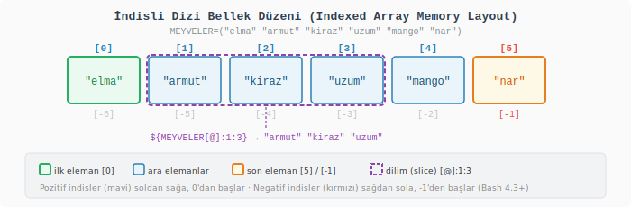

Bir diziyi tanımlamanın en doğrudan yolu, tüm elemanları parantez içinde boşlukla ayırarak yazmaktır:

```bash
MEYVELER=("elma" "armut" "kiraz" "uzum")
```

Boşluk içeren değerler tırnak içinde yazılmalıdır; aksi hâlde kabuk sözcük bölme (word splitting) uygular ve her kelimeyi ayrı eleman olarak değerlendirir.

Temel erişim ve bilgi alma işlemleri:

```bash
#!/usr/bin/env bash
# dizi_temel.sh

MEYVELER=("elma" "armut" "kiraz" "uzum")

# ─── TEK ELEMAN ERİŞİMİ ──────────────────────────────────────────

echo "${MEYVELER[0]}"      # elma   — ilk eleman; indis sıfırdan başlar
echo "${MEYVELER[2]}"      # kiraz  — üçüncü gözün içeriği
echo "${MEYVELER[-1]}"     # uzum   — son eleman; negatif indis sağdan sayar (Bash 4.3+)

# ─── DİZİ BİLGİSİ ────────────────────────────────────────────────

echo "${#MEYVELER[@]}"     # 4      — toplam eleman sayısı (#: length/uzunluk)
echo "${!MEYVELER[@]}"     # 0 1 2 3 — mevcut indislerin listesi (!: indirect/dolaylı)
echo "${MEYVELER[@]}"      # elma armut kiraz uzum — tüm elemanlar (@: all/hepsi)
```

`@` simgesi "hepsi" anlamında bir jokerdir; tüm elemanları ayrı kelimeler olarak döndürür. `!` değerlerin kendisi yerine indislerin listesini verir. `#` eleman sayısını döndürür.

Eleman ekleme, güncelleme ve silme:

```bash
#!/usr/bin/env bash
# dizi_degistirme.sh

MEYVELER=("elma" "armut" "kiraz" "uzum")

# Sonuna eleman ekleme: += sözdizimi mevcut diziyi genişletir
MEYVELER+=("mango")

# Belirli bir indise doğrudan yazma
MEYVELER[5]="nar"

# Mevcut bir elemanı güncelleme
MEYVELER[0]="erik"

echo "Güncel dizi    : ${MEYVELER[@]}"
# Çıktı: erik armut kiraz uzum mango nar

# Belirli bir elemanı silme
# unset bir indisi kaldırır; diziyi yeniden numaralandırmaz.
# Aradaki boşluğa sahip dizilere seyrek dizi (sparse array) denir.
unset 'MEYVELER[2]'

echo "Kiraz silindi  : ${MEYVELER[@]}"
# Çıktı: erik armut uzum mango nar

echo "Kalan indisler : ${!MEYVELER[@]}"
# Çıktı: 0 1 3 4 5   — 2 numaralı indis artık mevcut değil

# Tüm diziyi bellekten kaldırma
unset MEYVELER
```

`unset 'MEYVELER[2]'` ile bir eleman silindiğinde Bash diziyi sıkıştırmaz; 2 numaralı indis boş kalır, sonraki elemanlar yerinde durur. Diziyi boşluksuz yeniden kullanmak istiyorsanız elemanları döngüyle yeni bir diziye kopyalamanız gerekir.

Dilim (slice) alma — belirli bir aralığı kesmek:

```bash
MEYVELER=("elma" "armut" "kiraz" "uzum" "mango" "nar")

# ${DİZİ[@]:başlangıç:eleman_sayısı}
echo "${MEYVELER[@]:1:3}"    # armut kiraz uzum — 1. indisten itibaren 3 eleman
echo "${MEYVELER[@]:(-2)}"   # mango nar — sondan 2 eleman (Bash 4.2+)
```

Dizi içinde dolaşmak:

```bash
MEYVELER=("elma" "armut" "kiraz" "uzum" "mango" "nar")

for meyve in "${MEYVELER[@]}"; do
    echo "  - $meyve"
done
```

`"${MEYVELER[@]}"` ifadesini tırnak içinde yazmak kritik öneme sahiptir. Tırnak olmadan boşluk içeren bir eleman ikiye bölünür ve döngü beklenmedik sonuçlar üretir. Bu tırnak, her elemanın tek ve bütün bir kelime olarak işlenmesini garanti eder.

#### İlişkisel Dizi (Associative Array)

İlişkisel dizi, bir telefon rehberi gibi çalışır. Rehberde "Kaya" adını aratırsınız ve karşısında numarayı bulursunuz; rehberin kaçıncı sayfasında olduğunu bilmenize gerek yoktur. Aynı şekilde ilişkisel dizide elemanlara sıra numarasıyla değil, anlamlı bir metin anahtarıyla ulaşılır.

İndisli dizileri eczanedeki numaralı ilaç çekmeceleri, ilişkisel dizileri ise her çekmecenin üzerinde "Ağrı Kesici", "Vitamin", "Antibiyotik" yazan etiketlerin bulunduğu bir sistem olarak düşünebiliriz.

`declare -A` komutu olmadan Bash bir diziyi ilişkisel olarak tanıyamaz; bu bildirim zorunludur:

```bash
#!/usr/bin/env bash
# iliski_dizisi.sh

# declare -A: ilişkisel dizi bildirir (associative array declaration)
declare -A NOTLAR

# Anahtar: "Ad Soyad" (tam isim metin), Değer: ağırlıklı not (vize %30 + final %70)
# tail -n +2 başlık satırını atlar; IFS=',' virgülden böler
tail -n +2 notlar.csv | while IFS=',' read -r AD SOYAD VIZE FINAL; do
    AGIRLIKLI=$(echo "scale=2; ($VIZE * 30 + $FINAL * 70) / 100" | bc)
    NOTLAR["$AD $SOYAD"]=$AGIRLIKLI
done

# Tek değer okuma — anahtar tam isimdir
echo "Ali Yılmaz: ${NOTLAR["Ali Yılmaz"]}"    # 81.10

# Tüm anahtarlar — ! simgesi anahtar listesini verir
echo "${!NOTLAR[@]}"

# Tüm değerler
echo "${NOTLAR[@]}"

# Anahtarlar üzerinde döngü
for ogrenci in "${!NOTLAR[@]}"; do
    echo "  $ogrenci: ${NOTLAR[$ogrenci]}"
done
```

İlişkisel dizilerde anahtar sırası garanti değildir. Bash bu yapıyı dahili olarak bir hash tablosu (hash table) üzerinde tutar; ekleme sırasına göre değil, hash fonksiyonunun ürettiği konuma göre bellekte yer alır. Sıralı çıktı gerekiyorsa `sort` ile sıralamanız gerekir:

```bash
# Öğrenci adlarını alfabetik sıraya diz, sonra notları yazdır
for ogrenci in $(echo "${!NOTLAR[@]}" | tr ' ' '\n' | sort); do
    echo "  $ogrenci: ${NOTLAR[$ogrenci]}"
done
```

Bir anahtarın dizide var olup olmadığını kontrol etmek:

```bash
ANAHTAR="Mehmet Demir"
if [[ -v NOTLAR["$ANAHTAR"] ]]; then
    echo "$ANAHTAR mevcut: ${NOTLAR[$ANAHTAR]}"
else
    echo "$ANAHTAR bulunamadı"
fi
```

`-v` testi (Bash 4.2+), değişkenin ya da dizi anahtarının tanımlı olup olmadığını kontrol eder; değerin boş olup olmadığına değil, varlığına bakar. Bu, `${VAR:-}` ile boş kontrolü yapmanın farklı ve daha kesin bir yoludur.

Karşılaştırma özeti:

| Özellik | İndisli Dizi | İlişkisel Dizi |
| --- | --- | --- |
| Bildirim | `DIZI=(...)` | `declare -A DIZI` |
| Anahtar türü | Tam sayı (0, 1, 2...) | Metin ("Ankara", "Ali"...) |
| Sıra garantisi | Evet | Hayır |
| Negatif indis | Evet (Bash 4.3+) | Hayır |
| Dahili yapı | Sıralı (sequential) | Hash tablosu |
| Yaygın kullanım | Sıralı liste, ekleme sırası önemli | Arama tablosu, frekans sayacı |

---

### 8.8 Giriş/Çıkış Yönetimi (I/O Management)

#### Dosya Tanımlayıcıları (File Descriptors)

İşletim sistemi bir süreci (Process) belleğe yerleştirip çalıştırdığında, o sürecin çevresiyle iletişim kurabilmesi için üç adet varsayılan akış (Stream) kanalı açar. Sistem programlama terminolojisinde bu numaralandırılmış donanım erişim noktalarına Dosya Tanımlayıcı (File Descriptor - FD) adı verilir.

Bu yapıyı bir su tesisatına benzetebiliriz: 0 numaralı ana hattan binaya temiz su (veri) girer, 1 numaralı hattan işlenmiş temiz su binayı terk eder, 2 numaralı kanal ise sistemde oluşan atıkları ve sızıntıları (hataları) tahliye etmek için ayrılmış özel bir haktır.

| FD | Ad | Varsayılan Hedef |
|----|----|----|
| 0 | Standart Girdi (Standard Input - stdin) | Klavye |
| 1 | Standart Çıktı (Standard Output - stdout) | Terminal Ekranı |
| 2 | Standart Hata (Standard Error - stderr) | Terminal Ekranı |

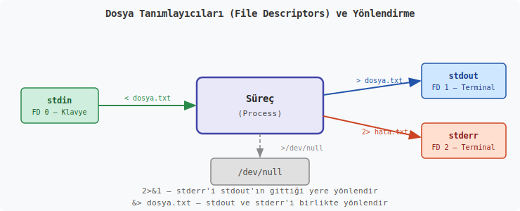

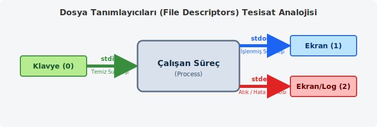

```bash
komut > dosya.txt          # stdout'u dosyaya yaz (üzerine)
komut >> dosya.txt         # stdout'u dosyaya ekle (sonuna)
komut 2> hatalar.txt       # stderr'i dosyaya yaz
komut > log.txt 2>&1       # stderr akışını, stdout akışının olduğu konuma bağla
komut < girdi.txt          # stdout akışına girdi.txt içeriğini yönlendir
komut &> birlikte.log      # stdout ve stderr'i birlikte yönlendir
komut > /dev/null 2>&1     # Tüm çıktıları işletim sisteminin kara deliğine (/dev/null) gönder
```

`2>&1` ifadesi "stderr (FD 2) yönünü, stdout (FD 1) nereye gidiyorsa oraya bağla" demektir. **Sıra önemlidir:** önce stdout dosyaya yönlendirilmeli, sonra stderr stdout'a bağlanmalıdır. Ters yazılırsa stderr terminale gitmeye devam eder.

`/dev/null`, işletim sisteminin boşaltım kutusu gibidir. Oraya giden veri yazılır ama saklanmaz.


```bash
# Değişken genişlemesi olan (EOF tırnaksız)
cat << EOF
Hostname: $(hostname)
Kullanici: $USER
EOF

# Değişken genişlemesi olmayan (EOF tek tırnaklı)
cat << 'EOF'
Bu satırda $ISIM ve $(komut) olduğu gibi kalır.
EOF

# Doğrudan dosyaya yazma
cat > yapilandirma.conf << 'EOF'
HOST=localhost
PORT=8080
DEBUG=false
EOF
```

Etiket herhangi bir kelime olabilir — `EOF` (End of File — Dosya Sonu) bir konvansiyondur.


```bash
grep "linux" <<< "Linux bir isletim sistemidir"
wc -w <<< "bir iki uc dort bes"    # 5
```

`<<<` tek bir metin değerini komutun stdin'ine gönderir.

---

### 8.9 Koşullu İfadeler (Conditional Statements)

#### Test Yapıları

Kabukta doğruluk ölçütü çoğu öğrencinin ilk anda beklediğinden farklıdır. Burada temel mesele “ifade doğru mu” değil, “komut başarıyla bitti mi” sorusudur. UNIX geleneğinde `0` başarı demektir. Bu yüzden `if`, yalnız köşeli parantez içindeki testleri değil, herhangi bir komutun sonucunu da sınayabilir:

```bash
if grep -q "ERROR" uygulama.log; then
    echo "Hata kaydi bulundu."
fi
```

Bash'te üç farklı test mekanizması vardır:

| Yapı | Açıklama |
|------|----------|
| `[ ]` | POSIX (Portable Operating System Interface — Taşınabilir İşletim Sistemi Arayüzü) uyumlu test |
| `[[ ]]` | Bash genişletmesi — regex desteği, daha güvenli |
| `(( ))` | Aritmetik test |

**Metin (string) testleri:**
<!-- Eski metin testleri kodu yerine tablo -->
| Operatör | Kategori | İngilizce Açılımı | Açıklama | Örnek Kullanım |
|----------|----------|-------------------|----------|----------------|
| `=` | Metin | Equal | İki metnin (karakter dizisinin) birbirine birebir eşit olup olmadığını kontrol eder. | `[ "$kullanici" = "admin" ]` |
| `!=` | Metin | Not Equal | İki metnin birbirinden farklı olup olmadığını kontrol eder. | `[ "$cevap" != "evet" ]` |
| `-z` | Metin | Zero length | Metnin uzunluğunun sıfır (0) olup olmadığını (yani boş olup olmadığını) kontrol eder. | `[ -z "$degisken" ]` |
| `-n` | Metin | Non-zero length | Metnin uzunluğunun sıfırdan büyük (dolu) olup olmadığını kontrol eder. | `[ -n "$mesaj" ]` |

**Sayısal testler:**
<!-- Eski sayısal testler tablosu yerine yeni tablo -->
| Operatör | Kategori | İngilizce Açılımı | Açıklama | Örnek Kullanım |
|----------|----------|-------------------|----------|----------------|
| `-eq` | Tam Sayı | Equal | İki sayının birbirine eşit olup olmadığını kontrol eder. | `[ $sayi1 -eq $sayi2 ]` |
| `-ne` | Tam Sayı | Not Equal | İki sayının birbirine eşit olmadığını kontrol eder. | `[ $sayi -ne 0 ]` |
| `-gt` | Tam Sayı | Greater Than | Birinci sayının ikinci sayıdan büyük olup olmadığını kontrol eder. | `[ $yas -gt 18 ]` |
| `-ge` | Tam Sayı | Greater or Equal | Birinci sayının ikinci sayıdan büyük veya eşit olup olmadığını kontrol eder. | `[ $puan -ge 50 ]` |
| `-lt` | Tam Sayı | Less Than | Birinci sayının ikinci sayıdan küçük olup olmadığını kontrol eder. | `[ $sicaklik -lt 0 ]` |
| `-le` | Tam Sayı | Less or Equal | Birinci sayının ikinci sayıdan küçük veya eşit olup olmadığını kontrol eder. | `[ $hiz -le 120 ]` |

**Dosya ve Dizin Testleri:**
<!-- Eski dosya testleri tablosu yerine yeni tablo -->
| Operatör | Kategori | İngilizce Açılımı | Açıklama | Örnek Kullanım |
|----------|----------|-------------------|----------|----------------|
| `-e dosya` | Dosya / Dizin | Exists | Belirtilen yolda bir dosyanın veya dizinin var olup olmadığını kontrol eder. | `[ -e "/etc/passwd" ]` |
| `-f dosya` | Dosya | File | Belirtilen nesnenin var olup olmadığını ve normal bir dosya olup olmadığını kontrol eder. | `[ -f "rapor.txt" ]` |
| `-d dosya` | Dizin | Directory | Belirtilen nesnenin var olup olmadığını ve bir klasör (dizin) olup olmadığını kontrol eder. | `[ -d "/home/user/Belgeler" ]` |
| `-l dosya` | Dosya | Link | Belirtilen nesnenin var olup olmadığını ve sembolik bir bağlantı olup olmadığını kontrol eder. | `[ -l "sembolik_link" ]` |
| `-r dosya` | Dosya İzni | Readable | Dosyanın var olduğunu ve mevcut kullanıcı için okuma izni (read permission) olduğunu kontrol eder. | `[ -r "gizli_veri.txt" ]` |
| `-w dosya` | Dosya İzni | Writable | Dosyanın var olduğunu ve mevcut kullanıcı için yazma izni (write permission) olduğunu kontrol eder. | `[ -w "ayar.conf" ]` |
| `-x dosya` | Dosya İzni | Executable | Dosyanın var olduğunu ve çalıştırılabilir (executable) olduğunu kontrol eder. | `[ -x "script.sh" ]` |
| `-s dosya` | Dosya | Size | Dosyanın var olduğunu ve boyutunun sıfırdan büyük olduğunu (içinin boş olmadığını) kontrol eder. | `[ -s "log.txt" ]` |
| `f1 -nt f2` | Dosya | Newer Than | `f1` dosyasının `f2` dosyasından daha yeni olup olmadığını kontrol eder. | `[ "yeni.txt" -nt "eski.txt" ]` |
| `f1 -ot f2` | Dosya | Older Than | `f1` dosyasının `f2` dosyasından daha eski olup olmadığını kontrol eder. | `[ "eski.txt" -ot "yeni.txt" ]` |

**Mantıksal Testler:**
| Operatör | Kategori | İngilizce Açılımı | Açıklama | Örnek Kullanım |
|----------|----------|-------------------|----------|----------------|
| `!` | Mantıksal | NOT (Değil) | Kendisinden sonra gelen koşulun tersini alır. Doğruyu yanlış, yanlışı doğru yapar. | `[ ! -f "dosya.txt" ]` (Dosya yoksa) |
| `-a` (veya `&&`) | Mantıksal | AND (Ve) | İki koşulun her ikisinin de doğru olup olmadığını kontrol eder. | `[ $sayi -gt 0 -a $sayi -lt 10 ]` |
| `-o` (veya `||`) | Mantıksal | OR (Veya) | İki koşuldan en az birinin doğru olup olmadığını kontrol eder. | `[ $kullanici = "admin" -o $kullanici = "root" ]` |

#### `[[ ]]` ile Genişletilmiş Test

```bash
[[ "$ISIM" == "Ali" ]]           # Metin eşitliği
[[ "$ISIM" =~ ^[A-Z] ]]         # Regex eşleştirme (=~ operatörü)
[[ "$A" -gt 5 && "$A" -lt 10 ]] # AND, tek ifade içinde
[[ -f "$DOSYA" || -d "$DOSYA" ]] # OR, tek ifade içinde
```

`[[ ]]` boşluklu metinleri daha güvenli işler ve regex operatörü `=~` içerir. Bash yazarken çoğu durumda `[[ ]]` tercih edilir.

#### if / elif / else

Gençler, yazdığımız programların veya betiklerin (script) sadece yukarıdan aşağıya körü körüne çalışan metin yığınları olmaktan çıkıp, duruma göre karar verebilen yapılara dönüşmesi gerekir. Bir programın belirli durumlarda farklı tepkiler vermesini sağlayan bu yapıya literatürde Control Flow (Kontrol Akışı) diyoruz.

Bir fabrikadaki kalite kontrol bandını düşünün. Üretim bandından geçen bir parça sensörler tarafından ölçülür. Sensörden gelen veri referans değerlerine uyuyorsa parça paketlemeye gider; uymuyorsa ıskartaya ayrılır veya yeniden işlenmek üzere başka bir hatta yönlendirilir. İşte programlamada bu sensör ve yönlendirme işlevini gören mekanizma if-else (eğer-değilse) kalıbıdır.

**if-else Temel Sözdizimi (Syntax)**
Kabuk programlamada (Shell Scripting) bir `if` kalıbı kurgularken kullandığımız yapı şu şekildedir:

```bash
if [ koşul ]; then
    # Koşul doğru (true) ise çalıştırılacak komutlar
else
    # Koşul yanlış (false) ise çalıştırılacak komutlar
fi
```
Burada dikkatinizi çekecek ilk detay bloğun `fi` ile kapatılmasıdır. Unix kültüründe bir bloğu başlatmak için kullanılan anahtar kelimenin harflerinin tersten yazılmasıyla bloğun sonlandırılması yaygın bir gelenektir (ileride göreceğiniz `case` bloğunun `esac` ile kapatılması gibi).

**Test Mekanizması ve Köşeli Parantezler**
Yukarıdaki yapıda gördüğünüz `[ ]` işaretleri aslında sıradan parantezler değildir. Kabuk ortamında `[` karakteri, `test` adı verilen bir komutun kısa yazım biçimidir. Yani `if [ $sayi -eq 10 ]` yazdığınızda, arka planda işletim sistemine "sayi değişkeninin 10'a eşit olup olmadığını test et" emrini vermiş olursunuz.

Metin (string) ve tam sayı (integer) karşılaştırmalarında kullanılan operatörler birbirinden farklıdır. Bu durum başlangıçta kafa karıştırıcı gelse de kelimelerin kökenlerine baktığınızda hafızada tutması oldukça kolaydır:

-   `-eq` : Equal (Eşit)
-   `-ne` : Not Equal (Eşit değil)
-   `-gt` : Greater Than (Daha büyük)
-   `-lt` : Less Than (Daha küçük)
-   `-ge` : Greater or Equal (Büyük veya eşit)
-   `-le` : Less or Equal (Küçük veya eşit)

Örnek bir senaryo üzerinden gidelim. Bir dosyanın sistemde var olup olmadığını kontrol edip ona göre bir işlem yapmak isteyelim:

```bash
#!/bin/bash

dosya_adi="rapor.txt"

if [ -f "$dosya_adi" ]; then
    echo "$dosya_adi bulundu, okuma işlemine geçiliyor."
    cat "$dosya_adi"
else
    echo "Hata: $dosya_adi bulunamadı. Lütfen dosyanın yolunu kontrol edin."
fi
```
Buradaki `-f` (file) parametresi, belirtilen yolun gerçekten bir dosya olup olmadığını kontrol eder.

**Çıkış Durumu (Exit Status) ve Arka Plan İşleyişi**
Daha derine indiğimizde, Unix tabanlı sistemlerde `if` kalıbının sadece doğru/yanlış (boolean) değerlere bakmadığını, aslında komutların Çıkış Durumu (Exit Status) değerlerini değerlendirdiğini görürüz.

İşletim sisteminde çalışan her süreç (process) işini bitirdiğinde kendisini çağıran üst sürece (parent process) bir tam sayı döndürür. Unix felsefesinde `0` değeri başarının (success), `0` haricindeki her değer (genellikle 1 ile 255 arası) ise bir hatanın veya başarısızlığın (failure) temsilidir. (C programlama dilindeki 0'ın 'yanlış' kabul edilmesi durumunun tam tersi bir mantık işler).

```bash
if grep -q "Hata" log_dosyasi.txt; then
    echo "Log dosyasında hata tespit edildi!"
fi
```
Bu örnekte `grep` komutu, dosya içinde aranan kelimeyi bulursa çıkış durumu olarak `0` döndürür. `if` mekanizması bu `0` değerini gördüğünde komutun başarıyla çalıştığını anlar ve `then` bloğunun içindeki koda geçer.

**Mantıksal Operatörler: `&&` (AND) ve `||` (OR)**
Bazen birden fazla koşulu aynı anda değerlendirmemiz gerekir. Bir otomobilin motorunun çalışması için hem yakıtın olması (koşul 1) hem de akünün dolu olması (koşul 2) gereklidir.

`&&` (AND - VE): İki koşulun da doğru olması zorunluluğunu ifade eder.

`||` (OR - VEYA): Koşullardan sadece birinin doğru olmasının yeterli olduğu durumlar içindir.

```bash
kullanici="admin"
sifre_girisi=1234

if [ "$kullanici" = "admin" ] && [ "$sifre_girisi" -eq 1234 ]; then
    echo "Sisteme giriş başarılı."
elif [ "$kullanici" = "admin" ] || [ "$sifre_girisi" -eq 1234 ]; then
    echo "Kullanıcı adı veya şifreden biri doğru, ancak giriş için ikisi de gerekli."
else
    echo "Giriş başarısız."
fi
```
Burada `elif` (else if - değilse eğer) yapısını da gördünüz. Zincirleme kontroller yapmamız gerektiğinde, yani birinci koşul tutmazsa ikincisine, o da tutmazsa üçüncüsüne bakılacağı durumlarda `elif` kullanılır.

Hata mesajları her zaman `>&2` ile stderr'e gönderilmelidir. Bu sayede programın normal çıktısını hata mesajlarından ayırt etmek, log kayıtlarında ve pipe zincirlerinde büyük önem taşır.

Aşağıda, not örneği üzerinden `if/elif/else` yapısının bir başka kullanımını görebilirsiniz:

```bash
#!/bin/bash

read -p "Notunuzu girin (0-100): " NOT

if [[ ! "$NOT" =~ ^[0-9]+$ ]]; then
    echo "Hata: Gecerli bir sayi giriniz." >&2
    exit 1
elif (( NOT >= 90 )); then
    echo "AA — Mukemmel"
elif (( NOT >= 80 )); then
    echo "BA — Iyi"
elif (( NOT >= 70 )); then
    echo "BB — Orta"
elif (( NOT >= 60 )); then
    echo "CB — Gecer"
else
    echo "FF — Basarisiz"
fi
```

#### case

Gençler, bir önceki konumuzda program akışını `if-else` bloklarıyla nasıl yönlendireceğimizi gördük. Ancak bazen elimizdeki tek bir değişkenin alabileceği onlarca farklı değer olabilir. Bir terminal menüsü tasarladığınızı veya sistemden gelen birçok farklı hata kodunu yakalamaya çalıştığınızı düşünün. Her bir ihtimal için peş peşe `elif` yazmak, kodu okumayı zorlaştırır ve çalışma zamanında (run-time) performans kaybına neden olabilir.

İşte böyle durumlarda, literatürde Desen Eşleştirme (Pattern Matching) olarak bilinen ve birçok derlemeli programlama dilinde Switch-Case olarak karşımıza çıkan `case` yapısını kullanırız. "Case" kelimesi, Latince bir olay, düşüş veya durum anlamına gelen *casus* kökünden gelir; sistem programlamada ise bir değişkenin "içine düştüğü durum" olarak değerlendirilir.

Bu yapıyı devasa bir kargo ayırma tesisine (sorting center) benzetebiliriz. Banttan gelen bir paketin (değişkenin) üzerinde bir posta kodu yazar. Mekanik sistem bu paketi alıp sırayla "Bu Ankara mı? Hayır. Bu İzmir mi? Hayır." diye her şehre tek tek sormak yerine, posta kodunu okur ve paketi doğrudan o koda ait kuyuya (oluğa) bırakır. Paketin gideceği yer tanımsızsa, en sondaki "Diğerleri" kuyusuna düşer.

**case Yapısının Sözdizimi (Syntax)**
Kabuk (Shell) ortamında bir `case` bloğu tasarlarken izlediğimiz iskelet şu şekildedir:

```bash
case "$degisken" in
    desen1)
        # desen1 eşleşirse çalışacak komutlar
        ;;
    desen2 | desen3)
        # desen2 veya desen3 eşleşirse çalışacak komutlar
        ;;
    *)
        # Hiçbir desen eşleşmezse çalışacak varsayılan (default) komutlar
        ;;
esac
```
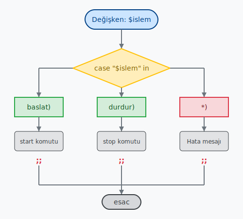

Bu yapıda dikkatinizi çekmesi gereken özel semboller ve mekanizmalar vardır:

-   `)` (Kapanış Parantezi): Kontrol edilecek deseni sonlandırır ve işletim sistemine "buradan sonra komutlar başlıyor" bilgisini verir.
-   `;;` (Çift Noktalı Virgül): Bu işaret, kargo tesisindeki kuyunun dibini temsil eder. Bir desen eşleşip ilgili komutlar çalıştırıldıktan sonra, sürecin (process) diğer durumlara akmasını engeller (fall-through) ve `case` bloğundan çıkılmasını sağlar. C programlama dilindeki `break` komutunun görevini üstlenir.
-   `*` (Yıldız / Asterisk): Kabuk terminolojisinde "her şey" anlamına gelen bir joker (wildcard) karakterdir. Hiçbir durumla eşleşmeyen bir değer geldiğinde, programın çökmemesi veya sahipsiz kalmaması için bir nevi güvenlik ağı (Varsayılan Durum - Default Case) görevi görür.
-   `esac`: Tıpkı `if` bloğunun `fi` ile kapatılması geleneği gibi, `case` kelimesinin tersten yazılmasıyla blok sonlandırılır.

**Örnek: Sistem Servis Yönetim Betiği**
Bir sunucu üzerindeki web servisini başlatıp durduracak basit bir kontrol betiği (script) yazalım. Kullanıcının terminalden gireceği parametreye göre (start, stop, vb.) işlem yapacak bir yapı kurgulayalım:

```bash
#!/bin/bash

echo "Web servisi kontrol paneline hoş geldiniz."
echo "Lütfen bir işlem seçin: [baslat | durdur | yeniden_baslat]"
read islem

case "$islem" in
    baslat)
        echo "Servis başlatılıyor..."
        # systemctl start apache2 gibi bir komut buraya yazılır
        ;;
    durdur)
        echo "Servis durduruluyor..."
        # systemctl stop apache2
        ;;
    yeniden_baslat)
        echo "Servis kapatılıp tekrar açılıyor..."
        # systemctl restart apache2
        ;;
    *)
        echo "Hata: Geçersiz bir parametre girdiniz. Sistemde değişiklik yapılmadı."
        ;;
esac
```
Bu kod çalıştığında, bellekten okunan `$islem` değişkeni yukarıdan aşağıya doğru desenlerle karşılaştırılır. Eşleşme sağlandığı anda sadece o bloğun içindeki komutlar işlenir ve `;;` görüldüğünde komut satırı doğrudan `esac` satırının sonrasına atlar.

**Çoklu Eşleştirme (Logical OR) ve Karakter Sınıfları**
Sistem programlarken bazen kullanıcıların aynı anlama gelen farklı girdiler yapmasını tolere etmemiz gerekir. Kullanıcı bir onaya büyük harfle "E", küçük harfle "e" veya kelime olarak "Evet" yanıtını verebilir. Bu durumda `|` (Pipe - Boru) karakterini bir Mantıksal VEYA (Logical OR) operatörü olarak kullanabiliriz.

```bash
read -p "Devam etmek istiyor musunuz? (E/H): " cevap

case "$cevap" in
    [eE] | [eE][vV][eE][tT])
        echo "İşleme devam ediliyor. Dosyalar kopyalanıyor..."
        ;;
    [hH] | [hH][aA][yY][ıI][rR])
        echo "İşlem kullanıcı tarafından iptal edildi."
        ;;
    *)
        echo "Tanımsız giriş. İşlem sonlandırılıyor."
        ;;
esac
```
Burada köşeli parantez `[ ]` kullanımı da bir başka güçlü desen eşleştirme tekniğidir. Köşeli parantez içindeki karakterler, o haneye yazılabilecek alternatif harfleri belirtir. Bu, Düzenli İfadeler (Regex - Regular Expressions) mantığının kabuk üzerindeki temel uygulamalarından biridir.

Aşağıda, not örneği üzerinden `case` yapısının bir başka kullanımını görebilirsiniz:

```bash
#!/bin/bash

read -p "Secim yapın [b/g/c/q]: " SECIM

case "$SECIM" in
    b|B|bas)
        echo "Baslatiliyor..."
        ;;
    g|G|goster)
        echo "Gosteriliyor..."
        ;;
    c|C|cik)
        echo "Cikiliyor."
        exit 0
        ;;
    q|Q)
        exit 0
        ;;
    *)
        echo "Bilinmeyen secim: $SECIM" >&2
        exit 1
        ;;
esac
```

`;;` her dalın sonunu işaret eder. `|` birden fazla deseni aynı dala bağlar. `*)` varsayılan dal — C dilindeki `default:` gibidir.

---

### 8.10 Döngüler ve Alt Kabuklar (Loops and Subshells)

Gençler, şu ana kadar yazdığımız betikler (scripts) yukarıdan aşağıya doğru bir kez çalışıp sonlanıyordu. `if-else` ve `case` ile programın yönünü değiştirmeyi öğrendik ancak aynı işlemi tekrar tekrar yapmamız gerektiğinde bu yapılar yetersiz kalır. Bir dizindeki binlerce dosyanın uzantısını değiştirmek veya bir log dosyasındaki her satırı tek tek okumak için aynı kodu bin defa alt alta yazamayız.

Tıpkı bir fabrikadaki üretim bandının (assembly line) dönmesi gibi, bilgisayar bilimlerinde de tekrar eden işlemleri otomatize etmek için döngü (loop) mekanizmalarını kullanırız. İşletim sistemleri, bu tekrarları donanım seviyesindeki atlama (jump) komutlarıyla oldukça verimli bir şekilde gerçekleştirir.

Kabuk ortamında (Shell Environment) en çok kullanacağımız üç temel döngü yapısı vardır: `for`, `while` ve `until`.

**1. `for` Döngüsü: Liste Üzerinde Gezinme**
`for` döngüsü, belirli bir liste veya dizi (array) içindeki elemanları tek tek alıp, her biri için belirli komutları çalıştırmak üzere tasarlanmıştır. Kaç kere döneceği baştan bellidir. Bir bahçedeki ağaçları sırayla suladığınızı düşünün; bahçedeki ağaç listesi bitene kadar hortumu bir sonrakine taşırsınız.

Temel Sözdizimi (Syntax):

```bash
for degisken_adi in liste
do
    # Her eleman için çalışacak komutlar
done
```
Dikkatinizi çekerim, `if` bloğu `fi` ile kapatılıyordu. Döngüler ise "yap" anlamına gelen `do` ile başlar, "yapıldı/bitti" anlamına gelen `done` ile sonlandırılır.

Örnek: Dosya İsimlerini Değiştirme

Diyelim ki klasörümüzde bir sürü `.txt` uzantılı dosya var ve biz bunların sonuna "_yedek" eklemek istiyoruz:

```bash
#!/bin/bash

# Bulunan tüm .txt dosyalarını sırayla 'dosya' değişkenine ata
for dosya in *.txt
do
    echo "$dosya işleniyor..."
    # mv komutu ile dosyanın adını değiştir
    mv "$dosya" "${dosya%.txt}_yedek.txt"
done
echo "Tüm yedekleme işlemleri tamamlandı."
```
Buradaki `${dosya%.txt}` ifadesi, değişkenin sonundaki ".txt" kısmını kırpar. Bu da kabuk programlamanın pratik özelliklerinden biridir.

#### for Döngüsü — C Tarzı

```bash
for ((i=0; i<10; i++)); do
    echo $i
done

# Geri sayım
for ((i=10; i>=1; i--)); do
    echo "$i..."
done
```

#### 2. while Döngüsü: Koşul Doğru (True) Oldukça Dön

`while` (sürece, -iken) döngüsü, belirli bir koşul doğru (0 çıkış kodu) olduğu sürece çalışmaya devam eder. Koşul yanlış olduğunda (sıfırdan farklı bir çıkış kodu döndüğünde) döngü kırılır. Mutfakta bir tencere çorbayı, sıcaklık 100 dereceye ulaşana kadar (sıcaklık < 100 koşulu doğru olduğu sürece) karıştırmaya benzer.

Örnek: Sayaç Mantığı

```bash
#!/bin/bash

sayac=1

while [ $sayac -le 5 ]
do
    echo "Döngü çalışıyor. Şu anki değer: $sayac"
    # Sayacı 1 artır (Aritmetik işlem için $(( )) kullanılır)
    sayac=$((sayac + 1))
done
```

Eğer sayacı artırmayı unutursanız, koşul her zaman doğru kalacağı için programınız Sonsuz Döngüye (Infinite Loop) girer ve siz Ctrl+C ile kesene kadar çalışmaya devam eder.

#### 3. until Döngüsü: Koşul Doğru Olana Kadar Dön

`until` döngüsü, `while` döngüsünün tam tersidir. Koşul yanlış (false) olduğu sürece çalışır, koşul doğru (true) olduğu anda durur. Genellikle bir sistemin veya servisin ayağa kalkmasını beklerken kullanılır. "Sunucuya bağlanılana kadar (until connected) tekrar dene" mantığı.

```bash
#!/bin/bash

# Ping atılamadığı sürece (komut hata döndürdükçe) dön
until ping -c 1 8.8.8.8 > /dev/null 2>&1
do
    echo "Ağ bağlantısı yok, 5 saniye sonra tekrar deneniyor..."
    sleep 5
done

echo "Bağlantı sağlandı!"
```

#### break ve continue

```bash
for i in {1..20}; do
    (( i % 2 == 0 )) && continue   # Çift sayıları atla
    (( i > 15 ))     && break      # 15'ten sonra dur
    echo $i
done
# Çıktı: 1 3 5 7 9 11 13 15
```

`break N` ile N seviye iç içe döngüden çıkılabilir.

#### Alt Kabuklar ve Kod Blokları (Subshells and Code Blocks)

Parantez içinde çalışan komut grubu alt kabuk (Subshell) üretir:

```bash
DEGER=10

(
    DEGER=99
    echo "Ic kisim: $DEGER"
)

echo "Disarisi: $DEGER"
```

İçeride `99`, dışarıda `10` görülür. Çünkü parantez içi ayrı çocuk süreçte çalışır. Orada yapılan değişiklik ana kabuğa geri taşınmaz.

Süslü parantez farklı davranır:

```bash
DEGER=10
{ DEGER=99; }
echo "$DEGER"
```

Burada yeni süreç açılmaz; değişiklik dışarı taşar. Ayrı laboratuvar odasında deneme yapmakla aynı masa üzerinde deneme yapmak arasındaki fark gibi düşünülebilir.

---

### 8.11 Fonksiyonlar (Functions)

Fonksiyonlar, bir grup komutu adlandırılmış bir blok altında toplar. Aynı kodu farklı yerlerde kullanmayı ve betiği parçalara bölmeyi sağlar.

```bash
# İki sözdizim de geçerlidir
selamla() {
    echo "Merhaba, $1!"
}

function selamla2 {
    echo "Hos geldin, $1!"
}

selamla "Ahmet"
selamla2 "Zeynep"
```

Fonksiyonun kendi `$1`, `$2`, `$#`, `$@` değişkenleri vardır; bunlar betiğin komut satırı argümanlarından **bağımsızdır**.

#### Dönüş Değerleri (Return Values)

Bash'te `return` yalnızca 0-255 arasında bir sayı döndürür (çıkış kodu). Gerçek bir değer döndürmek için `echo` ve komut ikamesi kullanılır:

```bash
karesi_al() {
    local sayi=$1
    echo $(( sayi * sayi ))    # Sonucu stdout'a yaz
}

SONUC=$(karesi_al 7)
echo "7'nin karesi: $SONUC"    # 49

# Hata kodu döndürme
dosya_kontrol() {
    [[ -f "$1" ]] && return 0 || return 1
}

if dosya_kontrol "/etc/passwd"; then
    echo "Dosya mevcut."
fi
```

#### Yerel Değişkenler (Local Variables)

```bash
x=10   # Global

fonksiyon() {
    local x=99                 # Yalnızca bu fonksiyona ait
    echo "Fonksiyon ici: $x"  # 99
}

fonksiyon
echo "Disarida: $x"           # 10 — değişmedi
```

`local` kullanmazsanız fonksiyon içindeki değişken global kapsamı değiştirir. Beklenmedik hatalara yol açar. Fonksiyonlarda her zaman `local` kullanın.

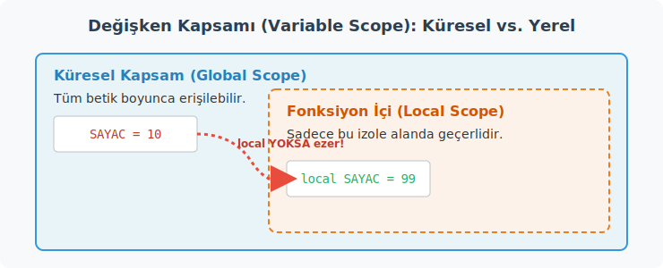

#### Özyinelemeli Fonksiyon (Recursive Function)

```bash
faktoriyel() {
    local n=$1
    if (( n <= 1 )); then
        echo 1
    else
        local alt=$(faktoriyel $(( n - 1 )))
        echo $(( n * alt ))
    fi
}

echo "5! = $(faktoriyel 5)"    # 120
```

Aynı kodun klavyeden değer alan (etkileşimli) versiyonu:

```bash
faktoriyel() {
    local n=$1
    if (( n <= 1 )); then
        echo 1
    else
        local alt=$(faktoriyel $(( n - 1 )))
        echo $(( n * alt ))
    fi
}

# Klavyeden girilen sayının faktöriyelini bulma
read -p "Faktöriyeli hesaplanacak sayıyı girin: " sayi
if [[ $sayi =~ ^[0-9]+$ ]]; then
    echo "$sayi! = $(faktoriyel $sayi)"
else
    echo "Lütfen geçerli bir pozitif tam sayı girin."
fi
```

Bash özyinelemeyi destekler ama her çağrı yeni bir alt süreç oluşturduğundan büyük değerlerde performans düşer. Gerçek sayısal hesaplamalar için Python veya C daha uygun seçimlerdir.

---

### 8.12 Hata Yönetimi (Error Handling)

#### Çıkış Kodları (Exit Kodları)

Linux ve Unix sistemlerinde, çalışan her komut veya program işini bitirdiğinde işletim sistemine gizli bir "durum raporu" bırakır. Bu rapora **Çıkış Kodu (Exit Code)** denir.

Bu sistemin evrensel kuralı şudur:
* **`0` (Sıfır):** "Her şey yolunda, görev başarıyla tamamlandı."
* **`1` ile `255` arası sayılar:** "Bir şeyler ters gitti!" (Farklı sayılar farklı hata türlerini belirtir).

Bir komutun çıkış kodunu öğrenmek için, komutu çalıştırdıktan hemen sonra **`$?`** özel değişkenine bakmamız gerekir.

**Örnekler:**

```bash
# Başarılı bir komut örneği: Var olan bir dizini listele
ls /var/log > /dev/null 2>&1
echo "Son komutun çıkış kodu: $?"    # Çıktı: 0 (Başarılı)

# Hatalı bir komut örneği: Olmayan bir dizini listelemeye çalış
ls /olmayan/dizin > /dev/null 2>&1
echo "Son komutun çıkış kodu: $?"    # Çıktı: 2 (Hata: Dizin veya dosya bulunamadı)
```

**Bilgi: `> /dev/null 2>&1` Ne Anlama Geliyor?**

Yukarıdaki örneklerde komutun ekrana gereksiz metin veya hata mesajı yazdırmasını engellemek, sadece gizli olan **çıkış kodunu (0 veya 2)** almak için bu yapı kullanılmıştır.


* **`> /dev/null`**: Standart çıktıyı (komutun normal sonucunu) Linux'un "kara deliği" olan `/dev/null` dosyasına yönlendirir. Buraya giden veri sonsuza dek kaybolur (ekranda görünmez).
* **`2>&1`**: Standart hatayı (`2`), standart çıktının (`1`) gittiği yere (yani `/dev/null` kara deliğine) yönlendirir. Böylece hatalar da ekranda görünmez.

**Kendi Betiklerimizde (Script) Kullanımı:**

Yazdığınız Bash betiklerinde `exit` komutunu kullanarak programın nasıl sonlandığını işletim sistemine (veya o betiği çalıştıran başka bir programa) bildirebilirsiniz:

* `exit 0`: "Betik görevini başarıyla tamamladı." (Betiğin sonuna konur).
* `exit 1` (veya diğer sayılar): "Betikte bir hata oluştu ve çalışma durduruldu." (Örneğin gerekli bir dosya bulunamadığında betiği kesmek için kullanılır).

#### Savunmacı Betik — `set` Seçenekleri

```bash
#!/bin/bash
set -e          # Herhangi bir komut hata dönerse betiği durdur (exit on error)
set -u          # Tanımlanmamış değişken kullanımını hata say (unset)
set -o pipefail # Pipe içindeki herhangi bir komut hata dönerse hata say
```

Bu üçü birlikte sık kullanılır:

```bash
#!/bin/bash
set -euo pipefail
```

`set -e` olmadan yanlış giden bir komut sessizce atlanıp betik devam edebilir. Bu, fark edilmeden veri kaybına veya sistemin tutarsız bir duruma girmesine neden olabilir.

**`set -u` neden kritik:**

```bash
# set -u olmadan
rm -rf "$HEDEF_DIZIN"/   # HEDEF_DIZIN tanimli degilse bos gibi davranabilir

# set -u ile
rm -rf "$HEDEF_DIZIN"/   # Hata: unbound variable — betik durur
```

#### Sinyal Yakalama (Signal Handling) ve trap Komutu

Gençler, bir sistem programcısı olarak yazdığımız kodun her zaman ideal koşullarda, başından sonuna kadar kesintisiz çalışacağını varsayamayız. Çalışan bir betik (script) aniden dışarıdan bir kesme (interrupt) alabilir. Örneğin, kullanıcı işlemin uzun sürmesinden sıkılıp **Ctrl+C** tuşlarına basabilir veya sistem yöneticisi süreci `kill` komutuyla zorla sonlandırmak isteyebilir.

Bu tür dış müdahalelere ve sistem bildirimlerine **Sinyal (Signal)** diyoruz. Sinyalleri, yoğun bir mutfakta çalışan aşçıbaşına gelen acil durum anonslarına benzetebiliriz. Eğer mutfakta yangın alarmı çalarsa (bir sinyal gelirse), aşçıbaşı elindeki bıçağı olduğu gibi tezgaha bırakıp mutfaktan kaçmamalıdır. Çıkmadan önce ocağın altını kapatmalı (açık dosyaları kapatmalı) ve tezgahı güvenli bir şekilde bırakmalıdır (geçici dosyaları temizlemelidir).

İşte `trap` komutu, betiğimize belirli bir sinyal geldiğinde tam olarak ne yapması gerektiğini tembihler:

```bash
#!/bin/bash
set -euo pipefail

# Temizlik rutinimizi tanımlıyoruz
temizle() {
    echo "Sistem: Temizlik yapiliyor, açık kaynaklar kapatılıyor..." >&2
    rm -f /tmp/gecici_$$
}

# EXIT sinyali: Betik her nasıl sonlanırsa sonlansın temizle fonksiyonunu çağır
trap temizle EXIT    

# INT sinyali: Ctrl+C'ye basıldığında özel bir mesaj ver ve hata ile çık
trap 'echo "Kullanici tarafindan iptal edildi!" >&2; exit 1' INT   

touch /tmp/gecici_$$
echo "Uzun süren islemler yapılıyor... (İptal etmek için Ctrl+C'ye basın)"
sleep 5
echo "Islem basariyla tamamlandı."
```

Yukarıdaki kodda yer alan `$$` ifadesi betiğin **Süreç Kimliği (PID - Process ID)** değerini temsil eder. Aynı betik iki farklı terminalde aynı anda çalıştırılırsa, her birinin `$$` değeri farklı olacağından oluşturdukları geçici dosyalar (örneğin `/tmp/gecici_1234` ve `/tmp/gecici_5678`) birbirinin üzerine yazılmaz ve karışmaz.

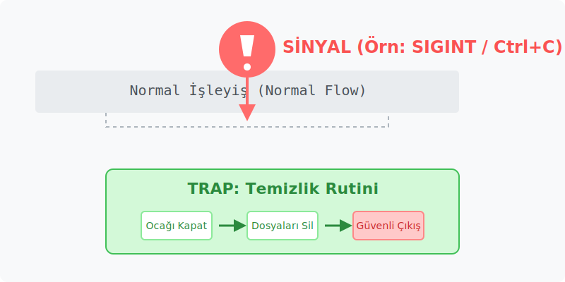

**Sık Karşılaşılan Sinyaller:**

| Sinyal | Kodu | Anlamı |
|--------|------|--------|
| `EXIT` | — | İşletim sistemine geri dönüş (Betik bittiğinde veya `exit` çağrıldığında tetiklenir) |
| `INT` | 2 | **Int**errupt (Kesme) — Genellikle **Ctrl+C** ile tetiklenir. |
| `TERM` | 15 | **Term**inate (Sonlandır) — `kill` komutunun varsayılan, işlemi sonlandırma isteğidir. |
| `ERR` | — | `set -e` açıkken bir komutun başarısız olması durumunda fırlatılır. |
| `HUP` | 1 | **H**ang**up** — Terminal penceresi kapatıldığında veya SSH bağlantısı koptuğunda gelir. |

---

### 8.13 Betik Hata Ayıklama (Debugging)

Yazılım geliştirme sürecinin önemli bir kısmı, kodun neden beklenen şekilde davranmadığını bulmakla geçer. Bash, diğer dillerdeki gibi adım adım ilerleyen görsel bir hata ayıklayıcıya sahip olmasa da, kendi içinde son derece güçlü izleme (tracing) mekanizmaları barındırır.

#### `set -x` ile Şeffaf İzleme

Hata ayıklamanın en etkili yollarından biri, komutların çalıştırılmadan hemen önce arka planda hangi son hali aldıklarını görmektir. `set -x` komutunu betiğinize eklediğinizde, boru hattınızı (pipeline) adeta şeffaf bir cama çevirirsiniz; böylece verinin hangi aşamadan, hangi değişkene dönüşerek aktığını net bir şekilde izleyebilirsiniz.

```bash
#!/bin/bash
set -x    # İzleme modunu aç (xtrace)
```

Eğer uzun bir betiğin sadece şüphelendiğiniz dar bir bölgesini izlemek isterseniz, bu modu yalnızca o kısım için açıp sonra kapatabilirsiniz:

```bash
# Sadece bu bölümü izle
set -x
HESAP=$(( 5 * (10 + 2) ))
echo "Sonuc: $HESAP"
set +x    # İzleme modunu kapat
```

Koda hiç dokunmadan, betiği dışarıdan izleme moduyla başlatmak için şu yöntem tercih edilir:

```bash
bash -x betik.sh
```

İzleme modu açıkken bash, çalıştıracağı her komutu (değişkenleri gerçek değerleriyle değiştirdikten sonra) başına bir `+` işareti koyarak ekrana yansıtır:

```text
+ HESAP=60
+ echo 'Sonuc: 60'
Sonuc: 60
```


#### Sözdizimi Kontrolü (Syntax Check)

Betiği çalıştırmadan önce sadece yazım kurallarına (syntax) uyup uymadığını denetlemek için `-n` (noexec) parametresini kullanırız. 

```bash
bash -n betik.sh    # Çalıştırmadan sadece sözdizimi denetle
```

#### Bash'te Sık Yapılan Tipik Hatalar

| Hatalı Kullanım | Neden Hatalı? | Doğru Kullanım |
|------|----------|---------|
| `ISIM = "Ali"` | Değişken atamalarında `=` işaretinin sağında ve solunda boşluk **kesinlikle olmamalıdır**. | `ISIM="Ali"` |
| `if[$A -gt 0]` | Köşeli parantezlerin `[ ]` iç ve dış kısımlarında boşluk bırakmak **zorunludur**. | `if [ "$A" -gt 0 ]` |
| `rm $DOSYA` | Değişken tırnak içine alınmazsa, boşluk içeren dosya isimlerinde komut parametreleri yanlış algılar. | `rm "$DOSYA"` |
| `[ $A == $B ]` | `$A` değişkeni boş kalırsa, ifade `[ == "deger" ]` şekline dönüşür ve ayrıştırma (parsing) hatası oluşur. | `[ "$A" == "$B" ]` |

---

### 8.14 İş Denetimi (Job Control)

Sistem programlamada donanım kaynaklarını ve zamanı verimli kullanmak önceliktir. Betiğinizin içindeki belirli adımlar birbirinden tamamen bağımsızsa, bu işleri sırayla (sequential) yapmak yerine aynı anda (parallel) çalıştırmak, işlem süresini büyük ölçüde kısaltır.

Bu durumu bir otomobil fabrikasındaki montaj hattı yerine, birbirinden bağımsız çalışan robot kollara benzetebiliriz. Kapıları takan robot ile camları takan robotun birbirini beklemesine gerek yoktur; her ikisi de aynı anda çalışabilir. Ancak kalite kontrol noktasına gelindiğinde, iki işlemin de bitmiş olması gerekir.

Bash'te çalıştırılan bir komutun veya sürecin sonuna `&` işareti koymak, o işi arka planda (background) başlatır. `wait` komutu ise bu işlemlerin tümünün bitmesini beklemek için bir senkronizasyon (synchronization) noktası oluşturur.

```bash
# Uzun süren bir veritabanı yedeğini arka planda başlatıyoruz
yedek_al &
YEDEK_PID=$!       # $! değişkeni, arka planda başlatılan son sürecin PID değerini yakalar

echo "Yedekleme arka planda devam ediyor (PID: $YEDEK_PID)..."

# Yedekleme sürerken diğer bağımsız işlerimize devam edebiliriz
loglari_sikistir

# Tüm hayati işlemler bitmeden ana betiğin kapanmasını engelliyoruz
wait $YEDEK_PID    
echo "Tüm isler tamamlandi, sistem güvenli durumda."
```

#### Paralel Çalıştırma Deseni (Parallel Execution Pattern)

Birçok işi aynı anda arka planda başlatıp, en sonunda hepsinin tamamlanmasını beklemek (genellikle Fork-Join modeli olarak adlandırılır) sistem yöneticilerinin sıklıkla kullandığı bir yapıdır. Özellikle birden fazla sunucuya aynı anda yapılandırma gönderirken veya çok sayıda büyük dosyayı işlerken kullanılır.

```bash
#!/bin/bash
set -euo pipefail

veri_isle() {
    local id=$1
    echo "Makine $id isleniyor..."
    # İşi simüle etmek için rastgele bir süre bekletiyoruz
    sleep $(( RANDOM % 5 + 1 )) 
    echo "Makine $id islemi tamamlandi."
}

PIDLER=()

# 5 farklı makine için işlemleri paralel olarak başlat
for i in {1..5}; do
    veri_isle "$i" &
    PIDLER+=($!)   # Başlayan her arka plan işinin PID'ini diziye ekle
done

echo "Tüm isler baslatildi, ana hat bekliyor..."

# Diziye kaydettiğimiz süreçlerin tamamının bitmesini garanti altına al
for pid in "${PIDLER[@]}"; do
    wait "$pid"
done

echo "Ana Betik: Tüm paralel islemler sorunsuz tamamlandi."
```

*Not:* Yukarıdaki kodda kullanılan `RANDOM`, Bash'in içerisinde yerleşik olarak bulunan ve her çağrıldığında 0 ile 32767 arasında sözde rastgele (pseudo-random) bir sayı üreten bir ortam değişkenidir.

---

### Uygulama 8 — Log Analiz Betiği

Aşağıdaki betiği `log_analiz.sh` olarak kaydedin:

```bash
#!/bin/bash
# log_analiz.sh — Sistem log dosyasını analiz eder

set -euo pipefail

LOG_DOSYASI="${1:-/var/log/syslog}"
RAPOR_DIZINI="$HOME/raporlar"
TARIH=$(date '+%Y%m%d_%H%M%S')
RAPOR="$RAPOR_DIZINI/log_analiz_${TARIH}.txt"

temizle() {
    [[ -f "$RAPOR" && ! -s "$RAPOR" ]] && rm -f "$RAPOR"
}
trap temizle EXIT

mkdir -p "$RAPOR_DIZINI"

if [[ ! -f "$LOG_DOSYASI" ]]; then
    echo "Hata: $LOG_DOSYASI bulunamadi." >&2
    exit 1
fi

if [[ ! -r "$LOG_DOSYASI" ]]; then
    echo "Hata: $LOG_DOSYASI okunamıyor (yetki yetersiz)." >&2
    exit 1
fi

{
    echo "================================================"
    echo "  LOG ANALIZ RAPORU"
    echo "  Tarih   : $(date)"
    echo "  Dosya   : $LOG_DOSYASI"
    echo "  Boyut   : $(du -sh "$LOG_DOSYASI" | cut -f1)"
    echo "  Satır   : $(wc -l < "$LOG_DOSYASI")"
    echo "================================================"
    echo ""

    echo "--- OZET ---"
    printf "ERROR : %d\n" "$(grep -c -i "error"   "$LOG_DOSYASI" || echo 0)"
    printf "WARN  : %d\n" "$(grep -c -i "warning" "$LOG_DOSYASI" || echo 0)"
    printf "INFO  : %d\n" "$(grep -c -i "info"    "$LOG_DOSYASI" || echo 0)"
    echo ""

    echo "--- EN FAZLA HATA URETEN KAYNAKLAR (Ilk 10) ---"
    grep -i "error" "$LOG_DOSYASI" \
        | awk '{print $5}' \
        | sort \
        | uniq -c \
        | sort -rn \
        | head -10
    echo ""

    echo "--- SON 20 HATA SATIRI ---"
    grep -i "error" "$LOG_DOSYASI" | tail -20

} > "$RAPOR"

echo "Rapor olusturuldu: $RAPOR"
```

Çalıştırma:

```bash
chmod +x log_analiz.sh
./log_analiz.sh                       # Varsayılan: /var/log/syslog
./log_analiz.sh /var/log/auth.log     # Farklı log dosyası
```

`{ } > "$RAPOR"` yapısı birden fazla komutun çıktısını gruplayıp tek bir yönlendirmeyle dosyaya yazar. Her satıra ayrı ayrı `>> "$RAPOR"` yazmaktan çok daha temiz ve hızlıdır.

---

## BÖLÜM 9 — Faydalı İleri Komutlar

### `find` — Dosya Bul

`find` komutu, dosya sisteminde güçlü koşullarla arama yapar. Basit bir isim aramasından, belirli yaş, boyut, izin ve kullanıcıya göre karmaşık sorgulara kadar genişletilebilir.

```bash
find /home -name "*.txt"                    # İsme göre bul
find /home -iname "*.TXT"                   # Büyük-küçük harf duyarsız
find /home -name "*.txt" -mtime -7          # Son 7 günde değiştirilmiş
find /var/log -size +10M                    # 10 MB'dan büyük
find . -type d -name "test"                 # "test" adlı dizinler
find . -name "*.tmp" -delete               # Bul ve sil
find . -name "*.java" -exec grep -l "main" {} \;   # main içeren Java dosyaları
find . -newer referans.txt                  # referans.txt'den daha yeni
find . -empty                               # Boş dosya ve dizinler
```

| Parametre | Anlam |
|-----------|-------|
| `-name` | Dosya adına göre |
| `-iname` | Büyük-küçük harf duyarsız |
| `-type f` | Düz dosya |
| `-type d` | Dizin |
| `-type l` | Sembolik bağlantı |
| `-size +10M` | 10 MB'dan büyük |
| `-mtime -7` | Son 7 günde değiştirilmiş |
| `-newer dosya` | dosya'dan daha yeni |
| `-user ali` | ali kullanıcısına ait |
| `-perm 644` | İzni 644 |
| `-exec cmd {} \;` | Her eşleşme için komut çalıştır |
| `-exec cmd {} +` | Tüm eşleşmeleri tek komuta topla (daha hızlı) |

`-exec ... {} \;` her dosya için ayrı komut çağırır. `-exec ... {} +` ise tüm dosyaları tek komuta argüman olarak toplar — çok daha hızlıdır.

**Betik içinde kullanım:**

```bash
# 30 günden eski log dosyalarını temizle
find /var/log -name "*.log" -mtime +30 -exec rm -f {} +

# Büyük dosyaları bul ve boyutlarıyla raporla
find "$HOME" -size +100M -exec du -sh {} \; | sort -rh
```

---

### `tar` — Arşivleme

**tar** (Tape Archive — Bant Arşivi), birden fazla dosyayı tek pakette toplar. Adı manyetik bant döneminden kalmadır ama günümüzde disk ve ağ yedeklemelerinde yaygın olarak kullanılmaktadır.

```bash
# Oluştur ve gzip ile sıkıştır
tar -czvf yedek.tar.gz Projeler/

# İçeriği listele
tar -tzvf yedek.tar.gz

# Aç
tar -xzvf yedek.tar.gz

# Belirli dizine aç
tar -xzvf yedek.tar.gz -C /hedef/

# bzip2 ile sıkıştır (daha iyi sıkıştırma, daha yavaş)
tar -cjvf yedek.tar.bz2 Projeler/

# xz ile sıkıştır (en iyi oran, en yavaş)
tar -cJvf yedek.tar.xz Projeler/
```

| Parametre | Anlam |
|-----------|-------|
| `-c` | Oluştur (create) |
| `-x` | Aç/çıkar (extract) |
| `-t` | İçeriği listele (list) |
| `-z` | gzip sıkıştırması |
| `-j` | bzip2 sıkıştırması |
| `-J` | xz sıkıştırması |
| `-v` | Ayrıntılı çıktı (verbose) |
| `-f` | Dosya adı belirt (file) |
| `-C` | Hedef dizin (change directory) |

`.tar.gz` hem arşivlenmiş hem sıkıştırılmış demektir. `tar` arşivler, `gzip` sıkıştırır — iki ayrı iş, iki ayrı araç. Windows'taki `.zip` bu iki işi tek adımda yapar; Linux'ta kavramlar ayrıdır.

---

### `which`, `whereis`, `type` — Komut Konumu

```bash
$ which python3
/usr/bin/python3

$ which -a python     # Tüm eşleşmeler
/usr/bin/python
/usr/local/bin/python

$ whereis python3
python3: /usr/bin/python3 /usr/lib/python3 /usr/share/man/man1/python3.1.gz

$ type ls
ls, `/usr/bin/ls' icin takma addır

$ type cd
cd bir yerlesik kabuk komutudur
```

`which` çalıştırılabilir dosyanın yolunu gösterir. `whereis` kaynak kodu ve kılavuz sayfasını da bulur. `type` ise komutun ne olduğunu — alias, function, builtin, ya da harici dosya — açıklar.

---

### `man` — Kılavuz Sayfaları

**man**, Latince *manualis* (elle tutulan, elle taşınan) kökünden gelir. Her komutun ayrıntılı kılavuz sayfası vardır ve bu sayfalar `less` ile gösterilir.

```bash
man ls
man 5 passwd     # Bölüm 5: dosya formatları (/etc/passwd açıklaması)
man -k "copy"    # "copy" ile ilgili tüm kılavuzları ara
apropos copy     # man -k ile eşdeğerdir
```

Kılavuz sayfaları bölümlere ayrılmıştır:

| Bölüm | İçerik |
|-------|--------|
| 1 | Kullanıcı komutları |
| 2 | Sistem çağrıları (system calls) |
| 3 | C kütüphane fonksiyonları |
| 5 | Dosya formatları |
| 8 | Sistem yönetim komutları |

`man 2 open` sistem programlamada sıkça kullanılır — `open()` sistem çağrısının C arayüzünü açıklar. Sistem programlama derslerinde bu bölüm özellikle değerli olacaktır.

---

### `alias` — Komut Kısayolu

```bash
alias ll='ls -la'
alias la='ls -A'
alias guncelle='sudo apt update && sudo apt upgrade -y'

# Mevcut aliasları listele
alias

# Alias kaldır
unalias ll
```

Kalıcı aliaslar için `~/.bashrc` dosyasına eklenmesi gerekir:

```bash
echo "alias ll='ls -la'" >> ~/.bashrc
source ~/.bashrc    # Değişiklikleri bu terminal oturumuna uygula
```

---

### `history` — Komut Geçmişi

```bash
history            # Tüm geçmiş
history 20         # Son 20 komut
!100               # 100. komutu tekrar çalıştır
!!                 # Son komutu tekrar çalıştır
!grep              # "grep" ile başlayan son komutu çalıştır
!$                 # Son komutun son argümanı
```

`sudo !!` yaygın bir kısayoldur: yetki hatası alan bir komutu `sudo !!` ile yönetici yetkisiyle tekrar çalıştırmak.

Geçmiş dosyası `~/.bash_history`'de saklanır. `HISTSIZE` bellekte, `HISTFILESIZE` dosyada tutulan komut sayısını belirler.

**Ctrl+R** ile geçmişte interaktif arama yapılır: tuşa basın, kelimeyi yazın, eşleşen komut görünür; Enter ile çalıştırın ya da ok tuşuyla düzenleyin.

---

### `cron` — Zamanlanmış Görevler (Scheduled Tasks)

`cron`, belirli zamanlarda otomatik komut çalıştıran bir servis programıdır (daemon — arka plan servisi). Latince daemonlar gibi arka planda sessizce çalışır; görünmez ama iş yapar. Windows'taki Görev Zamanlayıcı'nın (Task Scheduler) terminal karşılığıdır.

```bash
crontab -e    # Cron görevlerini düzenle
crontab -l    # Mevcut görevleri listele
crontab -r    # Tüm görevleri sil (dikkatli!)
```

**Cron sözdizimi:**

```
# Dakika  Saat  GunAy  Ay  GunHafta  Komut
  *       *     *      *   *         /path/to/komut
```

| Alan | Değer Aralığı | Özel Sözdizimi |
|------|--------------|---------------|
| Dakika | 0-59 | `*/5` her 5 dakikada |
| Saat | 0-23 | `0` gece yarısı |
| Gün (ay) | 1-31 | |
| Ay | 1-12 | |
| Gün (hafta) | 0-7 (0 ve 7 = Pazar) | `1-5` hafta içi |

```
# Her gece 02:00'de yedek al
0 2 * * * /home/kullanici/yedekle.sh >> /var/log/yedek.log 2>&1

# Her 15 dakikada kontrol et
*/15 * * * * /home/kullanici/kontrol.sh

# Hafta ici her sabah 09:00'da rapor gönder
0 9 * * 1-5 /home/kullanici/rapor.sh

# Her ayin 1'i gece 23:30'da aylik arsiv
30 23 1 * * /home/kullanici/aylik_arsiv.sh
```

Cron görevlerinin çıktısını log dosyasına yönlendirmek iyi bir alışkanlıktır:

```
0 2 * * * /home/kullanici/yedekle.sh >> /var/log/yedek.log 2>&1
```

---

### Ortam ve Başlangıç Dosyaları (Startup Files)

Bash başladığında belirli dosyaları sırayla okur. Bu dosyalar PATH, alias ve fonksiyon tanımlarının kalıcı olmasını sağlar.

**Login shell (oturum açma kabuğu) için:**
1. `/etc/profile` — sistem geneli
2. `~/.bash_profile` veya `~/.bash_login` veya `~/.profile` — kullanıcıya özel

**Interactive non-login shell (yeni terminal penceresi/sekmesi) için:**
1. `/etc/bash.bashrc` — sistem geneli
2. `~/.bashrc` — kullanıcıya özel

MATE Terminal'de yeni sekme açıldığında genellikle non-login interactive shell başlar; bu yüzden `~/.bashrc` en sık düzenlenen yapılandırma dosyasıdır.

```bash
# ~/.bashrc içine ekleme örnekleri
echo 'export PATH="$HOME/.local/bin:$PATH"' >> ~/.bashrc
echo 'alias ll="ls -la"'                    >> ~/.bashrc
echo 'export EDITOR=nano'                   >> ~/.bashrc
source ~/.bashrc    # Değişiklikleri hemen uygula
```

---

### Boru Hatları (Pipes) — Komutları Zincirleme

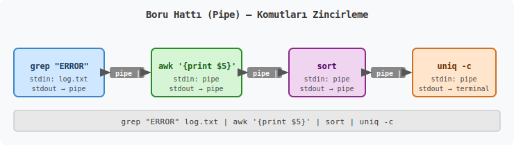

Linux'un felsefesi "tek bir işi iyi yapan küçük araçlar"dır. Bu araçlar `|` (pipe — boru) ile birbirine bağlanarak karmaşık işlemler gerçekleştirilir. Bir komutun stdout'u, bir sonraki komutun stdin'ine bağlanır.

```bash
# En çok disk kullanan 5 dizini bul
du -sh /var/* 2>/dev/null | sort -rh | head -5

# Sistemdeki kullanıcıları alfabetik listele
cut -d ":" -f 1 /etc/passwd | sort

# Log'da en çok tekrar eden hata kaynağını bul
grep "ERROR" /var/log/syslog | awk '{print $5}' | sort | uniq -c | sort -rn | head -10
```

Her `|` bir montaj hattının bağlantı noktasıdır. Fabrikada her istasyon bir işlem yapar ve ürünü bir sonrakine geçirir. Pipe zincirlerinde de her komut veriyi işler ve sonucu bir sonraki komuta aktarır.

---

## Komut Referans Tablosu — MS-DOS ve Linux Karşılaştırması

| İşlev | MS-DOS / cmd | Linux / Bash |
|-------|-------------|--------------|
| Dizin listele | `dir` | `ls` |
| Dizin değiştir | `cd` | `cd` |
| Dizin oluştur | `md` / `mkdir` | `mkdir` |
| Dizin sil | `rd` / `rmdir` | `rmdir` / `rm -r` |
| Ağaç göster | `tree` | `tree` |
| Neredeyim | `cd` (parametresiz) | `pwd` |
| Ekran temizle | `cls` | `clear` / Ctrl+L |
| Dosya içeriği | `type` | `cat` / `less` / `more` |
| Dosya kopyala | `copy` / `xcopy` | `cp` |
| Dosya taşı | `move` | `mv` |
| Dosya sil | `del` | `rm` |
| Yeniden adlandır | `ren` | `mv` |
| Metin ara | `find` / `findstr` | `grep` |
| Sırala | `sort` | `sort` |
| Ekrana yaz | `echo` | `echo` |
| Ortam değişkenleri | `set` | `env` / `export` |
| Sistem bilgisi | `systeminfo` | `uname -a` / `lsb_release -a` |
| Bilgisayar adı | `hostname` | `hostname` |
| Kullanıcı bilgisi | `whoami` | `whoami` / `id` |
| IP yapılandırması | `ipconfig` | `ip addr` / `ifconfig` |
| Bağlantı testi | `ping` | `ping` |
| Yol izleme | `tracert` | `traceroute` |
| DNS sorgusu | `nslookup` | `nslookup` / `dig` |
| Ağ bağlantıları | `netstat` | `ss` / `netstat` |
| Süreç listesi | `tasklist` | `ps` / `top` / `htop` |
| Süreç sonlandır | `taskkill` | `kill` / `killall` |
| Dosya bul | `dir /s` / `where` | `find` / `which` / `locate` |
| Yardım | `komut /?` | `man komut` / `komut --help` |
| Yorum satırı | `REM` | `#` |
| Batch/Script | `.bat` | `.sh` |
| Disk kullanımı | `wmic logicaldisk` | `df -h` |
| Kapatma | `shutdown /s` | `shutdown -h now` / `poweroff` |
| Yeniden başlat | `shutdown /r` | `shutdown -r now` / `reboot` |
| Dosya izinleri | `attrib` | `chmod` / `chown` |
| Paket kurma | (yok — .exe indirme) | `apt install` |
| Arşivleme | (yok — harici araç) | `tar` |
| Zamanlanmış görev | Görev Zamanlayıcı (GUI) | `cron` / `crontab` |

---

## Ek: Terminal Kısayolları

| Kısayol | İşlev |
|---------|-------|
| **Tab** | Otomatik tamamlama (dosya, dizin, komut) |
| **Ctrl + C** | Çalışan komutu durdur |
| **Ctrl + Z** | Komutu arka plana gönder (duraklat) |
| **Ctrl + D** | Oturumu kapat (exit) |
| **Ctrl + L** | Ekranı temizle (clear) |
| **Ctrl + R** | Komut geçmişinde ara |
| **Ctrl + A** | İmleci satır başına götür |
| **Ctrl + E** | İmleci satır sonuna götür |
| **Ctrl + W** | Son kelimeyi sil |
| **Ctrl + U** | İmleçten satır başına kadar sil |
| **Ctrl + K** | İmleçten satır sonuna kadar sil |
| **Yukarı/Aşağı Ok** | Önceki komutlar arasında gezin |
| **!!** | Son komutu tekrar çalıştır |
| **!$** | Son komutun son argümanı |

Bu kısayollar terminal hızını belirgin biçimde artırır. Özellikle **Tab** ve **Ctrl+R** günlük kullanımda en çok vakit kazandıran ikidir.

---

## İlerisi için Tavsiyeler

Kabuk programlama, öğrenilmesi kolay ama ustalaşılması zaman isteyen bir alandır. Komutları tek tek ezberlemekten çok "bu işi nasıl otomatize edebilirim?" sorusunu sormayı alışkanlık haline getirmek, uzun vadede çok daha değerlidir.

Güçlü bir sistem programcısı olmanın yolu bash içinde her şeyi çözmeye çalışmaktan değil, bash'in sınırlarını bilip doğru araçları seçmekten geçer. Metin işleme için `awk`, `sed`, `grep`; sistem yönetimi otomasyonu için bash; veri analizi ve API çağrıları için Python; performans gerektiren görevler için C/C++ — her aracın bir amacı ve bir sınırı vardır.

Bir sonraki adım olarak şu konular önerilir:

- **Düzenli ifadeler (Regular Expressions):** `grep -E`, `sed`, `awk` ile ileri metin işleme; sistem programlamada log analizi ve protokol ayrıştırmasında günlük ihtiyaç
- **Python scripting:** Bash'in zayıf kaldığı sayısal işlemler, HTTP istekleri, JSON işleme için
- **Ansible:** Büyük ölçekli sistem otomasyonu — birden fazla sunucuya aynı anda betik uygulamak
- **Docker ve konteyner yönetimi:** Shell bilgisi Dockerfile ve konteyner orkestrasyon betiklerinde doğrudan kullanılır
- **Git hooks:** Commit, push gibi git olaylarında otomatik betik çalıştırma — kod kalitesini otomatik denetleme
- **Systemd unit dosyaları:** Servisleri systemd ile yönetme — cron'un modern alternatifi
- **Advanced Bash Scripting Guide (TLDP):** Kapsamlı, ücretsiz açık kaynaklı referans

Komutları bir ağaç gibi düşünün: kökleri sağlam oturursa — süreç, dosya, akış, izin gibi temel kavramlar — dallar kendiliğinden anlamlı hale gelir. Her yeni komut öğrenildiğinde "bu nereye oturur, hangi problemi çözer?" diye sormak, ezber yerine anlayışla öğrenmeyi getirir.
