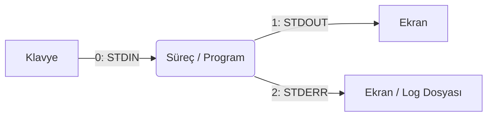
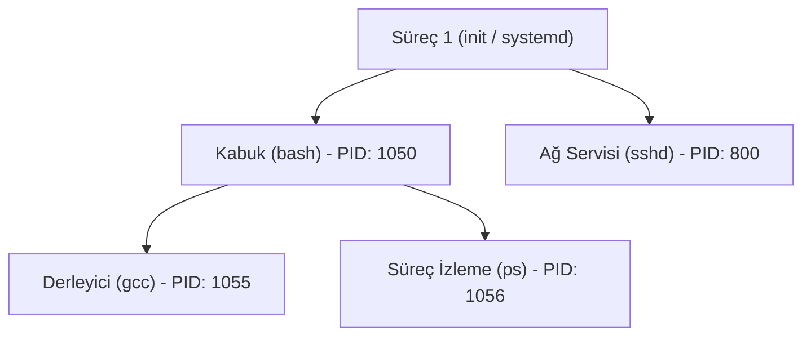

# Sistem Programlamaya Giriş ve Temel Linux

Gençler, sistem programlama (System Programming) kavramı, yazdığımız kodların donanımla nasıl etkileşime girdiğini, işletim sisteminin (Operating System - OS) kaynakları nasıl tahsis ettiğini ve işletim sistemi çekirdeğinin (Kernel) bize sunduğu arayüzleri kapsar. Bu arayüzlere sistem çağrıları (System Calls) adını veriyoruz. 

Çalışmalarımızı UNIX ve POSIX (Portable Operating System Interface) standartlarına dayanan Linux tabanlı sistemler üzerinde yürüteceğiz. Çünkü Linux mimarisi, geliştiriciye sistemin temel bileşenlerine müdahale etme ve çalışma zamanındaki yapıları şeffaf bir biçimde inceleme olanağı tanır.

## BÖLÜM 1: Linux Ortamı ve İzinlerin Doğası

### C Kodu Derleme İşlemleri

İnsan tarafından okunabilir olarak yazılmış C kodlarının, işlemcinin anlayacağı makine diline dönüşmesi sürecine derleme (Compilation) adı verilir. Linux sistemlerinde bu işlem çoğunlukla `gcc` (GNU Compiler Collection - GNU Derleyici Koleksiyonu) aracı ile gerçekleştirilir. Derleme işlemi arka planda dört adımdan oluşur: Önişleme (Preprocessing), Derleme (Compilation), Çeviri (Assembly) ve Bağlama (Linking). 

Bu süreci bir ürünün imalat bandına benzetebiliriz; ham madde sırasıyla şekillendirilir, parçalara ayrılır ve son aşamada diğer bileşenlerle birleştirilerek çalıştırılabilir (Executable) tek bir ürün haline getirilir.

```bash
# main.c dosyasını derler ve 'program' isminde çalıştırılabilir bir çıktı üretir.
gcc -Wall -g main.c -o program
```

Yukarıdaki satırda yer alan `-Wall` (Warnings all) parametresi derleyicinin karşılaştığı tüm uyarıları ekrana basmasını, `-g` parametresi ise hata ayıklama (Debugging) yapabilmemiz için gerekli sembollerin koda eklenmesini sağlar.

Birden fazla dosyadan oluşan büyük sistem yazılımlarında her bir dosyayı tek tek derlemek sürdürülebilir değildir. Bu derleme reçetesini işletim sistemine otomatik olarak iletmek için `make` aracını ve bir kural dosyası olan **Makefile** yapısını kullanırız.

```makefile
# Hedef (Target): Bağımlılıklar (Dependencies)
# <TAB> Komut (Recipe)

program: main.c yardimci.c
	gcc -Wall -g main.c yardimci.c -o program

clean:
	rm -f program *.o
```

Terminalde yalnızca `make` yazıldığında sistem dosyadaki kuralları okuyup bağımlılıkları sırasıyla derler.

### Çevre Değişkenleri

İşletim sistemi, o an çalışan programlara bilgisayarın o anki durumunu ve yapılandırmasını aktarmak için Çevre Değişkenleri (Environment Variables) kullanır. Bu değişkenler bir uygulamanın hangi dilde çalışması gerektiğini, dosyaları nerede araması gerektiğini belirten evrensel bir bilgi deposudur. Tıpkı bir bitkinin büyümek için etrafındaki toprağın pH değerine ve sıcaklığa göre şekil alması gibi, yazılımlar da bu çevresel etkenlere göre davranışlarını belirler.

Terminal üzerinde `env` komutu ile mevcut değişkenleri inceleyebilir, `export` komutu ile yeni bir değişken ihraç edebiliriz.

```bash
export KULLANICI_DILI="TR"
echo $PATH
```

`PATH` değişkeni, terminale bir komut yazdığımızda kabuğun bu programı diskteki hangi dizinlerde arayacağını işaret eden bir rota listesidir. 

Bu bilgilere doğrudan işletim sistemi çekirdeğinden talepte bulunarak C dili içerisinden de ulaşabiliriz. Bunun için POSIX kütüphanelerinde yer alan `getenv()` fonksiyonu kullanılır:

```c
#include <stdio.h>
#include <stdlib.h> 

int main() {
    // Çekirdek üzerinden PATH çevresel değişkenine erişim
    char *path_degiskeni = getenv("PATH");
    
    if (path_degiskeni != NULL) {
        printf("Sistemin mevcut rotası: %s\n", path_degiskeni);
    }
    return 0;
}
```

### Dosya İzinleri ve Sahiplik

Çok kullanıcılı bir sistem olan Linux, kaynakları korumak zorundadır. Sistemdeki her dosya üç gruba ayrılmış izin haklarına sahiptir: Sahip (User), Grup (Group) ve Diğerleri (Other).

İzin türleri; Okuma (`r` - Read), Yazma (`w` - Write) ve Çalıştırma (`x` - Execute) olarak tanımlanır. Yetkileri düzenlemek için `chmod` (Change Mode), sahipliği değiştirmek için `chown` (Change Owner) komutlarına başvururuz.

Sistem programlamada izinleri bit (ikili) seviyesinde yönetmek yerine genellikle Oktal (Sekizlik) sayı sistemi kullanılır.
* `r` = 4
* `w` = 2
* `x` = 1

Bir dosyanın 755 yetkisine sahip olması şu anlama gelir: Sahip okuma, yazma ve çalıştırma yetkilerine (4+2+1=7) sahiptir. Grup ve diğer kullanıcılar ise yalnızca okuma ve çalıştırma (4+1=5) yetkisine sahiptir.

C kodlarında bir dosya yaratmak için `open()` sistem çağrısını kullandığımızda, dosyanın çekirdek tarafından hangi izinlerle oluşturulacağını bu şekilde belirtiriz:

```c
#include <fcntl.h>
#include <unistd.h>

int main() {
    /* O_CREAT: Dosya yoksa yarat 
       0644 (Baştaki 0 oktal yazımı belirtir): Sahip oku/yaz (6), diğerleri sadece oku (4) */
    int fd = open("sistem_kayitlari.log", O_CREAT | O_WRONLY, 0644);
    
    // Okuma/Yazma İşlemleri...
    close(fd);
    return 0;
}
```

---

## BÖLÜM 2: Dosya Sistemi ve G/Ç Yönlendirmeleri

### "Her Şey Bir Dosyadır" Felsefesi

UNIX sistemlerinin çekirdek tasarımında soyutlama (Abstraction - Latince *abstrahere*, bir özelliğini ayırıp öne çıkarma) yatar. İşletim sistemi karmaşık donanım birimlerini yazılımcıya basit bir arayüzle sunar. Buna *"Everything is a file"* (Her şey bir dosyadır) kuralı denir.

Disk üzerindeki bir metin belgesine veri yazmak ile, ağ kartı üzerinden karşı bilgisayara veri göndermek veya klavyeden tuş okumak sistem çağrıları seviyesinde tıpatıp aynıdır. Siz C dilinde `write()` fonksiyonunu çağırdığınızda işletim sistemi bu verinin diske mi yoksa ekran kartına mı gideceğini arkada sizin yerinize yönetir.

### Dosya Tanımlayıcıları

İşletim sistemi bir programı başlattığında ona dünyayla konuşabilmesi için üç adet standart iletişim kanalı tahsis eder. Program bu kanalların fiziksel olarak nereye bağlı olduğunu bilmez; onlara sadece birer tam sayı olan Dosya Tanımlayıcı (File Descriptor - FD) numaraları ile hitap eder.

* **0 - STDIN (Standart Girdi):** Varsayılan girdi kaynağıdır, genellikle klavyedir.
* **1 - STDOUT (Standart Çıktı):** Varsayılan çıktı hedefidir, genellikle terminal ekranıdır.
* **2 - STDERR (Standart Hata):** Hata mesajlarının normal işleyişten bağımsız iletilmesini sağlayan ayrı bir çıktı kanalıdır.



### Yönlendirmeler ve Boru Hatları

Terminal üzerinde bu iletişim kanallarının yönünü donanıma müdahale etmeden değiştirebiliriz. Çıktıyı ekrana değil de diske yazdırmak için `>` veya `>>` operatörlerini kullanırız.

```bash
# STDOUT (1) hedefini ekrandan dizin_listesi.txt dosyasına yönlendirir
ls -l > dizin_listesi.txt

# İşletim sisteminin üreteceği hataları (STDERR - 2) ayrıştırarak dosyaya kaydeder
find / -name "kayip.c" 2> yetki_hatalari.log
```

İşletim sistemi tasarımının en güçlü araçlarından biri de Boru Hattı (`|` - Pipe) mimarisidir. Bir programın STDOUT kanalından çıkan veriyi, geçici bir dosya oluşturmadan doğrudan diğer bir programın STDIN kanalına sokmamızı sağlar. Bu yapı modüler yazılım tasarımının temelidir.

```bash
# ps komutunun ekran çıktısı doğrudan bellekte grep komutuna girdi olarak akar
ps aux | grep "gcc"
```

---

## BÖLÜM 3: Süreç Yönetimine Giriş

### Süreç (Process) Nedir?

Diskte duran statik, çalıştırılabilir dosyaya program denir. İşletim sistemi bu dosyayı okuyup belleğe (RAM) yüklediğinde ve işlemci üzerinde çalıştırmaya başladığında bu yapıya Süreç (Process - Latince *processus*, ileri gitme, ilerleme) adı verilir. Her süreç işletim sisteminden kendi izole bellek alanını ve çalışma haklarını talep eder.

Sistemde o an aktif olan süreçleri listelemek için `ps`, süreçlerin sistem kaynaklarını tüketimini dinamik olarak izlemek için ise `top` komutu kullanılır.

```bash
ps aux
```

### Süreç Hiyerarşisi

İşletim sistemi çekirdeği, yönettiği her bir sürece benzersiz bir numara olan PID (Process ID) tahsis eder. Linux mimarisinde her süreç, mutlak suretle mevcut başka bir süreç tarafından yaratılmak zorundadır. Bu ebeveyn sürece ait numaraya da PPID (Parent Process ID) denir.



Sistem ilk açıldığında çekirdek tarafından başlatılan 1 numaralı süreç (genellikle `init` veya `systemd`), sistemdeki diğer tüm süreçlerin atasıdır.

### Sürece Müdahale ve Sinyaller

Süreçler işletim sistemi ile veya birbirleriyle donanımsal değil, yazılımsal kesmeler olan Sinyaller (Signals) aracılığıyla haberleşir. Bir sürecin duraklatılması veya sonlandırılması bu sinyallerin gönderilmesi ile sağlanır. Komut satırında sürece sinyal gönderme eylemini `kill` aracı yürütür.

En yaygın kullanılan iki sonlandırma sinyali şunlardır:
* **SIGTERM (15):** Sürece kapatılması yönünde nazik bir bildirimdir. Süreç, dosya işlemlerini bitirip kendi belleğini temizleyerek güvenli bir kapanış gerçekleştirebilir.
* **SIGKILL (9):** İşletim sistemi bu sinyali sürece iletmez, süreci anında bellekten kazır. Sadece yanıt alınamayan kilitlenmiş süreçler için kullanılır.

```bash
# 1055 PID numaralı sürece SIGTERM (15) sinyali gönder
kill 1055

# 1056 PID numaralı süreci SIGKILL (9) ile işletim sistemi seviyesinde zorla sonlandır
kill -9 1056
```

Gençler, süreçlerin işletim sistemi içerisindeki yerini ve davranışlarını terminal komutları ile inceledik. İlerleyen konularda bu terminal araçlarının perde arkasına inerek, C dilindeki `fork()` sistem çağrısı ile süreçleri bellekte bizzat kopyalayacak ve `exec()` fonksiyon ailesini kullanarak kendi mimarimizi oluşturacağız.